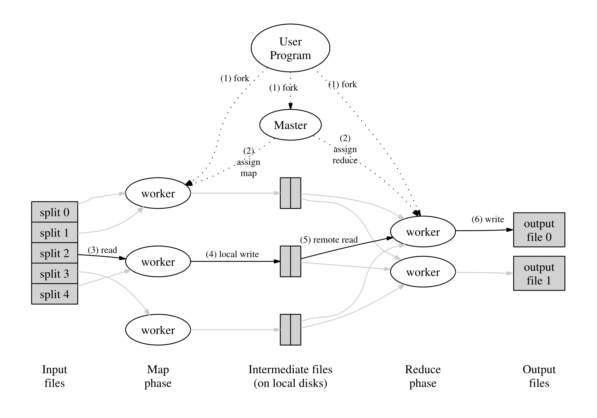

# MapReduce: Simplified Data Processing on Large Clusters

大型集群上的简化数据处理


## 摘要

MapReduce是一个用于处理和生成大型数据集的编程模型和相关实现

* 用户指定 `map` 函数处理键值对，进而生成一组中间键值
  * `map` 函数是将输入数据集划分成小的数据块，并对每个数据块（键值对）进行操作的函数。处理后会产生一个新的键值对输出。这个**输出**通常是一个**中间结果**，会被传递给 `reduce` 进行处理
* 用户指定 `reduce` 函数合并与同一中间键值相关的所有中间值
  * `reduce` 函数是将 `map` 函数的中间结果合并成最终结果的函数。在 `reduce` 中，**相同键**的值会被合并到一起， 并进行汇总计算。

* 系统负责划分输入数据、在一组机器上调度程序执行、处理机器错误以及管理所需的机器间通信的细节


## 引言

* 工作的主要贡献是一个简单而强大的接口。接口能够实现大规模计算的自动并行化和分布


## 编程模型

基本的编程模型描述

* 例子：对文档进行单词频率进行计数的模型

``````
map(String key, String value):
	// key: document name
	// value: document contents
	for each word w in value:
		EmitIntermediate(w, "1");
reduce(String key, Iterator values):
	// key: a word
	// values: a list of counts
	int result = 0;
	for each v in values:
		result += ParseInt(v);
	Emit(AsString(result));
``````

* `map` 生成一个 `word` 统计的键值对，`reduce` 对某个 `key(word)` 的所有 `value(count)` 进行合并统计，并返回一个结果
* 本质： `map` 是个根据需求处理键值对的函数，`reduce` 是一个统计的函数
* 其他例子：
  * `Distributed Grep` ：分布式 `grep`（字符查找）
  * `Count of URL Access Frequency` ：`URL` 访问频率计数
  * `Reverse Web-Link Graph` ：反向网络链接图
  * 等等
  
  

## 实现

针对基于集群的计算环境定制的 `MapReduce` 接口的实现

* 
  
* 数据切分成 `R` 个片
  * C++ 通过文件流（不会读取到内存中）读取文件
  * 然后设置需要读取片大小的缓冲区
  * 通过文件指针记录读取位置（`streampos pos = file.tellg()`），读取文件（`file.read()`）后，通过移动文件指针（`pos += buffer_size`），跳转（`file.seekg()`）到下一个片的位置
  * 文件流（`iostream`）**底层原理**：通过底层的文件操作系统调用标准的文件访问接口获取文件描述符。操作系统会分配文件指针对文件位置进行定位，文件流就是用过这个文件指针进行位置定位访问的，在读取的时候，文件流会将文件指针位置后的内容读取到缓冲区，因此存在缓冲区溢出的问题。
* 数据切分后放入 `map` 函数中进行中间处理，处理完成后写入本地
* 远端的 `reduce` 进行读取数据，首先会对 `key` 进行排序（必要的，很多不同的 `key` 会映射到同一个 `reduce` 中进行处理，所以需要排序之后将 `key` 切分，将相同的 `key` 传入同一 `reduce` 中），如果无法写入内存，进行外部排序。
* `Master` 担任调控这一过程的控制
* 容错问题：
  * `Master` 通过定期给 `worker` 发送信号，无回应会重新分配 `worker`，原 `woker` 生成的内容会回滚
  * 故障机中存储在磁盘的键值回滚，`reduce` 执行完的内容因为会分配到全局存储中，所以 `reduce` 的结果不需要重置
  * 如果 `worker A` 先执行，`woker B` 在执行（ `A` 失败了），则所有的 `reduce worker` 都会被通知重新执行。任何尚未从 `worker A` 读取数据的 reduce 都改成从 `worker B` 读取
  * 如果 `Master` 失败了，直接终止 `MapReduce` 计算
* 输入数据存储在集群的本地磁盘中，来达到节省带宽的功能。GFS（全局文件系统） 进行管理，会将文件划分成不同的块，然后将每个块的多个副本存储在不同机器中。
* 细粒度任务：将每个 map 阶段 和 reduce 阶段 进一步划分，可以实现负载均衡
* 备份任务：由于一些机器的一些原因影响计算速度。掉队的任务的备份任务会去执行，备份任务完成，同样会被标记完成。


## 改进

有用的编程模型的几个改进

* 分割函数：将中间键值对分配到 `reduce` 中。默认划分函数 `hash(key) mod R` ，这样会有均衡的划分。在某个特殊场景，会对key进行特殊处理，如处理url`hash(Hostname(urlkey)) mode R`
* 排序：中间键值对递增排序作为 `reduce` 使用
* 合并任务：同一个 `map` 可能会产生大量相同 `key` 的中间键，通过增加一个合并任务，来合并同一个 `map` 输出的相同的键
* 输入输出类型：支持不同格式的输入。例如 文本模式输入将每一行视为键值对（键是文件中的偏移量，值是行的内容）
* 跳过坏的记录：每个 worker 都安装一个信号处理程序，用于捕获分段冲突和总线错误。
* 本地执行：本地顺序执行的 `MapReduce` 库用以调试
* 状态信息：`master` 可以导出一组状态信息供用户使用。状态页面显示计算进度，例如已完成的任务数、正在进行的任务数，输入字节数、中间数据字节数、输出字节数、处理率等。可以用于辅助诊断用户代码中的错误
* 计数器：`map` 处理某个特定任务会提供一个计数器进行计算


## 结论

* 模型易用：隐藏了并行化、容错、局部优化和负载均衡的细节

