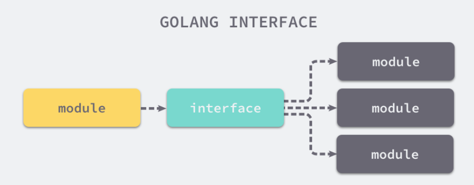

# go 学习笔记

## 1. 编译原理

### 1.1 编译过程

#### 1.1.1 基础知识

**抽象语法树（Abstract Syntax Tree，AST）：**

* 编译器使用的数据结构，用来表示编程语言的语法结构
* 每一个节点都表示源代码中的一个元素
* 每一棵子树都表示一个语法元素

**静态单赋值（Static Single Assigment，SSA）：**

* 用来做代码优化
* 同一变量多次复制，会优化掉不需要执行的那一个部分

**指令集：**

* 不同的设备，指令集可能不能，所以生成的源码，不能在生产环境中运行，可能使用为代码生成环境的指令集不同
* 指令集：
  * 复杂指令集（CISC）：通过增加指令的类型，减少指令的执行数量
  * 简单指令集（RISC）：通过更少的指令类型完成目标的计算任务

#### 1.1.2 编译原理

**编译逻辑：**

* 词法与语法分析、类型检查和 AST 转换、通用 SSA 生成和最后的机器代码生成

**各部分细则：**

* 词法与语法分析：
  * 词法分析：使用词法解析器；文件 to token
  * 语法分析：使用 LALR 文法；token to AST
  * 这个过程是将源文件解析成抽象语法树的过程

* 类型检查：
  * 按一下顺序分别验证：
    * 常量、类型和函数名及类型；
    * 变量的赋值和初始化；
    * 函数和闭包的主体；
    * 哈希键值对的类型；
    * 导入函数体；
    * 外部的声明；
  * 对 make 进行改写
* 中间代码生成：
  * 并发编译
* 机器码生成：
  * 根据架构生成不同的机器码

## 2. 数据结构

### 2.1 数组

#### 2.1.1 初始化

**上限推导：**

* `arr1 := [3]int{1, 2, 3}`：显示指定大小
* `arr1 := [...]int{1, 2, 3}`：不显示指定，编译期间对数组大小进行推导
* 两者使用的构建数组的函数不同

**语句转换：**

* 当元素数量**小于或者等于 4 个**时，会直接将数组中的元素放置在**栈**上；

* 当元素数量**大于 4 个**时，会将数组中的元素放置到**静态区**并在**运行时取出**；

#### 2.1.2 访问和赋值

* 通过指针进行访问就需要知道 1.数据类型，2.元素个数
  * 不知道数据类型，进行指针 + 操作，就无法访问到想要的元素的位置（不同类型，指针增加所对应的地址变换不同）
  * 不知道元素个数，就发生下标越界
* **编译期间**会通过函数去验证是否越界

### 2.2 切片（slice）

**切片即动态数组**

#### 2.2.1 数据结构

* 编译期间的切片是 `cmd/compile/internal/types.Slice` 类型

* 运行时切片可以由如下类型表示 `reflect.SliceHeader`

  ```go
  type SliceHeader struct {
  	Data uintptr
  	Len  int
  	Cap  int
  }
  ```

  * `Data` 是指向数组的指针;
  * `Len` 是当前切片的长度；
  * `Cap` 是当前切片的容量，即 `Data` 数组的大小：


* **个人理解：**相当于 `slice` 会提前申请一块连续的空间，其中容量有富余，然后通过 `cap` 标记容量，通过 `len` 标记已使用，与 C++ 的 `vector` 类似，不过 C++ 的 `vector` 封装的更加复杂

#### 2.2.2 初始化

**三种初始化方式**

* 通过下表方式获取

  * 通过下标的方式获得数组或者切片的一部分；
  * 使用字面量初始化新的切片；
  * 使用关键字 `make` 创建切片：（`make` 函数用于创建 `slice`、`map` 和 `channel` 类型的对象。这些类型在底层都使用了引用类型，并且需要进行初始化操作。`make` 函数分配并初始化了底层的数据结构，返回一个已经初始化的对象。）

  ```go
  arr[0:3] or slice[0:3]
  slice := []int{1, 2, 3}
  slice := make([]int, 10)
  ```

**使用下标**

编译阶段会获取：元素类型、数组指针、切片大小和容量，来对 `slice` 进行初始化

**字面量**

```go
var vstat [3]int
vstat[0] = 1
vstat[1] = 2
vstat[2] = 3
var vauto *[3]int = new([3]int)
*vauto = vstat
slice := vauto[:]
```

底层还是使用了**下标**

**关键字（运行时）**

需要进行检查

1. 切片的大小和容量是否足够小；
2. 切片是否发生了逃逸，最终在堆上初始化

> 逃逸指的是将一个局部变量（包括切片）分配到堆上，使得在函数结束后该变量仍然可以被访问
>
> 切片逃逸发生的情况包括：
>
> 1. 返回切片：如果一个函数返回一个切片，切片会逃逸到堆上，因为它需要在函数结束后继续存在。
> 2. 闭包引用切片：如果一个闭包（函数值）引用了一个局部的切片变量，该切片会逃逸到堆上，因为闭包可能在函数结束后仍然存在并访问该切片。
> 3. 传递切片给接口：如果一个切片被传递给一个接口类型的参数，切片会逃逸到堆上。这是因为接口变量在底层存储了类型信息和值，需要在堆上分配内存。

逃逸：在 C++ 中等同于在被调函数中创建了指针，函数结束后不会被释放，同时不手动释放；另一种需要注意的问题是在被调函数中定义了变量，但是函数结束后返回了该变量的指针，导致外部不能访问的问题，因为变量的定义后存储在栈中，被调函数结束后，就会出栈。

#### 2.2.3 访问元素

* cap，len 会触发 `“decompose builtin”` 阶段优化，直接替换成切片的容量或长度
* index 的操作，会直接转换成对地址的访问

#### 2.2.4 追加和扩容

* 使用 `append` 会根据返回值是否覆盖原变量进入两种流程

  * 不覆盖原变量：直接在原变量的 dataptr 的基础上根据地址进行赋值

    ```go
    // append(slice, 1, 2, 3)
    ptr, len, cap := slice
    newlen := len + 3
    if newlen > cap {
        ptr, len, cap = growslice(slice, newlen)
        newlen = len + 3
    }
    // 在原变量 ptr 的基础上进行地址操作
    *(ptr+len) = 1
    *(ptr+len+1) = 2
    *(ptr+len+2) = 3
    return makeslice(ptr, newlen, cap)   // 使用了原有 slice 的 ptr 去初始化一个 slice（拷贝的过程）相当于c++ 的拷贝构造
    ```

  * 覆盖原变量：

    ```go
    // slice = append(slice, 1, 2, 3)
    a := &slice
    ptr, len, cap := slice
    newlen := len + 3
    if uint(newlen) > uint(cap) {
       newptr, len, newcap = growslice(slice, newlen)
       vardef(a)
       *a.cap = newcap
       *a.ptr = newptr
    }
    newlen = len + 3
    *a.len = newlen
    *(ptr+len) = 1
    *(ptr+len+1) = 2
    *(ptr+len+2) = 3   // 不发生拷贝，在原有的地址上进行操作，同时返回
    ```

* 扩容
  * 容量扩大策略（仅元素个数）
    * 如果期望容量大于当前容量的两倍就会使用期望容量；
    * 如果当前切片的长度小于 1024 就会将容量翻倍；
    * 如果当前切片的长度大于 1024 就会每次增加 25% 的容量，直到新容量大于期望容量；
  * 实际存储容量扩容策略
    * 需要根据元素大小进行内存对齐
  * `growslice` 函数最终会返回一个新的切片，其中包含了新的数组指针、大小和容量，这个返回的三元组最终会覆盖原切片

#### 2.2.5 拷贝切片

* 非运行时调用 `copy`，会转换成下方代码

  ```go
  n := len(a)
  if n > len(b) {
      n = len(b)
  }
  if a.ptr != b.ptr {
      memmove(a.ptr, b.ptr, n*sizeof(elem(a)))  // memove 负责拷贝内存
  }
  ```

* 运行时调用 `copy`，会使用 `slicecopy` 替换运行期间调用的 `copy`

  ```go
  func slicecopy(to, fm slice, width uintptr) int {
  	if fm.len == 0 || to.len == 0 {
  		return 0
  	}
  	n := fm.len
  	if to.len < n {
  		n = to.len
  	}
  	if width == 0 {
  		return n
  	}
  	...
  
  	size := uintptr(n) * width
  	if size == 1 {
  		*(*byte)(to.array) = *(*byte)(fm.array)
  	} else {
  		memmove(to.array, fm.array, size)  // 通过 width 来计算 move 的 size
  	}
  	return n
  }
  ```

  会判断 `dst` 和 `src` 的容量，同时不是根据元素来计算 `memmove` 的大小

### 2.3 哈希表

#### 2.3.1 设计原理

* 哈希函数
* 冲突解决方法：
  * 开放地址法：性能影响因素（**装载因子**：元素数量与数组大小的比值），装载率超过 70% 之后，性能会急剧下降
  * **拉链法**：存储节点的内存是动态申请的（数组+链表），可以引入红黑树优化性能；（**装载因子**：元素数量 / 桶数量）

#### 2.3.2 数据结构

```go
type hmap struct {
	count     int  // 当前元素数量
	flags     uint8	
	B         uint8  // buckets 数量（len（buckets） == 2^B）
	noverflow uint16
	hash0     uint32 // 哈希种子

	buckets    unsafe.Pointer
	oldbuckets unsafe.Pointer  // 扩容时用于保存之前 buckets 的字段，是当前 buckets 的一半
	nevacuate  uintptr

	extra *mapextra
}

type mapextra struct {
	overflow    *[]*bmap
	oldoverflow *[]*bmap
	nextOverflow *bmap
}
```

* 哈希表的数据结构


* `hmap` 的桶是 `bmap`，每个 `bmap` 都能存 8 个键值对，单个桶装满是，就是使用 `extra.nextOverflow` 中的桶存储溢出的数据

  * 黄色的桶和绿色的溢出桶在**内存中是连续的**（溢出桶使用 C 语言实现时使用的设计）

  ```go
  type bmap struct {
  	tophash [bucketCnt]uint8
  }
  ```

  > `tophash` 存储了键的哈希的高 8 位，通过比较不同键的哈希的高 8 位可以减少访问键值对次数以提高性能

* 运行时的 `bmap` 不同，因为存储的 `kv` 类型不同

  * 使用以下结构进行重建

    ```go
    type bmap struct {
        topbits  [8]uint8    // 一个哈希桶中会存储其中每个key（八个key）的高八位，通过这个提前比较，可以提高效率
        keys     [8]keytype
        values   [8]valuetype
        pad      uintptr
        overflow uintptr
    }
    ```

#### 2.3.3 初始化

* 初始化的方法：
  * 字面量
    * 不超过 25 个元素，直接进行插入（直接分解 `hash["1"] = 2`）
    * 超过 25 个，对 `kv` 都创建一个列表，进行遍历插入
  * 运行时（调用 `makemap`）
    * 计算哈希占用的内存是否溢出或者超出能分配的最大值；
    * 调用 `runtime.fastrand` 获取一个随机的哈希种子；
    * 根据传入的 `hint` 计算出需要的最小需要的桶的数量；
    * 使用 `runtime.makeBucketArray` 创建用于保存桶的数组；
  * 溢出桶的创建
    * 当桶的数量小于 2^4 时，由于数据较少、使用溢出桶的可能性较低，会省略创建的过程以减少额外开销；
    * 当桶的数量多于 2^4 时，会额外创建 2^(B-4) 个溢出桶；

#### 2.3.4 读写操作

**访问**

- 当接受一个参数时，会使用 `runtime.mapaccess1`，该函数仅会返回一个指向目标值的指针；
- 当接受两个参数时，会使用 `runtime.mapaccess2`，除了返回目标值之外，它还会返回一个用于表示当前键对应的值是否存在的 `bool` 值：
- 会一次遍历正常桶和溢出桶的所有数据，正常桶会便比较高八位（tophash）
- 高八位相同在比较 key，然后相同的话，返回对应 values 的指针

**写入**

* 遍历，找到对应的 k v 地址，然后取出
* 如果键值对不存在，会为新键值规划存储的内存地址
* 如果当前桶溢出
  * 会调用 `newoverflow` 创建新桶，或者使用 `hmap` 在 `noverflow` 中创建好的桶来保存数据
  * 新桶会**追加**到已有桶的末尾（地址连续）
  * 同时会增加哈希表的 `noverflow` 计数器

**扩容**

* 发生扩容的情况
  * 装载因子已经超过 6.5；
  * 哈希使用了太多溢出桶；等量扩容，创建新桶保存数据，**垃圾回收**清理老桶释放内存，所以 `hmap` 有 **oldbuckets**
  * 扩容不是**原子操作**，所以需要判断是否已经处于**扩容状态**

* 等量扩容：`hashGrow` 只是创建新桶（新桶旧桶数量相同），并没有对数据进行拷贝和转移（在 `evcacuate` 中完成）
* 翻倍扩容：新桶的数量是旧桶的**一倍**，**一个旧桶对应两个新桶**，每个旧桶的元素都会分流到新桶中（可扩展哈希）

**删除**

使用 **delete** 关键字（不论 `kv` 是否存在，都不返回任何结果）

### 2.4 字符串

go 语言中的字符串是一个**只读**的字节数组，放在只读空间

go 不支持直接修改 `string` 类型变量的内存空间，但是可以通过 `string` 和 `[]byte` 类型之间的转换来实现修改的目的

* 先将这段内存拷贝到堆或者栈上；
* 将变量的类型转换成 `[]byte` 后并修改字节数据；
* 将修改后的字节数组转换回 `string`；

#### 2.4.1 数据结构

```go
type StringHeader struct {
	Data uintptr
	Len  int
}
```

* 因为是只读类型，所以不直接追加元素改变自身的内存空间，所有的写入都是通过拷贝来实现的

#### 2.4.2 解析过程

* 将原有无意义的字符流解析成 `Token` 序列
* 两种字面量方式初始化
  * 双引号：`str1 := "this is a string"`
  * 反引号：\`\`；可以摆脱单行限制，同时内部可以使用 `”`

#### 2.4.3 拼接

* 编译期间会根据拼接的字符串数量而选择合适的函数

  * 小于或等于 5 个：会调用 `concatstring{2, 3, 4, 5}` 等一些列函数
  * 超过 5 个，选择 `concatstrings` 传入一个数组切片；
  * 但最终都会调用 `concatstrings` 

* `concatstrings` ：先遍历传入的切片参数，过滤空字符串并计算拼接后的字符串长度

  ```go
  func concatstrings(buf *tmpBuf, a []string) string {
  	idx := 0
  	l := 0
  	count := 0
  	for i, x := range a {
  		n := len(x)
  		if n == 0 {
  			continue
  		}
  		l += n
  		count++
  		idx = i
  	}
  	if count == 0 {
  		return ""
  	}
  	if count == 1 && (buf != nil || !stringDataOnStack(a[idx])) {
  		return a[idx]
  	}
  	s, b := rawstringtmp(buf, l)
  	for _, x := range a {
  		copy(b, x)
  		b = b[len(x):]
  	}
  	return s
  }
  ```

  #### 2.4.4 类型转换

  * 当传入缓冲区时，它会使用传入的缓冲区存储 `[]byte`；
  * 当没有传入缓冲区时，运行时会调用 `runtime.rawbyteslice` 创建新的字节切片并将字符串中的内容拷贝过去；

## 3. 语言基础

### 3.1 函数调用

> C 语言和 Go 语言在设计函数的调用惯例时选择了不同的实现。C 语言**同时使用寄存器和栈传递参数**，使用 **eax 寄存器传递返回值；**而 Go 语言使用**栈传递参数和返回值**。我们可以对比一下这两种设计的优点和缺点：
>
> - C 语言的方式能够极大地减少函数调用的额外开销，但是也增加了实现的复杂度；
>   - CPU 访问栈的开销比访问寄存器高几十倍[3](https://draveness.me/golang/docs/part2-foundation/ch04-basic/golang-function-call/#fn:3)；
>   - 需要单独处理函数参数过多的情况；
> - Go 语言的方式能够降低实现的复杂度并支持多返回值，但是牺牲了函数调用的性能；
>   - 不需要考虑超过寄存器数量的参数应该如何传递；
>   - 不需要考虑不同架构上的寄存器差异；
>   - 函数入参和出参的内存空间需要在栈上进行分配；
>
> Go 语言使用栈作为参数和返回值传递的方法是综合考虑后的设计，选择这种设计意味着编译器会更加简单、更容易维护。

**参数传递**

* 整型和数组类型都是值传递的

### 3.2 接口

#### 3.2.1 概述

* **个人理解**：接口相当于 C++ 中的基类，子类可以转化成基类，同时通过基类访问子类的方法（抽象类）

> 接口是计算机系统中多个组件共享的边界，不同的组件能够在边界上交换信息[1](https://draveness.me/golang/docs/part2-foundation/ch04-basic/golang-interface/#fn:1)。如下图所示，接口的本质是引入一个新的中间层，调用方可以通过接口与具体实现分离，解除上下游的耦合，上层的模块不再需要依赖下层的具体模块，只需要依赖一个约定好的接口
>
> 

* **interface{}** 有两种：一种包含方法的接口，一种不包含方法的接口（接口**不是任意类型**）

**指针和接口**


* 结构体指针实现的接口，和接口体实现的接口不能混用，会出现  `“method redeclared”`
* 结构体实现的接口，可以通过结构体指针来初始化，因为 go 语言本身的特性：对**变量解引用（dereference）**，所以传递进去的就变成了结构体，但是反过来不行，因为 go 不会凭空的创建指针。
* 接口类型 `interface{} != nil`，但是未初始化的结构体指针 == nil

#### 3.2.2 数据结构

* 被分成两类的接口

  * 使用 `runtime.iface` 结构体表示包含方法的接口

    ```go
    type eface struct { // 16 字节
    	_type *_type
    	data  unsafe.Pointer
    }
    ```

  * 使用 `runtime.eface` 结构体表示不包含任何方法的 `interface{}` 类型；

    ```go
    type iface struct { // 16 字节
    	tab  *itab   // 
    	data unsafe.Pointer  // 指向原始数据的指针
    }
    ```

*  类型结构体（Go 语言类型的运行时表示）

  ```go
  type _type struct {
  	size       uintptr
  	ptrdata    uintptr
  	hash       uint32
  	tflag      tflag
  	align      uint8
  	fieldAlign uint8
  	kind       uint8
  	equal      func(unsafe.Pointer, unsafe.Pointer) bool
  	gcdata     *byte
  	str        nameOff
  	ptrToThis  typeOff
  }
  ```

* itab 结构体

  ```go
  type itab struct { // 32 字节
  	inter *interfacetype
  	_type *_type
  	hash  uint32
  	_     [4]byte
  	fun   [1]uintptr
  }
  ```

  * `hash` 是对 `_type.hash` 的拷贝，当我们想将 `interface` 类型转换成具体类型时，可以使用该字段快速判断目标类型和具体类型 `runtime._type` 是否一致；**用于转换时的类型判断**
  * `fun` 是一个动态大小的数组，它是一个用于动态派发的虚函数表，存储了一组函数指针。虽然该变量被声明成大小固定的数组，但是在使用时会通过原始指针获取其中的数据，所以 `fun` 数组中保存的元素数量是不确定的；

#### 3.2.3 类型转换


#### 3.2.4 类型断言

* `c.(type)` 进行类型断言，获取类型
* `c.(changetype)` 进行类型转换

#### 3.2.5 动态派发

**动态派发（Dynamic dispatch）是在运行期间选择具体多态操作（方法或者函数）执行的过程**

* 动态派发增加性能开销

### 3.3 反射

#### 3.3.1 反射的基本类型与函数

* 基本类型
  * `reflect.Type`：反射获取的类型
  * `reflect.Value`：反射获取的变量
* 函数
  * `reflect.TypeOf`：获取类型信息
  * `reflect.ValueOf`：获取数据的运行时表示

#### 3.3.2 Type

* 接口，通过这个接口，可以获取类型信息相关的内容

#### 3.3.3 Value

* 结构体，没有对暴漏的字段

#### 3.3.4 三大法则

1. 从 `interface{}` 变量可以反射出反射对象；
2. 从反射对象可以获取 `interface{}` 变量；
3. 要修改反射对象，其值必须可设置；

##### 3.3.4.1 第一法则

* 能将 `interface{}` 类型的变量转换成反射对象；这需要从源码中获取，在参数传递的过程中，会发生一次隐式转换（形参是 interface{} 类型），转换成 `interface{}` 类型，再从 `interface{}` 类型转换成反射对象

##### 3.3.4.2 第二法则

* 反射对象转换成接口（使用 reflect.Value.Interface 进行转换，然后进行显示转换）

- 从接口值到反射对象：

  - 从基本类型到接口类型的类型转换；（形参的转换）
  - 从接口类型到反射对象的转换；（转换函数内部）

- 从反射对象到接口值：

  - 反射对象转换成接口类型；（转换成接口）

  - 通过显式类型转换变成原始类型；（将接口类型显示转换）

    ```go
    v := reflect.ValueOf(1)
    v.Interface().(int)
    ```

##### 3.3.4.3 第三法则

* 反射变量如果重设值，转换成反射对象的时候，这个源对象的值必须是可以更改的（传入指针）

1. 调用 `reflect.ValueOf` 获取变量指针；
2. 调用 `reflect.Value.Elem` 获取指针指向的变量；
3. 调用 `reflect.Value.SetInt` 更新变量的值：

#### 3.3.5 更新变量

* 更新 value 的时候，需要调用 reflect.Value.Set 更新对象
  * `reflect.flag.mustBeAssignable` ：检查当前反射对象是否是可以被设置的
  * `reflect.flag.mustBeExported` ：检查字段是否是对外公开的

#### 3.3.6 实现协议

* `reflect.rtype.Implements` 可以判断某些类型是否遵循特定的接口

  ```go
  type CustomError struct{}
  
  func (*CustomError) Error() string {
  	return ""
  }
  
  func main() {
  	typeOfError := reflect.TypeOf((*error)(nil)).Elem()   // 一个*error 的类型
  	customErrorPtr := reflect.TypeOf(&CustomError{})
  	customError := reflect.TypeOf(CustomError{})
  
  	fmt.Println(customErrorPtr.Implements(typeOfError)) // #=> true
  	fmt.Println(customError.Implements(typeOfError)) // #=> false
  }
  ```

  * `CustomError` 类型并没有实现 `error` 接口；
  * `*CustomError` 指针类型实现了 `error` 接口；

#### 3.3.7 方法调用

* 通过获取函数的类型，以及函数的入参等信息，进行动态调用

  ```go
  func Add(a, b int) int { return a + b }
  
  func main() {
  	v := reflect.ValueOf(Add)
  	if v.Kind() != reflect.Func {
  		return
  	}
  	t := v.Type()
  	argv := make([]reflect.Value, t.NumIn())
  	for i := range argv {
  		if t.In(i).Kind() != reflect.Int {
  			return
  		}
  		argv[i] = reflect.ValueOf(i)
  	}
  	result := v.Call(argv)
  	if len(result) != 1 || result[0].Kind() != reflect.Int {
  		return
  	}
  	fmt.Println(result[0].Int()) // #=> 1
  }
  ```

  * 通过 `reflect.ValueOf` 获取函数 `Add` 对应的反射对象；
  * 调用 `reflect.rtype.NumIn` 获取函数的入参个数；
  * 多次调用 `reflect.ValueOf` 函数逐一设置 `argv` 数组中的各个参数；
  * 调用反射对象 `Add` 的 `reflect.Value.Call` 方法并传入参数列表；
  * 获取返回值数组、验证数组的长度以及类型并打印其中的数据；

## 4. 常用关键字

### 4.1 for 和 range

**for 和 range 在编译时都会转换成其他代码进行优化，同时这两个都会拷贝一个传入的副本**

* 哈希表会进行随机遍历，每次遍历结果不同，go 底层实现哈希表就不是让顺序遍历的

#### 4.1.1 经典循环

* 经典循环的节点由四个部分组成

  * 初始化循环的 `Ninit`；
  * 循环的继续条件 `Left`；
  * 循环体结束时执行的 `Right`；
  * 循环体 `NBody`：

  ```go
  for Ninit; Left; Right {
      NBody
  }
  ```

  

#### 4.1.2 范围循环

* 针对数组和切片会出现的三种情况

  * 分析遍历数组和切片清空元素的情况；
  * 分析使用 `for range a {}` 遍历数组和切片，不关心索引和数据的情况；
  * 分析使用 `for i := range a {}` 遍历数组和切片，只关心索引的情况；
  * 分析使用 `for i, elem := range a {}` 遍历数组和切片，关心索引和数据的情况；

* `arrayClear` 优化

  ```go
  // 原代码
  for i := range a {
  	a[i] = zero
  }
  
  // 优化后,清除原数组的内存
  if len(a) != 0 {
  	hp = &a[0]
  	hn = len(a)*sizeof(elem(a))
  	memclrNoHeapPointers(hp, hn)
  	i = len(a) - 1
  }
  ```

* 同时关注数据和索引，会触发**拷贝**

  ```go
  ha := a
  hv1 := 0
  hn := len(ha)
  v1 := hv1
  v2 := nil
  for ; hv1 < hn; hv1++ {
      tmp := ha[hv1]
      v1, v2 = hv1, tmp
      ...
  }
  ```

* 遍历**哈希表**，会随机获取桶
  * 哈希表遍历的顺序，首先会选出一个绿色的正常桶开始遍历，随后遍历所有黄色的溢出桶，最后依次按照索引顺序遍历哈希表中其他的桶，直到所有的桶都被遍历完成。
  * 在待遍历的桶为空时，选择需要遍历的新桶；
  * 在不存在待遍历的桶时。返回 `(nil, nil)` 键值对并中止遍历；
* 遍历**通道**
  * 如果不存在当前值，意味着当前的管道已经被关闭；
  * 如果存在当前值，会为 `v1` 赋值并清除 `hv1` 变量中的数据，然后重新陷入阻塞等待新数据；

### 4.2 select

**select 会先扫一遍所有的 case ，来快速确定当前是否有可以在执行的，没有的话优化代码，使用轮询的方法去监控通道**

* `select` 的 `case` 中的表达式必须都是 `channel` 的收发操作

#### 4.2.1 现象

1. `select` 能在 `Channel` 上进行非阻塞的收发操作；
2. `select` 在遇到多个 `Channel` 同时响应时，会随机执行一种情况；

**非阻塞收发**

* 两种情况，优先处理 `case` 的可收发，无则初始 `default`
  * 当存在可以收发的 `Channel` 时，直接处理该 `Channel` 对应的 `case`；
  * 当不存在可以收发的 `Channel` 时，执行 `default` 中的语句；

**随机执行**

* 随机的目的，防止饥饿

#### 4.2.2 数据结构

```go
type scase struct {
	c    *hchan         // chan
	elem unsafe.Pointer // data element
}
```

#### 4.2.3 实现原理

1. `select` 不存在任何的 `case`；
2. `select` 只存在一个 `case`；
3. `select` 存在两个 `case`，其中一个 `case` 是 `default`；
4. `select` 存在多个 `case`；

* 直接阻塞
  * 不包含 `case` 的情况
* 单一管道
  * 会改写成 `if` 语句
* 非阻塞操作（defer）
  * 发送
    * 使用条件语句和 `selectnbsend(ch, i)` 进行改写
  * 接收
    * 使用条件语句和 `selectnbrecv(&v, ch)` 进行改写
* 多个，通过 `if` 找出符合的 `case`
* 多个 `case` 但没有 `default` 的情况
  * 轮询顺序：通过 [`runtime.fastrandn`](https://draveness.me/golang/tree/runtime.fastrandn) 函数引入随机性；
  * 加锁顺序：按照 Channel 的地址排序后确定加锁顺序；
  * 通过 goto 跳转执行语句

### 4.3 defer

**defer 通过头插的链式进行存储，调用会调用最后插入的那个，即链头的 defer；defer 中设计底层的栈指针和程序计数器等**

#### 4.3.1 现象

- `defer` 关键字的调用时机以及多次调用 `defer` 时执行顺序是如何确定的；
  - 链式头插，从头执行
- `defer` 关键字使用传值的方式传递参数时会进行预计算，导致不符合预期的结果；
  - 预计算参数，在写这个 `func` 的时候，就确定了传入的参数内容了

#### 4.3.2 执行机制

* 栈上执行
* 堆上执行
* 开放编码
  * 函数的 `defer` 数量少于或者等于 8 个；
  * 函数的 `defer` 关键字不能在循环中执行；
  * 函数的 `return` 语句与 `defer` 语句的乘积小于或者等于 15 个；

### 4.4 panic 和 recover

**panic 触发的递归延迟调用，在 defer 终止 panic 造成的程序崩溃**

- `panic` 只会触发当前 Goroutine 的 `defer`；
- `recover` 只有在 `defer` 中调用才会生效；
- `panic` 允许在 `defer` 中嵌套多次调用；

* `panic` 可以嵌套崩溃

### 4.5 make 和 new

- `make` 的作用是初始化内置的数据结构，也就是我们在前面提到的切片、哈希表和 Channel
- `new` 的作用是根据传入的类型分配一片内存空间并返回指向这片内存空间的指针
