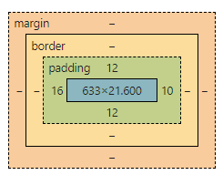

# CSS 基础学习笔记

# 1. 选择器

**给对应的 html 元素进行渲染**

## 1.1 基本选择器

**基本选择器类型**

* 标签选择器（h1）：选择一类标签
  * 使用：h1{}（标签{}）
* 类选择器（class）：选择 class 相同的标签
  * 使用：.class{}（.类名{}）
* ID 选择器（id）：选择 id（全局唯一） 相同的标签
  * 使用：#id{}（#id名{}） 

**优先级**

* id > class > h1

## 1.2 层次选择器

### 1.2.1 后端选择器

* 某个元素的后代，全部进行设置
  * 使用 元素 后代元素{} 来编写

```css
body p{
    background: red;
}
```

### 1.2.2 子选择器

* 只有一代
  * 使用 元素>子代元素{} 来编写

```css
body>p{
    background: red;
}
```

### 1.2.3 相邻兄弟选择器

* 同级的相邻兄弟（对下不对上，只选择相邻下面的一个指定类型元素）
  * 使用 类名 + 相邻元素{}

```css
.classname + p{
    background: red;
}
```

### 1.2.4 通用选择器

* 同级的所有相邻元素（对下不对上，选择下方的所有指定类型元素）
  * 使用 类名 ~ 元素名{}

```css
.classname ~ p{
    background: red;
}
```

## 1.3 结构伪类选择器

* 不使用 id,class 进行半精准匹配（子类的某一个）；伪类相当于有个动作
  * 类: 修饰类{}
  * 可以配合父类进行使用

```css
/*父类的第一个li子类*/
ul li:first-child{}

/*当前类父类的第一个子类
同时父类的第一个子类必须是p，不然不生效*/
p:nth-child(1){}

/*同上,但是不是第一个子类必须是p
而是第一个p子类*/
p:nth-of-type(1){}
```


## 1.4 属性选择器

* 选择标签带有某种属性的；可以使用正则匹配
  * 模糊选择：标签[属性]{}
  * 精准选择：标签[属性名=属性值]{}；
  * 包含选择：标签[属性名*="属性值"]{}；属性中含有这个属性的
  * 正则选择：标签[属性名^=属性值]{};
* 符号
  * = 绝对等于
  * *= 包含等于
  * ^= 以属性开头
  * $= 以属性结尾

```css
/*带有id属性*/
a[id]{}

/*绝对等于*/
a[id=name]{}

/*包含这个属性*/
a[class*="links"]{}
```


# 2 美化网页元素

## 2.1 约定俗称的样式

* `<span></span>` 标签突出重点：`span` 可以换成**其他**的名字，但是约定俗称，都是用 `span`
* `<div></div>` 标签

## 2.2 字体

* `font`：字体的多级设置，可以同时写多个属性

* `font-family`：字体
  * 可以设置两种字体，一种针对英文，一种针对中文
* `font-size`：字体大小
  * px：像素为单位
  * em：字体个数为单位
* `font-weight`：字体粗细
* `color`：字体颜色

## 2.3 文本样式

* `color` 颜色：
  * 单词
  * RGB：16进制颜色
  * RGBA：颜色加透明度
* `text-align` 排版：
  * left 等
* `text-indent` 首行缩进
* `line-height` 行高，用来设置和 **块高** 相同，来进行**行居中**
* `text-decoration` 文本修饰效果，用来加下划线、删除线等
* `vartical-align: middle` 文本图片水平对齐
  * 使用格式：元素1,元素2{vartical-align: middle;}

## 2.4 阴影和超链接伪类

* `text-shadow` 阴影

* `a:hover` 超链接伪类，鼠标悬停

## 2.5 列表样式

## 2.6 背景图片

**`<div></div>` 中加背景图片**

* `background: 颜色 资源 图片位置 平铺方式`

* 拆分使用

  * `background_image: url()`：背景的资源

  * `background-repeat`：背景的平铺方式

  * `background-position`：位置

## 2.7 背景渐变

* CSS 渐变色网站 [Grabient](https://www.grabient.com/)

# 3 盒子模型



* `margin`”：外边距
* `border`：边框
* `padding`：内边距

**高效开发规范**

* 使用 `css` 样式将所有的元素的 `margin padding text-decoration`  等初始化为 0

****

* margin 剧中的条件：块元素，块元素有宽度

# 4 浮动

* 块级元素：独占一行

  ```
  h1-h6 p div 列表
  ```

* 行内元素：不独占一行

  ```
  span a img strong...
  ```

* **行内元素**可以被**包含**在**块级元素**中，**反正不行**

* 动态设置行内元素和块元素（display）

  * `block`：块元素
  * `inline`：行内元素
  * `inline-block`：块元素，同时内联，在一行
  * `none`：去掉

* 浮动：`float`

  * 清除浮动：clear:both

**父级边框塌陷**

* `clear` 清除浮动

  * `right`：右侧不允许有浮动元素
  * `left`：左侧不允许有浮动元素
  * `both`：两侧不允许有浮动元素
  * `none`

* 解决方案：

  * 增加父级元素高度

  * 增加空的 `div` 标签，清除浮动

  * `overflow`：溢出的设置成隐藏或者滚动条（在父级元素中增加 hidden）

    * `hidden`
    * `scroll`

  * 父类添加伪类：`:after`

    ```css
    #father:after{
        content: '';
        display: block;
        clear: both;
    }
    ```

**小结**

1. 浮动元素后增加 div
   - 简单
   - 代码中避免空 div
2. 设置父元素的高度
   - 简单
   - 元素假社超出了固定高度，会被限制
3. overflow
   - 简单
   - 下拉场景避免使用
4. 父类添加伪类：after（推荐）
   - 写法稍微复杂
   - 整体html没有无用元素，仅在css中增加代码

# 5 定位

## 5.1 相对定位

* 相对于**原来的位置**进行指定的偏移

* position: relative ；相对位置
  * top: 20px
  * left
  * ...

## 5.2 绝对定位

* 没有父级元素定位，就是相对于浏览器定位
* 假社父级中有定位，子元素再进行绝对定位，是相对于父级元素来进行定位
* position:absolute

## 5.3 固定定位

* position:fix：不论网页怎么下滑，都不动

## 5.3 z-index

* `z-index:0`： 网页的第多少层
* `opacity:0.5`：背景的透明度

