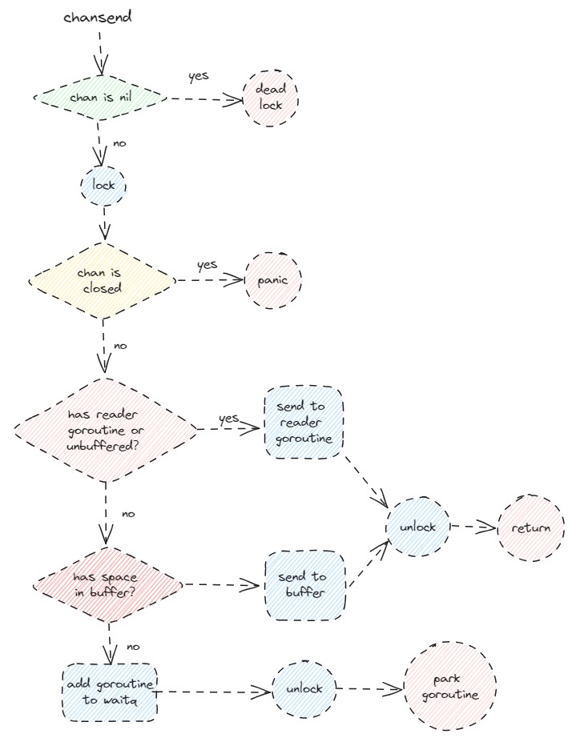
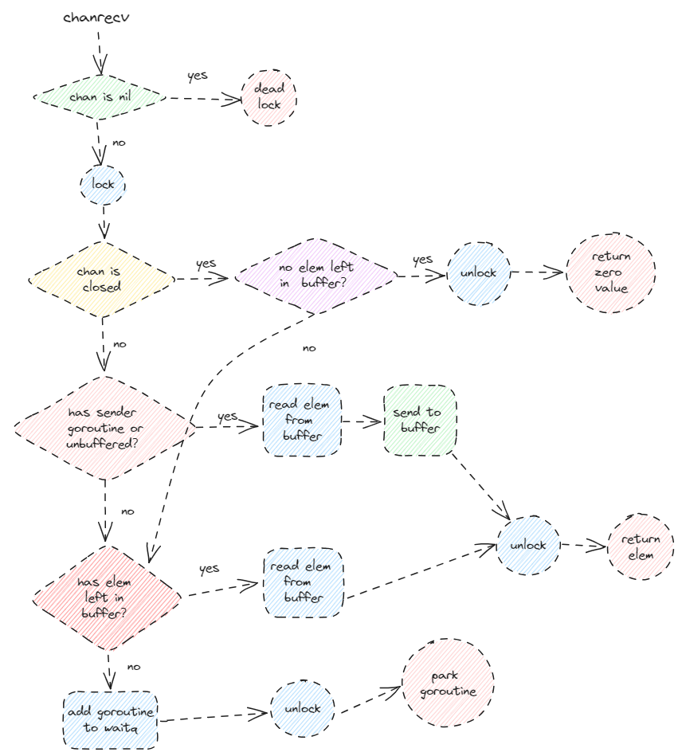
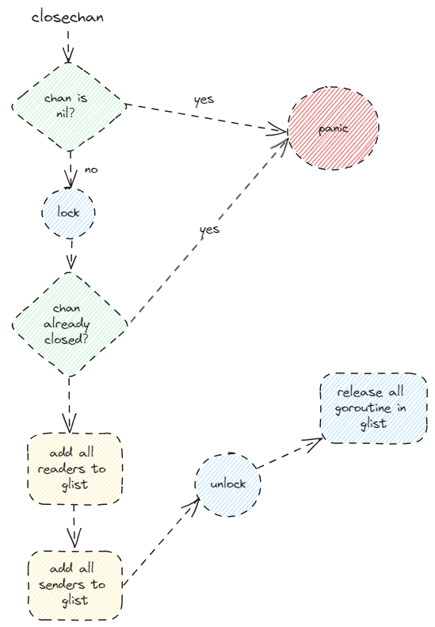

# 小吴修仙传

# C++篇


# Golang篇

## 练气


## 筑基

### Channel 原理

**Channel用来goroutine之间通信，goroutine之间不需要过多关注通信的交互，只需要将数据交给Channel进行处理。支持高并发，内部加锁，通过陷入阻塞来提高性能**

**文件位置：runtime 包下的 chan.go**

#### 1 Channel 数据结构

##### 1.1 Channel 基础

**两种构造方法：无缓、有缓** 

```go
ch := make(chan int)   // 无缓冲
ch := make(chan int, 10) // 有缓冲
```

**注**：只声明的 `chan`（var ch chan int） 不能直接使用，因为声明的 `chan` 是 `nil`。

**读取：有缓读、无缓读**

* 读取的两种方式
  * 直接读取：`val := <- ch`
  * 验证读取：`val, ok := <- ch`，`ok` 是用来判断是否有数据读出，这种读取可以作为**非阻塞**的方式
    * 读取的 `chan` 关闭，同时其中没有元素的时候，会返回 `false`
    * 读取的 `chan` 关闭了，但是其中有元素，返回 `true`
    * 实际理解：能读出来东西，就是 `true`
  * 注：关闭 `chan` 的时候，需要通过**验证读取**的方式进行获取元素（通过 `ok` 判断是否继续读），因为即便是关闭的 `chan`，其中没有元素，`val` 也能**被读出**，不过是类型的**零值**

* **有缓读**的两种情况
  * 缓冲区有元素：直接读取
  * 缓冲区无元素：陷入阻塞
* **无缓读**：双方**同步读写**，否则双方都陷入阻塞

**写入：有缓写、无缓写**

* **有缓写**的两种情况
  * 缓冲区未满：直接写入
  * 缓冲区已满：写入方陷入阻塞
* **无缓写**：双方**同步读写**，否则双方都陷入阻塞

**关闭**

* 使用 `close` 进行关闭，但是关闭的 `chan` 需要到程序结束才会回收（程序还在执行的时候仍旧能使用直接读取**进行读**，但是**不能写（发生 panic）**）

##### 1.2 核心数据结构

```go
type hchan struct {
	qcount   uint           // total data in the queue
	dataqsiz uint           // size of the circular queue
	buf      unsafe.Pointer // points to an array of dataqsiz elements
	elemsize uint16
	closed   uint32
	elemtype *_type // element type
	sendx    uint   // send index
	recvx    uint   // receive index
	recvq    waitq  // list of recv waiters
	sendq    waitq  // list of send waiters

	// lock protects all fields in hchan, as well as several
	// fields in sudogs blocked on this channel.
	//
	// Do not change another G's status while holding this lock
	// (in particular, do not ready a G), as this can deadlock
	// with stack shrinking.
	lock mutex
}
```

**元素存储**

* **队列（先进先出）**：通过**环形数组**进行存储数据
  * 通过 `dataqsize` 来标记**环形数组**的**长度**
  * 通过 `qcount` 标记**环形数组**内的**元素个数**
  * `buf` 就是实际的**环形数组** 
  * `elemsize` 标记**元素的大小**，用来申请内存（buf），通过地址（与 C++ 不同，需要对 `Pointer` 进行转换才能进行地址运算）进行访问
  * `elemtype` 标记**元素的类型**
  * 尾：通过 `sendx` 来标记写入元素的 `index`，以此来操作环形数组实现队列的效果
  * 首：通过 `recvx` 来标记接收元素的 `index`，以此来操作环形数组实现队列的效果
* 环形数组的实现：
  * 首尾 `index`，通过取模（dataqsize）运算，来使用**一维数组**模拟**环形数组**

**chan 状态**

* `closed` 标记 `chan` 是否关闭

**读写 goroutine 标记**

* 通过 `recvq` 来标记（链式）阻塞的读 `goroutine`
* 通过 `sendq` 来标记（链式）阻塞的写 `goroutine`

* `recvq、sendq` 实现

  ```go
  type waitq struct {
  	first *sudog
  	last  *sudog
  }
  
  type sudog struct {
  	// The following fields are protected by the hchan.lock of the
  	// channel this sudog is blocking on. shrinkstack depends on
  	// this for sudogs involved in channel ops.
  
  	g *g
  
  	next *sudog
  	prev *sudog
  	elem unsafe.Pointer // data element (may point to stack)
  
  	// The following fields are never accessed concurrently.
  	// For channels, waitlink is only accessed by g.
  	// For semaphores, all fields (including the ones above)
  	// are only accessed when holding a semaRoot lock.
  
  	acquiretime int64
  	releasetime int64
  	ticket      uint32
  
  	// isSelect indicates g is participating in a select, so
  	// g.selectDone must be CAS'd to win the wake-up race.
  	isSelect bool
  
  	// success indicates whether communication over channel c
  	// succeeded. It is true if the goroutine was awoken because a
  	// value was delivered over channel c, and false if awoken
  	// because c was closed.
  	success bool
  
  	parent   *sudog // semaRoot binary tree
  	waitlink *sudog // g.waiting list or semaRoot
  	waittail *sudog // semaRoot
  	c        *hchan // channel
  }
  ```

  * `waitq` 构成的阻塞 `goroutine` 的**链表首尾节点** 
  * `sudog` 存储了每个阻塞的 `goroutine`，同时构成了一个指向前后阻塞 `goroutine` 的**双向链表**
    * **每个** `sudog`  **对应**一个阻塞的 `goroutine`
  * `isSelect` 判断 `chan` 是否处于一个**多路复用**的模式下，对应 `select` 的非阻塞模式（default）
  * `c` 标记当前`goroutine` 对应的 `chan` 

**并发**

* 通过自带的 `lock` 来**加锁**实现并发

#### 2 Channel 构造

```go
func makechan64(t *chantype, size int64) *hchan {
	if int64(int(size)) != size {
		panic(plainError("makechan: size out of range"))
	}

	return makechan(t, int(size))
}

func makechan(t *chantype, size int) *hchan {
    elem := t.Elem

    // compiler checks this but be safe.
    if elem.Size_ >= 1<<16 {
       throw("makechan: invalid channel element type")
    }
    if hchanSize%maxAlign != 0 || elem.Align_ > maxAlign {
       throw("makechan: bad alignment")
    }

    // 判断是否超过可申请内存的上限
    mem, overflow := math.MulUintptr(elem.Size_, uintptr(size))
    if overflow || mem > maxAlloc-hchanSize || size < 0 {
       panic(plainError("makechan: size out of range"))
    }

    // Hchan does not contain pointers interesting for GC when elements stored in buf do not contain pointers.
    // buf points into the same allocation, elemtype is persistent.
    // SudoG's are referenced from their owning thread so they can't be collected.
    // TODO(dvyukov,rlh): Rethink when collector can move allocated objects.
    var c *hchan
    switch {
    // 无缓分配或者元素类型大小为 0， hchanSize（hchanSize = unsafe.Sizeof(hchan{}) + uintptr(-int(unsafe.Sizeof(hchan{}))&(maxAlign-1))） 固定值，96 byte
    case mem == 0:
       // Queue or element size is zero.
       c = (*hchan)(mallocgc(hchanSize, nil, true))
       // Race detector uses this location for synchronization.
       c.buf = c.raceaddr()
    // 结构体的情况，分配 hchanSize + mem（内存大小）
    case elem.PtrBytes == 0:
       // Elements do not contain pointers.
       // Allocate hchan and buf in one call.
       c = (*hchan)(mallocgc(hchanSize+mem, nil, true))
       // buf 进行地址偏移
       c.buf = add(unsafe.Pointer(c), hchanSize)
    // 指针的类型
    default:
       // Elements contain pointers.
       // new 内部会调用 mallocgc
       c = new(hchan)
       // 两次调用 mallocgc，导致内存的碎片化，非连续
       c.buf = mallocgc(mem, elem, true)
    }

    c.elemsize = uint16(elem.Size_)
    c.elemtype = elem
    c.dataqsiz = uint(size)
    lockInit(&c.lock, lockRankHchan)

    if debugChan {
       print("makechan: chan=", c, "; elemsize=", elem.Size_, "; dataqsiz=", size, "\n")
    }
    return c
}
```

##### 2.1 无缓冲型 channel

* 使用 `mallocgc` 分配默认大小的内存（hchanSize，96 byte）

##### 2.2 有缓冲型 channel

**struct 类型 channel**

* 分配**连续**的内存空间（hchanSize + 存储元素的数组需要的内存大小）
* 缓冲区在申请内存之后，进行**偏移**（hchanSize 大小的内存是 hchan 结构体中字段所需要的容量）

**pointer 类型 channel**

* 使用 `new` 进行申请 `hchan` 的内存空间
* 缓冲再次使用 `mallocgc` 来进行申请，因为是存储指针，所以不需要连续的内存空间（`new` 中也会使用 `mallocgc`，因此两次申请的内存是碎片化的）

#### 3 读写流程

##### 3.1 写流程

```go
func chansend1(c *hchan, elem unsafe.Pointer) {
	chansend(c, elem, true, getcallerpc())
}

func chansend(c *hchan, ep unsafe.Pointer, block bool, callerpc uintptr) bool {
	// 1. chan 只是声明的情况
    if c == nil {
		if !block {
			return false
		}
		gopark(nil, nil, waitReasonChanSendNilChan, traceBlockForever, 2)
		throw("unreachable")
	}

	if debugChan {
		print("chansend: chan=", c, "\n")
	}

	if raceenabled {
		racereadpc(c.raceaddr(), callerpc, abi.FuncPCABIInternal(chansend))
	}

	// Fast path: check for failed non-blocking operation without acquiring the lock.
	//
	// After observing that the channel is not closed, we observe that the channel is
	// not ready for sending. Each of these observations is a single word-sized read
	// (first c.closed and second full()).
	// Because a closed channel cannot transition from 'ready for sending' to
	// 'not ready for sending', even if the channel is closed between the two observations,
	// they imply a moment between the two when the channel was both not yet closed
	// and not ready for sending. We behave as if we observed the channel at that moment,
	// and report that the send cannot proceed.
	//
	// It is okay if the reads are reordered here: if we observe that the channel is not
	// ready for sending and then observe that it is not closed, that implies that the
	// channel wasn't closed during the first observation. However, nothing here
	// guarantees forward progress. We rely on the side effects of lock release in
	// chanrecv() and closechan() to update this thread's view of c.closed and full().
	if !block && c.closed == 0 && full(c) {
		return false
	}

	var t0 int64
	if blockprofilerate > 0 {
		t0 = cputicks()
	}
	
    // 要访问临界资源，需要先上锁
	lock(&c.lock)
	
    // 防止写的过程中 chan 被关闭
	if c.closed != 0 {
		unlock(&c.lock)
		panic(plainError("send on closed channel"))
	}

	if sg := c.recvq.dequeue(); sg != nil {
		// Found a waiting receiver. We pass the value we want to send
		// directly to the receiver, bypassing the channel buffer (if any).
		send(c, sg, ep, func() { unlock(&c.lock) }, 3)
		return true
	}

	if c.qcount < c.dataqsiz {
		// Space is available in the channel buffer. Enqueue the element to send.
		qp := chanbuf(c, c.sendx)
		if raceenabled {
			racenotify(c, c.sendx, nil)
		}
		typedmemmove(c.elemtype, qp, ep)
		c.sendx++
		if c.sendx == c.dataqsiz {
			c.sendx = 0
		}
		c.qcount++
		unlock(&c.lock)
		return true
	}
	
    // 非阻塞的情况
	if !block {
		unlock(&c.lock)
		return false
	}

	// Block on the channel. Some receiver will complete our operation for us.
	gp := getg()
	mysg := acquireSudog()
	mysg.releasetime = 0
	if t0 != 0 {
		mysg.releasetime = -1
	}
	// No stack splits between assigning elem and enqueuing mysg
	// on gp.waiting where copystack can find it.
	mysg.elem = ep
	mysg.waitlink = nil
	mysg.g = gp
	mysg.isSelect = false
	mysg.c = c
	gp.waiting = mysg
	gp.param = nil
	c.sendq.enqueue(mysg)
	// Signal to anyone trying to shrink our stack that we're about
	// to park on a channel. The window between when this G's status
	// changes and when we set gp.activeStackChans is not safe for
	// stack shrinking.
	gp.parkingOnChan.Store(true)
	gopark(chanparkcommit, unsafe.Pointer(&c.lock), waitReasonChanSend, traceBlockChanSend, 2)
	// Ensure the value being sent is kept alive until the
	// receiver copies it out. The sudog has a pointer to the
	// stack object, but sudogs aren't considered as roots of the
	// stack tracer.
	KeepAlive(ep)

	// someone woke us up.
	if mysg != gp.waiting {
		throw("G waiting list is corrupted")
	}
	gp.waiting = nil
	gp.activeStackChans = false
	closed := !mysg.success
	gp.param = nil
	if mysg.releasetime > 0 {
		blockevent(mysg.releasetime-t0, 2)
	}
	mysg.c = nil
	releaseSudog(mysg)
	if closed {
		if c.closed == 0 {
			throw("chansend: spurious wakeup")
		}
		panic(plainError("send on closed channel"))
	}
	return true
}
```

**写入过程的大纲**

1. `chan` 是声明的情况
2. `chan` 被关闭的情况
3. `chan` 是无缓或者有阻塞读 `goroutine` 的情况（通过取出的读 `goroutine` 阻塞队列元素为非 `nil` 判断）
4. `chan` 的读阻塞队列为空，缓冲区有空间
5. `chan` 的读阻塞队列为空，缓冲区没有空间

**写入过程图解**



**`chan` 只声明的情况**

```go
if c == nil {
    if !block {
        return false
    }
    // gopark 会陷入异常的被动阻塞
    gopark(nil, nil, waitReasonChanSendNilChan, traceBlockForever, 2)
    throw("unreachable")
}
```

* `gopark` 会使 `goroutine` 陷入异常的**被动阻塞**
* `goroutine` 不会被唤醒（因为 `chan` 是 `nil`） ，所以会**抛出异常**

**`chan` 被关闭的情况**

```go
lock(&c.lock)

if c.closed != 0 {
    unlock(&c.lock)
    panic(plainError("send on closed channel"))
}
```

* 要访问**临界资源**，所以需要**先上锁**
* 然后判断是否是已关闭的 `chan`，已关闭的 `chan` **不能进行写**

**阻塞读队列不为空的情况（包括了无缓冲，和缓冲队列不为空两种情况）**

```go
lock(&c.lock)

// ... 

if sg := c.recvq.dequeue(); sg != nil {
    // Found a waiting receiver. We pass the value we want to send
    // directly to the receiver, bypassing the channel buffer (if any).
    send(c, sg, ep, func() { unlock(&c.lock) }, 3)
    return true
}
```

* 操作流程

  * 加锁
  * 使用 `memmove` 将写 `goroutine` 的内容**直接拷贝**到阻塞的读 `goroutine` 中（链式结构，所以传递给**最开头等待时间最长**的 `goroutine`）
    * 无缓
    * 有缓但有阻塞读 `goroutine` 

  * 解锁

  * 使用 `goready`（与 `gopark` 成对存在） 唤醒读 `goroutine`

**阻塞队列为空，但是缓冲区有空间**

```go
if c.qcount < c.dataqsiz {
    // Space is available in the channel buffer. Enqueue the element to send.
    qp := chanbuf(c, c.sendx)
    if raceenabled {
        racenotify(c, c.sendx, nil)
    }
    typedmemmove(c.elemtype, qp, ep)
    c.sendx++
    if c.sendx == c.dataqsiz {
        c.sendx = 0
    }
    c.qcount++
    unlock(&c.lock)
    return true
}
```

* 先获取要**写入**的位置对应的**指针**
* 使用 `memmove` 来**拷贝元素**
* **修改**用来模拟环形数组的一维数组标志位
  * `sendx` 写下标加一
  * 判断 `send` 是否需要取模
  * `qcount` 元素个数加一

**无阻塞读 `goroutine` 且缓冲区无空间（写 `goroutine` 需要挂起的情况）**

```go
// Block on the channel. Some receiver will complete our operation for us.
// 获取写 goroutine
gp := getg()
// 获取一个 sudog，将写 goroutine 封装进去
mysg := acquireSudog()
mysg.releasetime = 0
if t0 != 0 {
    mysg.releasetime = -1
}
// No stack splits between assigning elem and enqueuing mysg
// on gp.waiting where copystack can find it.
// 初始化
mysg.elem = ep
mysg.waitlink = nil
mysg.g = gp
mysg.isSelect = false
mysg.c = c
gp.waiting = mysg
gp.param = nil
// 将当前写 goroutine 的 sudog 放入阻塞队列中
c.sendq.enqueue(mysg)
// Signal to anyone trying to shrink our stack that we're about
// to park on a channel. The window between when this G's status
// changes and when we set gp.activeStackChans is not safe for
// stack shrinking.
gp.parkingOnChan.Store(true)
// 当前 goroutine 陷入阻塞
gopark(chanparkcommit, unsafe.Pointer(&c.lock), waitReasonChanSend, traceBlockChanSend, 2)
// Ensure the value being sent is kept alive until the
// receiver copies it out. The sudog has a pointer to the
// stack object, but sudogs aren't considered as roots of the
// stack tracer.
KeepAlive(ep)

// someone woke us up.
if mysg != gp.waiting {
    throw("G waiting list is corrupted")
}
gp.waiting = nil
gp.activeStackChans = false
closed := !mysg.success
gp.param = nil
if mysg.releasetime > 0 {
    blockevent(mysg.releasetime-t0, 2)
}
mysg.c = nil
releaseSudog(mysg)
if closed {
    if c.closed == 0 {
        throw("chansend: spurious wakeup")
    }
    panic(plainError("send on closed channel"))
}
return true
```

* 加锁
* 获取写 `goroutine`
* 封装成 `sudog` 对象，初始化 `sudog` 对象
* 将 `sudog` 对象放入写阻塞队列中
* 当前写 `goroutine` 陷入阻塞

* 从 `park` 中唤醒后回收 `sudog`（被唤醒后，阻塞的 `goroutine` 对应的 `sudog` 就不再需要了）

##### 3.2 读流程

```go
func chanrecv1(c *hchan,  elem unsafe.Pointer) {
	chanrecv(c, elem, true)
}

//go:nosplit
func chanrecv2(c *hchan, elem unsafe.Pointer) (received bool) {
	_, received = chanrecv(c, elem, true)
	return
}

func chanrecv(c *hchan, ep unsafe.Pointer, block bool) (selected, received bool) {
	// raceenabled: don't need to check ep, as it is always on the stack
	// or is new memory allocated by reflect.

	if debugChan {
		print("chanrecv: chan=", c, "\n")
	}

	if c == nil {
		if !block {
			return
		}
		gopark(nil, nil, waitReasonChanReceiveNilChan, traceBlockForever, 2)
		throw("unreachable")
	}

	// Fast path: check for failed non-blocking operation without acquiring the lock.
	if !block && empty(c) {
		// After observing that the channel is not ready for receiving, we observe whether the
		// channel is closed.
		//
		// Reordering of these checks could lead to incorrect behavior when racing with a close.
		// For example, if the channel was open and not empty, was closed, and then drained,
		// reordered reads could incorrectly indicate "open and empty". To prevent reordering,
		// we use atomic loads for both checks, and rely on emptying and closing to happen in
		// separate critical sections under the same lock.  This assumption fails when closing
		// an unbuffered channel with a blocked send, but that is an error condition anyway.
		if atomic.Load(&c.closed) == 0 {
			// Because a channel cannot be reopened, the later observation of the channel
			// being not closed implies that it was also not closed at the moment of the
			// first observation. We behave as if we observed the channel at that moment
			// and report that the receive cannot proceed.
			return
		}
		// The channel is irreversibly closed. Re-check whether the channel has any pending data
		// to receive, which could have arrived between the empty and closed checks above.
		// Sequential consistency is also required here, when racing with such a send.
		if empty(c) {
			// The channel is irreversibly closed and empty.
			if raceenabled {
				raceacquire(c.raceaddr())
			}
			if ep != nil {
				typedmemclr(c.elemtype, ep)
			}
			return true, false
		}
	}

	var t0 int64
	if blockprofilerate > 0 {
		t0 = cputicks()
	}

	lock(&c.lock)

	if c.closed != 0 {
		if c.qcount == 0 {
			if raceenabled {
				raceacquire(c.raceaddr())
			}
			unlock(&c.lock)
			if ep != nil {
				typedmemclr(c.elemtype, ep)
			}
			return true, false
		}
		// The channel has been closed, but the channel's buffer have data.
	} else {
		// Just found waiting sender with not closed.
		if sg := c.sendq.dequeue(); sg != nil {
			// Found a waiting sender. If buffer is size 0, receive value
			// directly from sender. Otherwise, receive from head of queue
			// and add sender's value to the tail of the queue (both map to
			// the same buffer slot because the queue is full).
			recv(c, sg, ep, func() { unlock(&c.lock) }, 3)
			return true, true
		}
	}

	if c.qcount > 0 {
		// Receive directly from queue
		qp := chanbuf(c, c.recvx)
		if raceenabled {
			racenotify(c, c.recvx, nil)
		}
		if ep != nil {
			typedmemmove(c.elemtype, ep, qp)
		}
		typedmemclr(c.elemtype, qp)
		c.recvx++
		if c.recvx == c.dataqsiz {
			c.recvx = 0
		}
		c.qcount--
		unlock(&c.lock)
		return true, true
	}

	if !block {
		unlock(&c.lock)
		return false, false
	}

	// no sender available: block on this channel.
	gp := getg()
	mysg := acquireSudog()
	mysg.releasetime = 0
	if t0 != 0 {
		mysg.releasetime = -1
	}
	// No stack splits between assigning elem and enqueuing mysg
	// on gp.waiting where copystack can find it.
	mysg.elem = ep
	mysg.waitlink = nil
	gp.waiting = mysg
	mysg.g = gp
	mysg.isSelect = false
	mysg.c = c
	gp.param = nil
	c.recvq.enqueue(mysg)
	// Signal to anyone trying to shrink our stack that we're about
	// to park on a channel. The window between when this G's status
	// changes and when we set gp.activeStackChans is not safe for
	// stack shrinking.
	gp.parkingOnChan.Store(true)
	gopark(chanparkcommit, unsafe.Pointer(&c.lock), waitReasonChanReceive, traceBlockChanRecv, 2)

	// someone woke us up
	if mysg != gp.waiting {
		throw("G waiting list is corrupted")
	}
	gp.waiting = nil
	gp.activeStackChans = false
	if mysg.releasetime > 0 {
		blockevent(mysg.releasetime-t0, 2)
	}
	success := mysg.success
	gp.param = nil
	mysg.c = nil
	releaseSudog(mysg)
	return true, success
}
```

**读取过程的大纲**

1. `chan` 为 `nil` 的情况
2. `chan` 为关闭状态
3. `chan` 有阻塞的写 `goroutine`（无缓或者有阻塞写 `goroutine`）
4. `chan` 无阻塞的写 `goroutine` 同时缓冲去有元素
5. `chan` 缓冲区没有元素

**读取过程的图解**



**`chan` 为 `nil` 的情况**

```go
if c == nil {
    if !block {
        return
    }
    gopark(nil, nil, waitReasonChanReceiveNilChan, traceBlockForever, 2)
    throw("unreachable")
}
```

* 非阻塞的情况直接返回（这种情况说明如果是非阻塞，会查不出错误，一直都是直接返回的情况）
* 陷入死锁

**`chan` 被关闭的情况**

```go
if c.closed != 0 {
		if c.qcount == 0 {
			if raceenabled {
				raceacquire(c.raceaddr())
			}
			unlock(&c.lock)
			if ep != nil {
				typedmemclr(c.elemtype, ep)
			}
			return true, false
		}
		// The channel has been closed, but the channel's buffer have data.
	}
```

* 判断里面是否有元素
* 直接返回 false

**`chan` 有阻塞的写 `goroutine`（无缓或者有阻塞的写 goroutine）**

```go
else {
		// Just found waiting sender with not closed.
		if sg := c.sendq.dequeue(); sg != nil {
			// Found a waiting sender. If buffer is size 0, receive value
			// directly from sender. Otherwise, receive from head of queue
			// and add sender's value to the tail of the queue (both map to
			// the same buffer slot because the queue is full).
			recv(c, sg, ep, func() { unlock(&c.lock) }, 3)
			return true, true
		}
	}
```

```go
func recv(c *hchan, sg *sudog, ep unsafe.Pointer, unlockf func(), skip int) {
	if c.dataqsiz == 0 {
		if raceenabled {
			racesync(c, sg)
		}
		if ep != nil {
			// copy data from sender
			recvDirect(c.elemtype, sg, ep)
		}
	} else {
		// Queue is full. Take the item at the
		// head of the queue. Make the sender enqueue
		// its item at the tail of the queue. Since the
		// queue is full, those are both the same slot.
		qp := chanbuf(c, c.recvx)
		if raceenabled {
			racenotify(c, c.recvx, nil)
			racenotify(c, c.recvx, sg)
		}
		// copy data from queue to receiver
		if ep != nil {
			typedmemmove(c.elemtype, ep, qp)
		}
		// copy data from sender to queue
		typedmemmove(c.elemtype, qp, sg.elem)
		c.recvx++
		if c.recvx == c.dataqsiz {
			c.recvx = 0
		}
		c.sendx = c.recvx // c.sendx = (c.sendx+1) % c.dataqsiz
	}
	sg.elem = nil
	gp := sg.g
	unlockf()
	gp.param = unsafe.Pointer(sg)
	sg.success = true
	if sg.releasetime != 0 {
		sg.releasetime = cputicks()
	}
	goready(gp, skip+1)
}
```

* `chan` 为先进先出的策略（`recv` 内部进行操作）
  * 如果 `chan` 无缓冲区，直接读取写 `goroutine` 的元素，同时唤醒写 `goroutine`
  * 如果 `chan` 有缓冲区，先从**缓冲区**中取出最前面的元素给读 `goroutine`，并将写入的元素写入缓冲区尾部，唤醒写 `goroutine`

**`chan` 无阻塞的写 `goroutine` 同时缓冲去有元素**

```go
if c.qcount > 0 {
    // Receive directly from queue
    qp := chanbuf(c, c.recvx)
    if raceenabled {
        racenotify(c, c.recvx, nil)
    }
    if ep != nil {
        typedmemmove(c.elemtype, ep, qp)
    }
    typedmemclr(c.elemtype, qp)
    c.recvx++
    if c.recvx == c.dataqsiz {
        c.recvx = 0
    }
    c.qcount--
    unlock(&c.lock)
    return true, true
}
```

* 直接将元素使用 memmove 拷贝到缓冲区
* 修改环形数组的参数
  * `recvx` 加一
  * 判断 `recvx` 是否需要取模
  * `qcount` 减一

**`chan` 缓冲区没有元素**

```go
// no sender available: block on this channel.
// 获取当前的 goroutine
gp := getg()
// 获取 sudog，用来封装当前的 goroutine
mysg := acquireSudog()
mysg.releasetime = 0
if t0 != 0 {
    mysg.releasetime = -1
}
// No stack splits between assigning elem and enqueuing mysg
// on gp.waiting where copystack can find it.
// 初始化当前的 sudog
mysg.elem = ep
mysg.waitlink = nil
gp.waiting = mysg
mysg.g = gp
mysg.isSelect = false
mysg.c = c
gp.param = nil
// 将当前的 sudog 放入阻塞的读队列中
c.recvq.enqueue(mysg)
// Signal to anyone trying to shrink our stack that we're about
// to park on a channel. The window between when this G's status
// changes and when we set gp.activeStackChans is not safe for
// stack shrinking.
gp.parkingOnChan.Store(true)
// 将当前的 goroutine 陷入被动阻塞
gopark(chanparkcommit, unsafe.Pointer(&c.lock), waitReasonChanReceive, traceBlockChanRecv, 2)

// someone woke us up
if mysg != gp.waiting {
    throw("G waiting list is corrupted")
}
gp.waiting = nil
gp.activeStackChans = false
if mysg.releasetime > 0 {
    blockevent(mysg.releasetime-t0, 2)
}
success := mysg.success
gp.param = nil
mysg.c = nil
releaseSudog(mysg)
return true, success
```

* 获取当前的 `goroutine`
* 获取 `sudog`，用来**封装**当前的 `goroutine`
* 初始化当前的 `sudog`
* 将当前的 `sudog` 放入**阻塞的读队列**中
* 将当前的 `goroutine` 陷入**被动阻塞**

* **被唤醒**后释放 `sudog`

#### 4 阻塞模式与非阻塞模式

##### 4.1 阻塞模式与非阻塞模式的区别

* 通过 `block bool` 参数来判断**阻塞**与**非阻塞模式**
* 非阻塞模式下
  * 所有会使当前 `goroutine` **阻塞挂起**的情况，非阻塞模式下都会返回 `false`
  * 所有使得当前 `goroutine` 进入**死锁**的状况，非阻塞模式下都会返回 `false`
  * 所有能立即完成的**读、写**操作，非阻塞模式下都会返回 `true`

##### 4.2 非阻塞模式

* `select` 语句的多路复用的情况下会变成非阻塞的情况（default）

* 在 `select` 编译的时候会展开

  ```go
  func selectnbrecv(elem unsafe.Pointer, c *hchan) (selected, received bool) {
  	return chanrecv(c, elem, false)
  }
  
  func selectnbsend(c *hchan, elem unsafe.Pointer) (selected bool) {
  	return chansend(c, elem, false, getcallerpc())
  }
  ```

#### 5 两种读协议

```go
if val, ok := <- ch; ok {
    
}
```

* 通过 `ok` 判断 `chan` 是否关闭，用以判断 `val` 是否为 `chan` 关闭后缓冲区无元素所读取的**零值**

#### 6 chan的关闭

```go
func closechan(c *hchan) {
	if c == nil {
		panic(plainError("close of nil channel"))
	}

	lock(&c.lock)
	if c.closed != 0 {
		unlock(&c.lock)
		panic(plainError("close of closed channel"))
	}

	if raceenabled {
		callerpc := getcallerpc()
		racewritepc(c.raceaddr(), callerpc, abi.FuncPCABIInternal(closechan))
		racerelease(c.raceaddr())
	}

	c.closed = 1

	var glist gList

	// release all readers
	for {
		sg := c.recvq.dequeue()
		if sg == nil {
			break
		}
		if sg.elem != nil {
			typedmemclr(c.elemtype, sg.elem)
			sg.elem = nil
		}
		if sg.releasetime != 0 {
			sg.releasetime = cputicks()
		}
		gp := sg.g
		gp.param = unsafe.Pointer(sg)
		sg.success = false
		if raceenabled {
			raceacquireg(gp, c.raceaddr())
		}
		glist.push(gp)
	}

	// release all writers (they will panic)
	for {
		sg := c.sendq.dequeue()
		if sg == nil {
			break
		}
		sg.elem = nil
		if sg.releasetime != 0 {
			sg.releasetime = cputicks()
		}
		gp := sg.g
		gp.param = unsafe.Pointer(sg)
		sg.success = false
		if raceenabled {
			raceacquireg(gp, c.raceaddr())
		}
		glist.push(gp)
	}
	unlock(&c.lock)

	// Ready all Gs now that we've dropped the channel lock.
	for !glist.empty() {
		gp := glist.pop()
		gp.schedlink = 0
		goready(gp, 3)
	}
}
```

**关闭大纲**

1. `chan` 是否是 `nil`
2. `chan` 为关闭状态
   1. 读写 `goroutine` 加入到 `glist`
   2. 释放所有在 `gliset` 中的 `goroutine`

**关闭图解**



### GMP 模型原理


### Context 原理


## 结丹

## 元婴

## 化神

## 练虚

## 合体

## 大乘

## 真仙

## 金仙

## 太乙

## 大罗

## 道主

# 计算机基础篇

## 计算机网络

## 操作系统

## 数据库

## 数据结构

# MySQL篇

# Redis篇


