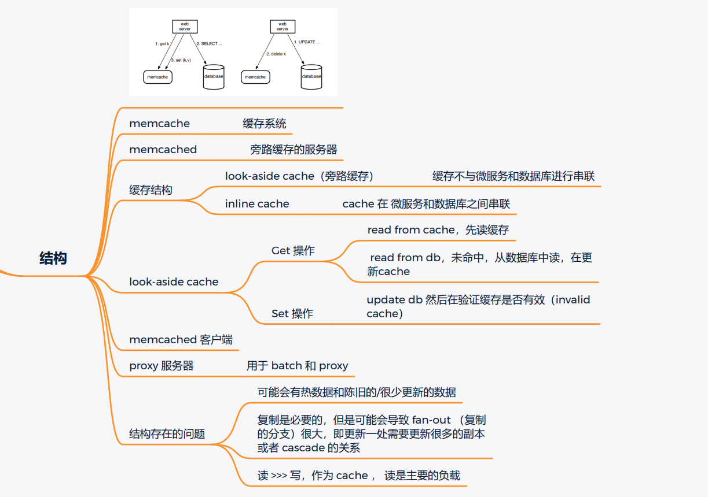

# 小吴修仙传之生产环境篇

# Redis 篇

## 缓存一致性

### 解决方案

1. ==缓存失效==：**更新**数据库时，使缓存失效。保证**最终一致性**，但是失效的时候会产生**数据不一致**的情况。（最终一致，存在不一致空挡）（应用场景，保证数据最终一直，对短暂的不一致可以容忍）
2. ==缓存更新==：**更新**数据库时，同时更新缓存。保证**强一致性**，但是代码更加复杂，系统负载更高。（强一致，高负载）（应用场景，需要强一致实时更新的场景）
3. ==异步更新==：**更新**数据库时，异步更新缓存。保证系统可用性和性能（异步），同样会导致短暂的数据不一致（最终一致，低负载，高性能）（应用场景，需要**高性能系统**，同时对短暂不一致可以容忍）

### 实践方案

1. 选择合理缓存失效时间（被动更新）：业务不需要实时性，设置缓存失效，**定期**从数据库更新缓存
2. 使用分布式锁：数据库缓存更新时，使用分布式锁（获取锁，检查缓存，获取数据库数据，更新缓存，释放分布式锁）避免并发导致的数据不一致
3. 定期同步缓存和数据库（主动更新）
4. 采用合理的缓存策略（缓存失效、缓存更新、异步更新等）
5. 使用分布式事务：在进行数据库和缓存的更新操作时，使用分布式事务来保证数据的一致性和可靠性
6. 监控和警告：对 redis 缓存系统进行监控和警告

### 缓存一致模型

#### Memcached（旁路缓存）



## 业务场景

### 1 统计访问次数

* 为访问次数设置 `key`
* 单次 +1：通过 `incr` 命令单次 +1 `incr key`
* 单次 +n：通过 `incrby` 命令单词 +n `incrby key n`

### 2 获取分类树（缓存）

**分类树**：网页的多级结构，需要通过访问多个库表拼接获取（相当于**目录**）

* 直接保存成字符串的格式即可 `key_value`
* 但是 `key` 的数据特别多，可能会出现 **大 Key** 的情况

### 3 分布式锁

### 4 做排行榜

* 使用 `sort set` 类型，存储排行榜的 `Name` 和 `Score` 数据
* 使用 `ZADD` 添加排行榜数据
* 使用 `ZRANGE` 获取排行榜的数据

```
ZADD rank:score 100 "fisrt"
ZADD rank:score 90 "second"
ZRANGE rank:socre 0 -1 WITHSCORES
```

* 集合类型（key:value）
* 插入数据（setName  key:value）
* 通过 `ZRANGE setName beginIndex endIndex options`（`WITHSCORES` 同时返回**成员**和**对应分数**）

### 5 记录用户登录状态

* 用户登录状态查询
* 访问时直接访问 `Redis` 查找对应用户的登陆状态（可以设置**失效时间**，来应对登陆状态失效）
  * 存在 `string`，则已登录
  * 不存在，则未登录

### 6 限流（nginx 同样可以做到）

**限流**：每个 ip 每分钟可以访问的次数做限制

* key 作为用户信息，value 记录次数
* 同时要设置过期时间
  * 设置过期时间清零数据
  * 每次未过期时，如果访问，**重置**过期时间

### 7 位统计

**如一周内连续登录**

* 数据类型 `redis` 中的 `bitmap`
  * `bitmap` 是一个二进制的 `byte` 数组
  * 将二进制数据存储到 `byte` 数组中（"01101100"）
* 保存数据的命令：`setbit key offset value`，设置某一位的数值
  * `setbit user:view:2024-01-14 username 1`:设置   `username` 的用户，在`2024-01-14` 设置偏移为 `1`
  * 本质是 `user:view:2024-01-14` 为 `key`，`username` 为偏移量，`1` 为设置的二进制值
* 获取数据：`getbit key offset`
  * `getbit user:view:2024-01-17 username`:获取 `user:view:2024-01-17` 的偏移值（username）

* 连续登录获取方法：遍历用户 `ID` 即可

### 8 缓存加速

* 用作缓存

* 要考虑缓存一直性的问题

* 存在问题：
  * **缓存击穿**：某个**特定缓存**被**频繁的请求**，但是 `key` 在缓存中**不存在**或者**过期**，就需要直接请求后端
  * **雪崩**：大量缓存同时失效
  * **数据一致性**：数据库与缓存的数据不一致
  * **数据过期管理**：缓存策略使用**过期方式**，**同时过期**大量数据，则会降低 `redis` 性能

### 9 消息队列

**PubSub（发布订阅），2.0 引入的消息传递模型**

* 和消息队列模型相同

### 10 生成全局 ID

* 利用 `incrby` 的原子性操作
* 应用场景：**分库分表**的场景，对于**批量操作**，一次性拿出大量数据给业务系统使用

* 原理：使用 `incrby` 对一个特定的 `key` 进行**递增**，同时这些递增的 `value` 是原子操作，获取 `value` 后就是全局唯一的不重复的（一直调用 `incrby` 获取数据）
