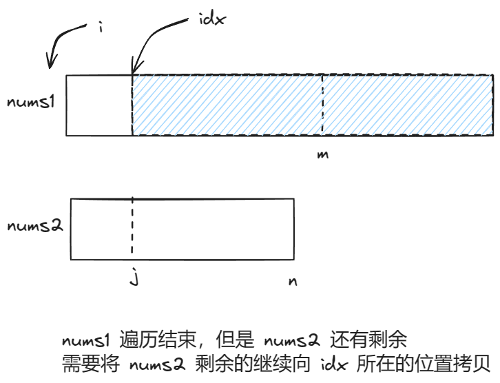
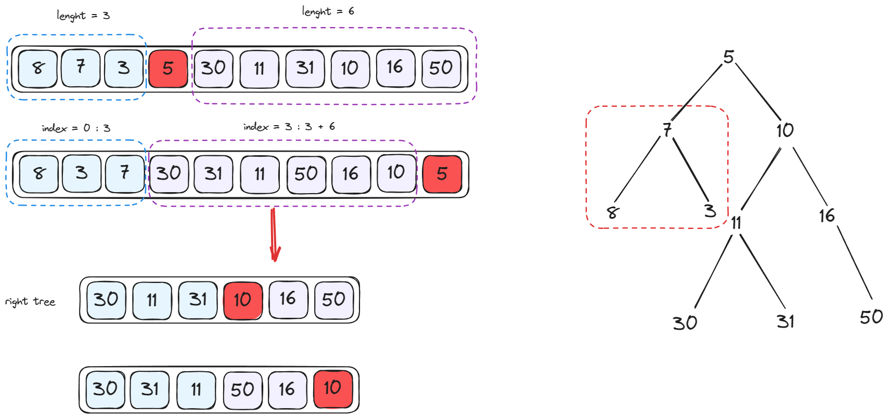
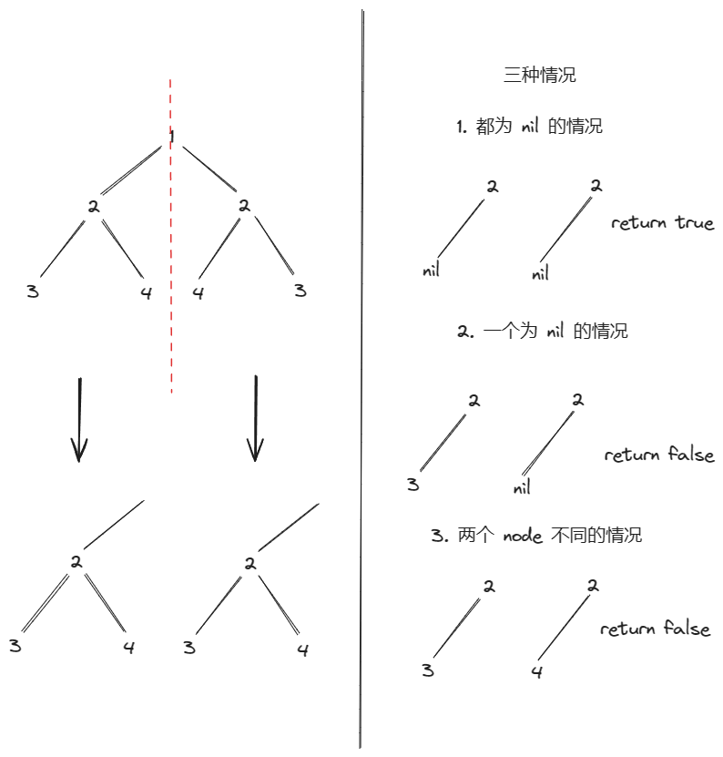
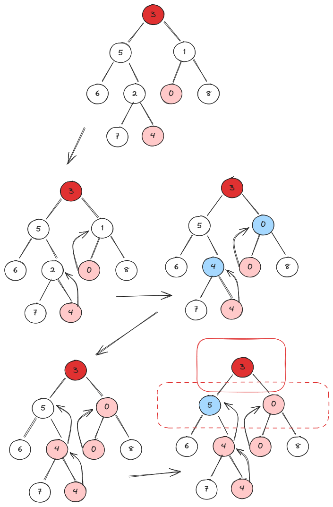
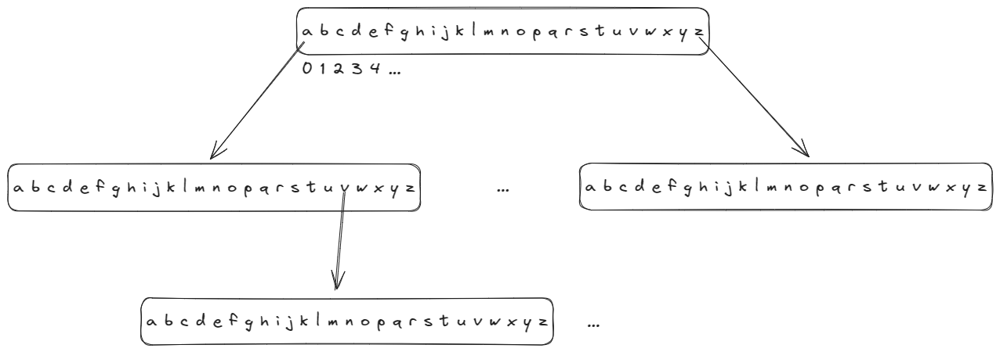

# 小吴修仙传之算法篇

# 数组/字符串

## 合并两个有序数组

[88. 合并两个有序数组](https://leetcode.cn/problems/merge-sorted-array/)

### 1 利用 sort 函数（快排，不推荐）

1. 将数组2的数据**合并**到数组1

2. 使用 sort 函数对数组1进行**排序**

   * C++使用的是 `sort` 函数：`sort(nums1.begin(), nums1.end());`

   * Golang使用的是 `sort.Slice` 函数：`sort.Slice(nums1, func(i, j int){ return nums1[i] < nums2[j]})`

### 2 双指针，使用辅助空间（空间复杂度 O(m+n)）

1. 构建一个 `m + n` 的辅助空间
2. 利用双指针，比较 `nums1` 与 `nums2`，放到辅助空间中
3. 最后将辅助空间的数组拷贝到 `nums1` 中

### 3 逆向双指针（空间复杂度 O(1)，推荐）

**利用 nums1 中的数组尾部为空可以作为暂存的辅助空间来进行排序，先排最大的，放到辅助空间**

1. 实际是三指针

   * `nums1` 的逆向下表存储的指针（idx）：用来标记当前存放元素的位置
   * `nums1` 的数组实际下表指针（i）：用来标记比较到的位置
   * `nums2` 的数组实际下表指针（j）：用来标记比较到的位置

2. 需要考虑两种情况

   （1）`nums2` 遍历结束，`nums1` 遍历没结束（使用 `nums2` 数组的下表判断是否超出范围，超出范围直接结束，因为 `nums2` 排完序之后，`nums1` 就不需要排序了）

   

   （2）nums1 遍历结束，但是 nums2 遍历没结束，即 nums1 的下表超出范围

   

   3. 从两个数组的最后向前遍历，同时移动 `idx` 指针

   ```go
   func merge(nums1 []int, m int, nums2 []int, n int)  {
       idx, i, j := m + n - 1, m - 1, n - 1
       for ; idx >= 0 && j >= 0; idx-- {
           if i < 0 && j >= 0 {
               nums1[idx] = nums2[j]
               j--
               continue
           }
           if nums1[i] >= nums2[j] {
               nums1[idx] = nums1[i]
               i--
           } else {
               nums1[idx] = nums2[j]
               j--
           }
       }
   }
   ```

## 删除有序数组中的重复项 Ⅱ

[80. 删除有序数组中的重复项 II](https://leetcode.cn/problems/remove-duplicates-from-sorted-array-ii/)

使用快慢指针：重复项，一般都需要前驱标志位来比较是否重复，重复次数，一般需要计数标志位

1. 快慢指针：快指针用来遍历数组，慢指针用来标记新数组（下一个可以放置符合条件元素的位置）
2. 前驱标志位：用来记录上一个元素的值，用来比较快指针遍历到的元素是否与上一个元素重复
3. 计数标志位：用来记录与前驱标志位重复的次数

需要判断的三种情况：

1. 重复且不超过两次的情况：不超过两次都是符合题意，使用这个元素构建新数组
2. 重复且超过两次的情况：直接跳过这个元素
3. 不相等的情况：需要同时修改前驱标志位，计数标志位，同时使用这个元素构建新数组

```go
func removeDuplicates(nums []int) int {
    count := 1
    pre := nums[0]
    left, right := 1, 1

    for ; right < len(nums); right++ {
        // 相等的情况，重复不超过两次，增加计数
        if nums[right] == pre && count < 2 {
            nums[left] = pre
            left++
            count++
        } else if nums[right] == pre && count >= 2 {   // 相等的情况，重复超过了两次，增加技术，只修改右指针
            count++
        } else {     // 不相等的情况，需要 增加计数，修改左指针，以及 pre
            nums[left] = nums[right]
            left++
            pre = nums[right]
            count = 1
        }
    }
    return left
}
```

## 最后一个单词的长度

[58. 最后一个单词的长度](https://leetcode.cn/problems/length-of-last-word/)

直接通过 `" "` 切分字符串，然后判断最后一个

* golang 的 `Split` 切分后要考虑  `""` 的存在


# 双指针

## 判断子序列

[392. 判断子序列](https://leetcode.cn/problems/is-subsequence/)

双指针，直接顺序判断另一个数组中，是否按序出现子序列的所有字符

**注意**：s 长度为 0 的情况，需要判断

## 两数之和Ⅱ - 输入有序数组

[167. 两数之和 II - 输入有序数组](https://leetcode.cn/problems/two-sum-ii-input-array-is-sorted/)

双指针，从数组两端求和，向中间靠拢

* 当和大于 `target`，则右指针移动，减小 `sum`
* 当和小于 `target`，则左指针移动，增加 `sum`

## 验证回文串

[125. 验证回文串](https://leetcode.cn/problems/valid-palindrome/)

双指针，从中间向两端扩散

* 字符串大小写字母转换：通过 byte 计算 `'C' - 'A' `
  * golang 中 `strings.ToLower` 用来转换大小写
  * C++ 中 `tolower` 来转换大小写
  * C++ 中 `isalnum` 来判断是否是字母和数字
* 双指针扩散，中间位置定位（len(str)%2 是否等于 1， 偶数两个不同，奇数两个相同）

反转字符串，判断是否相等


# 滑动窗口


# 矩阵


# 哈希表

## 单词规律

[290. 单词规律](https://leetcode.cn/problems/word-pattern/)

使用哈希表记录模式对应的单词，验证存在的模式是否单词也对应

* 要注意模式与单词长度是否对应
* 要注意不同模式的单词一定不同


# 区间


# 栈

## 简化路径

[71. 简化路径](https://leetcode.cn/problems/simplify-path/)

将路径节点根据条件出栈入栈

注意：C++ 需要自己实现 `split`，因此要注意最后一个节点不能通过 `'/'` 去判断的情况

Golang 要注意一个问题，使用 `Split` 之后，会切分出 `""` 的情况，所以需要判断


# 链表


# 二叉树

## 从中序与后序遍历序列构造二叉树 

[106. 从中序与后序遍历序列构造二叉树](https://leetcode.cn/problems/construct-binary-tree-from-inorder-and-postorder-traversal/)

先找根节点

* 后序遍历的最后一个节点，就是根节点

再根据根节点拆分左右子树

* 通过后续遍历找到的根节点去找中序遍历的根节点所在，中序遍历根节点的左右两侧就是左右子树
* 后续遍历的左右子树划分的方法
  * 中序遍历的左右子树的长度，与后序遍历的左右子树长度相等
  * 后续遍历的最前面就是左子树，后续遍历选完左子树，剩下的就是右子树，通过中序遍历的长度去选



```go
/**
 * Definition for a binary tree node.
 * type TreeNode struct {
 *     Val int
 *     Left *TreeNode
 *     Right *TreeNode
 * }
 */
func buildTree(inorder []int, postorder []int) *TreeNode {
    if len(inorder) == 0 {
        return nil
    }

    // 后续遍历的最后一个是根节点
    // 中序遍历的这个节点左边是左子树，右边是右子树
    
    // TODO: 找根节点
    n := len(postorder) - 1
    root := postorder[n]

    // TODO: 构建根节点
    rootNode := &TreeNode{
        Val: root,
    }

    // TODO: 找 inorder 的左右子树
    var tempInorderLeft []int
    var tempPostorderLeft []int
    var tempInorderRight []int
    var tempPostorderRight []int
    for idx, node := range inorder {
        // 暂存左子树
        if node == root && idx - 1 >= 0 {
            tempInorderLeft = inorder[0: idx]
            tempPostorderLeft = postorder[0: len(tempInorderLeft)]
        }
        // 暂存右子树
        if node == root && idx + 1 < len(inorder) {
            tempInorderRight = inorder[idx+1:]
            tempPostorderRight = postorder[len(tempInorderLeft): len(tempInorderLeft)+len(tempInorderRight)]

        }
    } 

    // TODO: 找 postorder 的左右子树, 不用找，直接算
    // Q: 不能选 0 怎么办
    rootNode.Left = buildTree(tempInorderLeft, tempPostorderLeft)
    rootNode.Right = buildTree(tempInorderRight, tempPostorderRight)
    return rootNode
}
```

## 对称二叉树

[101. 对称二叉树](https://leetcode.cn/problems/symmetric-tree/)

镜像问题，通过将对称的部分反转来对比即可



## 二叉树的最近公共祖先

[236. 二叉树的最近公共祖先](https://leetcode.cn/problems/lowest-common-ancestor-of-a-binary-tree/)

使用后序遍历，最后判断当前节点的左右子树是否存在于给定两个节点相等的节点。

* 退出条件：当前节点（root）到叶子节点下了（nil），或者当前节点等于给定节点之一

相当于一个左右子树**节点上浮**的操作



```go
/**
 * Definition for a binary tree node.
 * type TreeNode struct {
 *     Val int
 *     Left *TreeNode
 *     Right *TreeNode
 * }
 */
 func lowestCommonAncestor(root, p, q *TreeNode) *TreeNode {
    if root == nil || root == q || root == p {
        return root
    }

    left := lowestCommonAncestor(root->Left, p, q)
    right := lowestCommonAncestor(root->Right, p, q)
	
     // 后序遍历，到最下层的叶子节点，然后进行节点上浮
    if right != nil && left != nil {
        return root
    } else if left != nil {
        return left
    } else {
        return right
    }
}
```


# 二叉树层序遍历

## 二叉树的层平均值

[637. 二叉树的层平均值](https://leetcode.cn/problems/average-of-levels-in-binary-tree/)

使用队列来遍历每一层

* 需要记录上一层的数量，用来进出队列遍历每一层
* golang 封装一个 `slice` 的结构体来实现队列


# 二叉搜索树


# 图


# 图的广度优先搜索


# 字典树

## 实现Trie（前缀树）

[208. 实现 Trie (前缀树)](https://leetcode.cn/problems/implement-trie-prefix-tree/)

树节点结构体：

（1）isEnd：用来表示每个单词的结尾

（2）[26]*Trie：用来作为字符的节点

实现思路：由于全是小写字母，所以将字符串拆分成单个字母，`T rie` 节点用来存储字母。通过字母对应的数组下标来遍历这棵树

* 每个 `Trie` 节点有一个存储下一个字符节点的数组
* 数组有长度对应着字母，下标对应字母（a-a，为 0 下标），a-0，b-1，c-2
* 注意，`Constructor` 构建的 `Trie` 根，需要通过这个 `Trie` 根来访问 `Trie` 字符节点



```go
type Trie struct {
    isEnd bool
    root [26]*Trie
}


func Constructor() Trie {
    return Trie{
        isEnd: false,
        root: [26]*Trie{},
    }
}


func (this *Trie) Insert(word string)  {
    byteWord := []byte(word)
    var tempNode *Trie
    if this.root[byteWord[0]-'a'] == nil {
        this.root[byteWord[0]-'a'] = &Trie{
            isEnd: false,
            root: [26]*Trie{},
        }
    }
    // 遍历每个节点
    for i := 0; i < len(byteWord); i++ {
        // 判断第一个节点，因为需要从根节点获取节点信息
        if i == 0 {
            tempNode = this.root[byteWord[i]-'a']
            continue
        }

        // tempNode 是上一个节点，判断上个节点能否为当前 char 提供节点来存储
        if tempNode.root[byteWord[i]-'a'] == nil {
            tempNode.root[byteWord[i]-'a'] = &Trie{
                isEnd: false,
                root: [26]*Trie{},
            }
        }

        // 更新节点
        tempNode = tempNode.root[byteWord[i]-'a']
    }

    // 最后一个节点
    tempNode.isEnd = true
}


func (this *Trie) Search(word string) bool {
    // 同上
    byteWord := []byte(word)
    var tempNode *Trie

    // 提前判断
    if this.root[byteWord[0]-'a'] == nil {
        return false
    }

    // 遍历每个节点
    for i := 0; i < len(byteWord); i++ {
        // 判断第一个节点，因为需要从根节点获取节点信息
        if i == 0 {
            tempNode = this.root[byteWord[i]-'a']
            continue
        }

        if tempNode.root[byteWord[i]-'a'] == nil {
            return false
        }
        // 更新节点
        tempNode = tempNode.root[byteWord[i]-'a']
    }

    // 最后一个节点
    if !tempNode.isEnd {
        return false
    }
    return true

}


func (this *Trie) StartsWith(prefix string) bool {
        // 同上
    byteWord := []byte(prefix)
    var tempNode *Trie

    // 提前判断
    if this.root[byteWord[0]-'a'] == nil {
        return false
    }

    // 遍历每个节点
    for i := 0; i < len(byteWord); i++ {
        // 判断第一个节点，因为需要从根节点获取节点信息
        if i == 0 {
            tempNode = this.root[byteWord[i]-'a']
            continue
        }

        if tempNode.root[byteWord[i]-'a'] == nil {
            return false
        }
        // 更新节点
        tempNode = tempNode.root[byteWord[i]-'a']
    }

    return true
}
```


# 回溯


# 分治


# Kadane算法


# 二分查找


# 堆


# 位运算


# 数学


# 一维动态规划


#  多维动态规划


