#  小吴修仙传之编程语言篇

# Golang篇

## 练气期

### 数据结构

#### 数组

##### 1 数组的结构体

```go
type Array struct {
	len  int64
	elem Type
}

func NewArray(elem Type, len int64) *Array { return &Array{len: len, elem: elem} }
```

* 编译期间通过 `NewArray` 生成

##### 2 两种声明的方法

* 显示指定大小：`arr := [10]int{1, 2, 3}`
* 编译期间推到数组大小：`arr := [...]int{1, 2, 3}`

**注**：当元素数量**超过四个**的时候，会先从静态存储去初始化数组中的元素，再将静态存储区的数组赋值给数组（在静态存储区初始化，然后拷贝到栈中。**因此，小的数组通常都是初始化在栈中**）

```go
// 不超过四个的初始化方法
var arr [3]int
arr[0] = 1
arr[1] = 2
arr[2] = 3
// 超过四个的初始化方法，statictmp_0 唯一
var arr [5]int
statictmp_0[0] = 1
statictmp_0[1] = 2
statictmp_0[2] = 3
statictmp_0[3] = 4
statictmp_0[4] = 5
arr = statictmp_0
```

##### 3 访问方法

**数组三个必须的元素**

1. 指向数组开头的指针：用来访问数组
2. 元素的数量：用来确定指针移动的边界
3. 元素类型所占的空间大小：用来确定指针移动多少字节

**数组在编译期间的静态类型检测会判断数组越界**

* 访问非整数
* 访问小于 0 
* 访问超过数组的长度

#### 切片

##### 1 数据结构

```go
type Slice struct {
	elem Type
}

func NewSlice(elem Type) *Slice { return &Slice{elem: elem} }

// 运行时切片的类型
type SliceHeader struct {
	Data uintptr
	Len  int
	Cap  int
}
```

* 编译期间生成**只含有元素类型**的 `slice`
* `SliceHeader`
  * `Data`： 指向数组的指针（连续的内存空间）
  * `Len`： 切片的长度
  * `Cap`： 当前切片的容量

##### 2 声明方法

* 因为**长度可变**，所以声明的时候**不显示定义长度**

* `[]interface, []int`

* **三种**初始化的方法：
  * 通过下标的方式获取（数组和切片都能进行初始化）：`arr[0:3] or slice[0:3]`（先创建一个数组，**会占用更多的内存**）
  
    * 不会拷贝原数组或者原切片中的数据
    * 创建一个**指向**元素组的切片结构体（data 指向的是原数组的地址）
    * 修改切片**同时修改**原数组或者切片
  
  * 通过字面量初始化：`slice := []int{1, 2, 3}`（创建数组存储元素，然后创建数组指针进行初始化，在通过赋值进行下标获取，**多消耗一个存储数组的空间**）
  
    * 根据元素数量推断底层数组的大小，创建一个数组 ，`var stat [3]int`
    * 将字面常量存储到数组中，`vstat[0] = 1, vstat[1] = 2, vstat[2] = 3`
    * 创建一个指向推断出数量的数组指针（[3]int）,`var Vauto *[3]int`
    * 将静态存储区的数组（上面创建的数组）的地址赋值给数组指针，`*vauto = vstat`
    * 通过下标的方式获指针对应的切片，`slice := vauto[:]`
  
  * 通过 `make` 关键字：`slice := make([]int, 10)`（会使用类型的零值进行**初始化**）
  
    * 首先要进行两次检测（make 运行时）
      * 切片的大小和容量是否足够小（大的话要在**堆**上进行初始化）
      * 切片是否发生逃逸，最终在堆上初始化
  
    * 申请内存：元素大小 * 切片容量
    * 返回指向底层数组的指针

**注**：range 操作是在**编译的时候**进行展开的，所以在**运行时**，动态修改 slice **不会**对 range 有影响

##### 3 append 方法

* 两种 `append` 的使用方法

  * 直接使用 append 的情况（`append(slice, 1, 2, 3)`）：会进行切片扩容，**复用**原本的数组内存地址，修改 `len、cap` 的长度

    ```go
    // append(slice, 1, 2, 3)
    ptr, len, cap := slice
    newlen := len + 3
    if newlen > cap {
        ptr, len, cap = growslice(slice, newlen)
        newlen = len + 3
    }
    *(ptr+len) = 1
    *(ptr+len+1) = 2
    *(ptr+len+2) = 3
    return makeslice(ptr, newlen, cap)
    ```

  * 使用赋值语句（`slice = append(slice, 1, 2, 3)`）：会覆盖原切片，需要扩容的时候，会创建一个新的地址，将原地址修改（不用担心切片发生拷贝影响性能）

    ```go
    // slice = append(slice, 1, 2, 3)
    a := &slice
    ptr, len, cap := slice
    newlen := len + 3
    if uint(newlen) > uint(cap) {
       newptr, len, newcap = growslice(slice, newlen)
       vardef(a)
       *a.cap = newcap
       *a.ptr = newptr
    }
    newlen = len + 3
    *a.len = newlen
    *(ptr+len) = 1
    *(ptr+len+1) = 2
    *(ptr+len+2) = 3

* 扩容

  1. 如果期望容量大于当前容量的两倍就会使用期望容量；
  2. 如果当前切片的长度小于 1024 就会将容量翻倍；
  3. 如果当前切片的长度大于 1024 就会每次增加 25% 的容量，直到新容量大于期望容量；

##### 4 copy 方法

* 使用 `memmove` 对内存进行拷贝
* 两种 copy 方法
  * 编译时
  * 运行时

* 大切片拷贝影响性能

#### 哈希表

##### 1 哈希表冲突解决

* 开放寻址法
* 拉链法
  * 装载因子：元素数量 / 桶的数量
    * 装载因子越高，性能越差

##### 2 数据结构

```go
// A header for a Go map.
type hmap struct {
	// Note: the format of the hmap is also encoded in cmd/compile/internal/reflectdata/reflect.go.
	// Make sure this stays in sync with the compiler's definition.
	count     int // # live cells == size of map.  Must be first (used by len() builtin)
	flags     uint8
	B         uint8  // log_2 of # of buckets (can hold up to loadFactor * 2^B items)
	noverflow uint16 // approximate number of overflow buckets; see incrnoverflow for details
	hash0     uint32 // hash seed

	buckets    unsafe.Pointer // array of 2^B Buckets. may be nil if count==0.
	oldbuckets unsafe.Pointer // previous bucket array of half the size, non-nil only when growing
	nevacuate  uintptr        // progress counter for evacuation (buckets less than this have been evacuated)

	extra *mapextra // optional fields
}

// mapextra holds fields that are not present on all maps.
type mapextra struct {
	overflow    *[]*bmap
	oldoverflow *[]*bmap

	// nextOverflow holds a pointer to a free overflow bucket.
	nextOverflow *bmap
}
```

1. `count` 表示当前哈希表中元素的数量
2. `B` 表示当前哈希表持有的 `buckets` 数量，但是因为哈希表中桶的数量都是 2 的倍数，所以该字段会存储对数 `len(buckets) == 2^B`
3. `hash0` 是哈希的种子，它能为**哈希函数的结果引入随机性**，这个值在**创建哈希表时确定**，并在调用哈希函数时作为**参数**传入
4. `oldbuckets` 是哈希在扩容时用于保存之前 `buckets` 的字段，它的大小是当前 `buckets` 的一半，**即旧的 buckets 指针被保留**

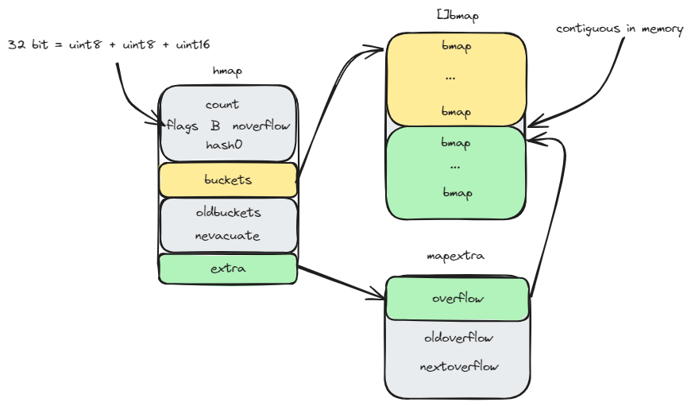

* `bmap` 能存储 8 个键值对，**单个桶装满**时会使用 `nextoverflow` 中桶存储溢出的数据
* 两种不同颜色的桶（黄色：正常桶和绿色：溢出桶）在内存中是连续的，

```go
type bmap struct {
	tophash [bucketCnt]uint8
}
```

* `bmap` 中 `tophash` 存储了键的哈希值的**高 8 位**，通过比较不同键的哈希高 8 位，来减少访问键值对次数来**提高性能**

* 哈希表中可能存储**不同类型**的键值对，而且 Go 语言也不支持泛型，所以键值对占据的内存空间大小只能在编译时进行推导，在编译期间的 `bmap` 通过 `gc.bmap` 进行**重建**

  ```go
  type bmap struct {
      topbits  [8]uint8
      keys     [8]keytype
      values   [8]valuetype
      pad      uintptr
      overflow uintptr
  }
  ```

##### 3 初始化

* 字面量初始化 `hash := map[string]int { "1": 2, "2": 2}`

  * 当哈希表中的元素**少于等于** 25 个的时候，回使用赋值进行初始化。

    ```go
    hash := make(map[string]int, 3)
    hash["1"] = 2
    hash["3"] = 4
    hash["5"] = 6
    ```

  * 哈希表中元素超过 25 个的时候，编译器会创建**两个数组**分别存储键和值（会使用**额外的存储空间**）

    ```go
    hash := make(map[string]int, 26)
    vstatk := []string{"1", "2", "3", ... ， "26"}
    vstatv := []int{1, 2, 3, ... , 26}
    for i := 0; i < len(vstak); i++ {
        hash[vstatk[i]] = vstatv[i]
    }
    ```


##### 4 读写操作

* **访问**的两种方式（先通过哈希值找到目录中对应的桶，再通过哈希值的高八位与桶的 `tophash` 进行比较）
  * `val := hash["key"]`
  * `val, ok := hash["key"]`  多了一个判断元素是否存在
* **写入** `hash["key"] = value`
* **扩容** 
  * 装载因子已经超过6.5
  * 哈希使用了太多的溢出桶
* **删除** `delete(hashTable, "key")`

##### 5 无序

* go 语言每次遍历的时候会提前取出一个**随机数**，把**桶**的**遍历**顺序**随机化**（mapiterinit 方法）

#### 字符串

##### 1 数据结构

* go 中字符串是**只读**的类型，但是是一个**连续的内存空间**
  * 如果想要**修改**字符串，可以通过转换成 `[]byte` 进行修改
  * 因为是只读类型，**不可变**，所以可以作为 `hash` 的 `key`、

```go
type StringHeader struct {
	Data uintptr
	Len  int
}
```

##### 2 解析过程

* 两种方式
  * `""` 进行初始化
  * `` 进行初始化
* 编译函数处理字符串的逻辑
  * 标准字符串使用双引号表示开头和结尾；
  * 标准字符串需要使用反斜杠 `\` 来逃逸双引号；
  * 标准字符串不能出现如下所示的隐式换行 `\n`；

### 常用关键字

#### make 和 new

**功能**

* `make` 用来初始化内置数据结构（切片、哈希表、channel）
* `new` 根据传入类型**分配**一片**内存空间**并**返回**指向这片内存空间的**指针**

**使用方法**

* `make` 有**两种**使用方法，主要针对 `slice` 的特性（cap）

  * `slice := make([]int, 0, 100)`，0 表示初始长度，100 表示容量
  * `slice := make([]int, 10)`，表示长度为 10，同时容量 = 长度

  * 对其他的都是**只有容量（buffer and bucket）**

* `new` 只需要**类型**

**原理**

* `make` 会调用**运行时函数**去初始化**数据结构**
* `new` 根据申请的**内存大小**由两种情况
  * 如果申请的空间为 0 会返回一个表示**空指针**的 `zerobase` 变量
  * 其他情况会将关键字转换成 `newobject` 函数，返回一个**零值内存空间**的地址

## 筑基

### Channel 原理

**Channel用来goroutine之间通信，goroutine之间不需要过多关注通信的交互，只需要将数据交给Channel进行处理。支持高并发，内部加锁，通过陷入阻塞来提高性能**

**文件位置：runtime 包下的 chan.go**

#### 1 Channel 数据结构

##### 1.1 Channel 基础

**两种构造方法：无缓、有缓** 

```go
ch := make(chan int)   // 无缓冲
ch := make(chan int, 10) // 有缓冲
```

**注**：只声明的 `chan`（var ch chan int） 不能直接使用，因为声明的 `chan` 是 `nil`。

**读取：有缓读、无缓读**

* 读取的两种方式
  * 直接读取：`val := <- ch`
  * 验证读取：`val, ok := <- ch`，`ok` 是用来判断是否有数据读出，这种读取可以作为**非阻塞**的方式
    * 读取的 `chan` 关闭，同时其中没有元素的时候，会返回 `false`
    * 读取的 `chan` 关闭了，但是其中有元素，返回 `true`
    * 实际理解：能读出来东西，就是 `true`
  * 注：关闭 `chan` 的时候，需要通过**验证读取**的方式进行获取元素（通过 `ok` 判断是否继续读），因为即便是关闭的 `chan`，其中没有元素，`val` 也能**被读出**，不过是类型的**零值**

* **有缓读**的两种情况
  * 缓冲区有元素：直接读取
  * 缓冲区无元素：陷入阻塞
* **无缓读**：双方**同步读写**，否则双方都陷入阻塞

**写入：有缓写、无缓写**

* **有缓写**的两种情况
  * 缓冲区未满：直接写入
  * 缓冲区已满：写入方陷入阻塞
* **无缓写**：双方**同步读写**，否则双方都陷入阻塞

**关闭**

* 使用 `close` 进行关闭，但是关闭的 `chan` 需要到程序结束才会回收（程序还在执行的时候仍旧能使用直接读取**进行读**，但是**不能写（发生 panic）**）

##### 1.2 核心数据结构

```go
type hchan struct {
	qcount   uint           // total data in the queue
	dataqsiz uint           // size of the circular queue
	buf      unsafe.Pointer // points to an array of dataqsiz elements
	elemsize uint16
	closed   uint32
	elemtype *_type // element type
	sendx    uint   // send index
	recvx    uint   // receive index
	recvq    waitq  // list of recv waiters
	sendq    waitq  // list of send waiters

	// lock protects all fields in hchan, as well as several
	// fields in sudogs blocked on this channel.
	//
	// Do not change another G's status while holding this lock
	// (in particular, do not ready a G), as this can deadlock
	// with stack shrinking.
	lock mutex
}
```

**元素存储**

* **队列（先进先出）**：通过**环形数组**进行存储数据
  * 通过 `dataqsize` 来标记**环形数组**的**长度**
  * 通过 `qcount` 标记**环形数组**内的**元素个数**
  * `buf` 就是实际的**环形数组** 
  * `elemsize` 标记**元素的大小**，用来申请内存（buf），通过地址（与 C++ 不同，需要对 `Pointer` 进行转换才能进行地址运算）进行访问
  * `elemtype` 标记**元素的类型**
  * 尾：通过 `sendx` 来标记写入元素的 `index`，以此来操作环形数组实现队列的效果
  * 首：通过 `recvx` 来标记接收元素的 `index`，以此来操作环形数组实现队列的效果
* 环形数组的实现：
  * 首尾 `index`，通过取模（dataqsize）运算，来使用**一维数组**模拟**环形数组**

**chan 状态**

* `closed` 标记 `chan` 是否关闭

**读写 goroutine 标记**

* 通过 `recvq` 来标记（链式）阻塞的读 `goroutine`
* 通过 `sendq` 来标记（链式）阻塞的写 `goroutine`

* `recvq、sendq` 实现

  ```go
  type waitq struct {
  	first *sudog
  	last  *sudog
  }
  
  type sudog struct {
  	// The following fields are protected by the hchan.lock of the
  	// channel this sudog is blocking on. shrinkstack depends on
  	// this for sudogs involved in channel ops.
  
  	g *g
  
  	next *sudog
  	prev *sudog
  	elem unsafe.Pointer // data element (may point to stack)
  
  	// The following fields are never accessed concurrently.
  	// For channels, waitlink is only accessed by g.
  	// For semaphores, all fields (including the ones above)
  	// are only accessed when holding a semaRoot lock.
  
  	acquiretime int64
  	releasetime int64
  	ticket      uint32
  
  	// isSelect indicates g is participating in a select, so
  	// g.selectDone must be CAS'd to win the wake-up race.
  	isSelect bool
  
  	// success indicates whether communication over channel c
  	// succeeded. It is true if the goroutine was awoken because a
  	// value was delivered over channel c, and false if awoken
  	// because c was closed.
  	success bool
  
  	parent   *sudog // semaRoot binary tree
  	waitlink *sudog // g.waiting list or semaRoot
  	waittail *sudog // semaRoot
  	c        *hchan // channel
  }
  ```

  * `waitq` 构成的阻塞 `goroutine` 的**链表首尾节点** 
  * `sudog` 存储了每个阻塞的 `goroutine`，同时构成了一个指向前后阻塞 `goroutine` 的**双向链表**
    * **每个** `sudog`  **对应**一个阻塞的 `goroutine`
  * `isSelect` 判断 `chan` 是否处于一个**多路复用**的模式下，对应 `select` 的非阻塞模式（default）
  * `c` 标记当前`goroutine` 对应的 `chan` 

**并发**

* 通过自带的 `lock` 来**加锁**实现并发

#### 2 Channel 构造

```go
func makechan64(t *chantype, size int64) *hchan {
	if int64(int(size)) != size {
		panic(plainError("makechan: size out of range"))
	}

	return makechan(t, int(size))
}

func makechan(t *chantype, size int) *hchan {
    elem := t.Elem

    // compiler checks this but be safe.
    if elem.Size_ >= 1<<16 {
       throw("makechan: invalid channel element type")
    }
    if hchanSize%maxAlign != 0 || elem.Align_ > maxAlign {
       throw("makechan: bad alignment")
    }

    // 判断是否超过可申请内存的上限
    mem, overflow := math.MulUintptr(elem.Size_, uintptr(size))
    if overflow || mem > maxAlloc-hchanSize || size < 0 {
       panic(plainError("makechan: size out of range"))
    }

    // Hchan does not contain pointers interesting for GC when elements stored in buf do not contain pointers.
    // buf points into the same allocation, elemtype is persistent.
    // SudoG's are referenced from their owning thread so they can't be collected.
    // TODO(dvyukov,rlh): Rethink when collector can move allocated objects.
    var c *hchan
    switch {
    // 无缓分配或者元素类型大小为 0， hchanSize（hchanSize = unsafe.Sizeof(hchan{}) + uintptr(-int(unsafe.Sizeof(hchan{}))&(maxAlign-1))） 固定值，96 byte
    case mem == 0:
       // Queue or element size is zero.
       c = (*hchan)(mallocgc(hchanSize, nil, true))
       // Race detector uses this location for synchronization.
       c.buf = c.raceaddr()
    // 结构体的情况，分配 hchanSize + mem（内存大小）
    case elem.PtrBytes == 0:
       // Elements do not contain pointers.
       // Allocate hchan and buf in one call.
       c = (*hchan)(mallocgc(hchanSize+mem, nil, true))
       // buf 进行地址偏移
       c.buf = add(unsafe.Pointer(c), hchanSize)
    // 指针的类型
    default:
       // Elements contain pointers.
       // new 内部会调用 mallocgc
       c = new(hchan)
       // 两次调用 mallocgc，导致内存的碎片化，非连续
       c.buf = mallocgc(mem, elem, true)
    }

    c.elemsize = uint16(elem.Size_)
    c.elemtype = elem
    c.dataqsiz = uint(size)
    lockInit(&c.lock, lockRankHchan)

    if debugChan {
       print("makechan: chan=", c, "; elemsize=", elem.Size_, "; dataqsiz=", size, "\n")
    }
    return c
}
```

##### 2.1 无缓冲型 channel

* 使用 `mallocgc` 分配默认大小的内存（hchanSize，96 byte）

##### 2.2 有缓冲型 channel

**struct 类型 channel**

* 分配**连续**的内存空间（hchanSize + 存储元素的数组需要的内存大小）
* 缓冲区在申请内存之后，进行**偏移**（hchanSize 大小的内存是 hchan 结构体中字段所需要的容量）

**pointer 类型 channel**

* 使用 `new` 进行申请 `hchan` 的内存空间
* 缓冲再次使用 `mallocgc` 来进行申请，因为是存储指针，所以不需要连续的内存空间（`new` 中也会使用 `mallocgc`，因此两次申请的内存是碎片化的）

#### 3 读写流程

##### 3.1 写流程

```go
func chansend1(c *hchan, elem unsafe.Pointer) {
	chansend(c, elem, true, getcallerpc())
}

func chansend(c *hchan, ep unsafe.Pointer, block bool, callerpc uintptr) bool {
	// 1. chan 只是声明的情况
    if c == nil {
		if !block {
			return false
		}
		gopark(nil, nil, waitReasonChanSendNilChan, traceBlockForever, 2)
		throw("unreachable")
	}

	if debugChan {
		print("chansend: chan=", c, "\n")
	}

	if raceenabled {
		racereadpc(c.raceaddr(), callerpc, abi.FuncPCABIInternal(chansend))
	}

	// Fast path: check for failed non-blocking operation without acquiring the lock.
	//
	// After observing that the channel is not closed, we observe that the channel is
	// not ready for sending. Each of these observations is a single word-sized read
	// (first c.closed and second full()).
	// Because a closed channel cannot transition from 'ready for sending' to
	// 'not ready for sending', even if the channel is closed between the two observations,
	// they imply a moment between the two when the channel was both not yet closed
	// and not ready for sending. We behave as if we observed the channel at that moment,
	// and report that the send cannot proceed.
	//
	// It is okay if the reads are reordered here: if we observe that the channel is not
	// ready for sending and then observe that it is not closed, that implies that the
	// channel wasn't closed during the first observation. However, nothing here
	// guarantees forward progress. We rely on the side effects of lock release in
	// chanrecv() and closechan() to update this thread's view of c.closed and full().
	if !block && c.closed == 0 && full(c) {
		return false
	}

	var t0 int64
	if blockprofilerate > 0 {
		t0 = cputicks()
	}
	
    // 要访问临界资源，需要先上锁
	lock(&c.lock)
	
    // 防止写的过程中 chan 被关闭
	if c.closed != 0 {
		unlock(&c.lock)
		panic(plainError("send on closed channel"))
	}

	if sg := c.recvq.dequeue(); sg != nil {
		// Found a waiting receiver. We pass the value we want to send
		// directly to the receiver, bypassing the channel buffer (if any).
		send(c, sg, ep, func() { unlock(&c.lock) }, 3)
		return true
	}

	if c.qcount < c.dataqsiz {
		// Space is available in the channel buffer. Enqueue the element to send.
		qp := chanbuf(c, c.sendx)
		if raceenabled {
			racenotify(c, c.sendx, nil)
		}
		typedmemmove(c.elemtype, qp, ep)
		c.sendx++
		if c.sendx == c.dataqsiz {
			c.sendx = 0
		}
		c.qcount++
		unlock(&c.lock)
		return true
	}
	
    // 非阻塞的情况
	if !block {
		unlock(&c.lock)
		return false
	}

	// Block on the channel. Some receiver will complete our operation for us.
	gp := getg()
	mysg := acquireSudog()
	mysg.releasetime = 0
	if t0 != 0 {
		mysg.releasetime = -1
	}
	// No stack splits between assigning elem and enqueuing mysg
	// on gp.waiting where copystack can find it.
	mysg.elem = ep
	mysg.waitlink = nil
	mysg.g = gp
	mysg.isSelect = false
	mysg.c = c
	gp.waiting = mysg
	gp.param = nil
	c.sendq.enqueue(mysg)
	// Signal to anyone trying to shrink our stack that we're about
	// to park on a channel. The window between when this G's status
	// changes and when we set gp.activeStackChans is not safe for
	// stack shrinking.
	gp.parkingOnChan.Store(true)
	gopark(chanparkcommit, unsafe.Pointer(&c.lock), waitReasonChanSend, traceBlockChanSend, 2)
	// Ensure the value being sent is kept alive until the
	// receiver copies it out. The sudog has a pointer to the
	// stack object, but sudogs aren't considered as roots of the
	// stack tracer.
	KeepAlive(ep)

	// someone woke us up.
	if mysg != gp.waiting {
		throw("G waiting list is corrupted")
	}
	gp.waiting = nil
	gp.activeStackChans = false
	closed := !mysg.success
	gp.param = nil
	if mysg.releasetime > 0 {
		blockevent(mysg.releasetime-t0, 2)
	}
	mysg.c = nil
	releaseSudog(mysg)
	if closed {
		if c.closed == 0 {
			throw("chansend: spurious wakeup")
		}
		panic(plainError("send on closed channel"))
	}
	return true
}
```

**写入过程的大纲**

1. `chan` 是声明的情况
2. `chan` 被关闭的情况
3. `chan` 是无缓或者有阻塞读 `goroutine` 的情况（通过取出的读 `goroutine` 阻塞队列元素为非 `nil` 判断）
4. `chan` 的读阻塞队列为空，缓冲区有空间
5. `chan` 的读阻塞队列为空，缓冲区没有空间

**写入过程图解**

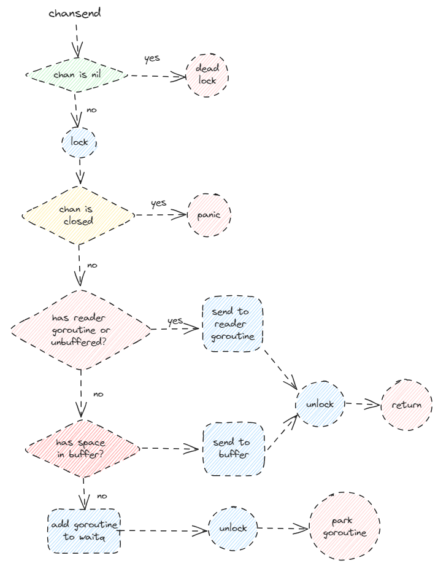

**`chan` 只声明的情况**

```go
if c == nil {
    if !block {
        return false
    }
    // gopark 会陷入异常的被动阻塞
    gopark(nil, nil, waitReasonChanSendNilChan, traceBlockForever, 2)
    throw("unreachable")
}
```

* `gopark` 会使 `goroutine` 陷入异常的**被动阻塞**
* `goroutine` 不会被唤醒（因为 `chan` 是 `nil`） ，所以会**抛出异常**

**`chan` 被关闭的情况**

```go
lock(&c.lock)

if c.closed != 0 {
    unlock(&c.lock)
    panic(plainError("send on closed channel"))
}
```

* 要访问**临界资源**，所以需要**先上锁**
* 然后判断是否是已关闭的 `chan`，已关闭的 `chan` **不能进行写**

**阻塞读队列不为空的情况（包括了无缓冲，和缓冲队列不为空两种情况）**

```go
lock(&c.lock)

// ... 

if sg := c.recvq.dequeue(); sg != nil {
    // Found a waiting receiver. We pass the value we want to send
    // directly to the receiver, bypassing the channel buffer (if any).
    send(c, sg, ep, func() { unlock(&c.lock) }, 3)
    return true
}
```

* 操作流程

  * 加锁
  * 使用 `memmove` 将写 `goroutine` 的内容**直接拷贝**到阻塞的读 `goroutine` 中（链式结构，所以传递给**最开头等待时间最长**的 `goroutine`）
    * 无缓
    * 有缓但有阻塞读 `goroutine` 

  * 解锁

  * 使用 `goready`（与 `gopark` 成对存在） 唤醒读 `goroutine`

**阻塞队列为空，但是缓冲区有空间**

```go
if c.qcount < c.dataqsiz {
    // Space is available in the channel buffer. Enqueue the element to send.
    qp := chanbuf(c, c.sendx)
    if raceenabled {
        racenotify(c, c.sendx, nil)
    }
    typedmemmove(c.elemtype, qp, ep)
    c.sendx++
    if c.sendx == c.dataqsiz {
        c.sendx = 0
    }
    c.qcount++
    unlock(&c.lock)
    return true
}
```

* 先获取要**写入**的位置对应的**指针**
* 使用 `memmove` 来**拷贝元素**
* **修改**用来模拟环形数组的一维数组标志位
  * `sendx` 写下标加一
  * 判断 `send` 是否需要取模
  * `qcount` 元素个数加一

**无阻塞读 `goroutine` 且缓冲区无空间（写 `goroutine` 需要挂起的情况）**

```go
// Block on the channel. Some receiver will complete our operation for us.
// 获取写 goroutine
gp := getg()
// 获取一个 sudog，将写 goroutine 封装进去
mysg := acquireSudog()
mysg.releasetime = 0
if t0 != 0 {
    mysg.releasetime = -1
}
// No stack splits between assigning elem and enqueuing mysg
// on gp.waiting where copystack can find it.
// 初始化
mysg.elem = ep
mysg.waitlink = nil
mysg.g = gp
mysg.isSelect = false
mysg.c = c
gp.waiting = mysg
gp.param = nil
// 将当前写 goroutine 的 sudog 放入阻塞队列中
c.sendq.enqueue(mysg)
// Signal to anyone trying to shrink our stack that we're about
// to park on a channel. The window between when this G's status
// changes and when we set gp.activeStackChans is not safe for
// stack shrinking.
gp.parkingOnChan.Store(true)
// 当前 goroutine 陷入阻塞
gopark(chanparkcommit, unsafe.Pointer(&c.lock), waitReasonChanSend, traceBlockChanSend, 2)
// Ensure the value being sent is kept alive until the
// receiver copies it out. The sudog has a pointer to the
// stack object, but sudogs aren't considered as roots of the
// stack tracer.
KeepAlive(ep)

// someone woke us up.
if mysg != gp.waiting {
    throw("G waiting list is corrupted")
}
gp.waiting = nil
gp.activeStackChans = false
closed := !mysg.success
gp.param = nil
if mysg.releasetime > 0 {
    blockevent(mysg.releasetime-t0, 2)
}
mysg.c = nil
releaseSudog(mysg)
if closed {
    if c.closed == 0 {
        throw("chansend: spurious wakeup")
    }
    panic(plainError("send on closed channel"))
}
return true
```

* 加锁
* 获取写 `goroutine`
* 封装成 `sudog` 对象，初始化 `sudog` 对象
* 将 `sudog` 对象放入写阻塞队列中
* 当前写 `goroutine` 陷入阻塞

* 从 `park` 中唤醒后回收 `sudog`（被唤醒后，阻塞的 `goroutine` 对应的 `sudog` 就不再需要了）

##### 3.2 读流程

```go
func chanrecv1(c *hchan,  elem unsafe.Pointer) {
	chanrecv(c, elem, true)
}

//go:nosplit
func chanrecv2(c *hchan, elem unsafe.Pointer) (received bool) {
	_, received = chanrecv(c, elem, true)
	return
}

func chanrecv(c *hchan, ep unsafe.Pointer, block bool) (selected, received bool) {
	// raceenabled: don't need to check ep, as it is always on the stack
	// or is new memory allocated by reflect.

	if debugChan {
		print("chanrecv: chan=", c, "\n")
	}

	if c == nil {
		if !block {
			return
		}
		gopark(nil, nil, waitReasonChanReceiveNilChan, traceBlockForever, 2)
		throw("unreachable")
	}

	// Fast path: check for failed non-blocking operation without acquiring the lock.
	if !block && empty(c) {
		// After observing that the channel is not ready for receiving, we observe whether the
		// channel is closed.
		//
		// Reordering of these checks could lead to incorrect behavior when racing with a close.
		// For example, if the channel was open and not empty, was closed, and then drained,
		// reordered reads could incorrectly indicate "open and empty". To prevent reordering,
		// we use atomic loads for both checks, and rely on emptying and closing to happen in
		// separate critical sections under the same lock.  This assumption fails when closing
		// an unbuffered channel with a blocked send, but that is an error condition anyway.
		if atomic.Load(&c.closed) == 0 {
			// Because a channel cannot be reopened, the later observation of the channel
			// being not closed implies that it was also not closed at the moment of the
			// first observation. We behave as if we observed the channel at that moment
			// and report that the receive cannot proceed.
			return
		}
		// The channel is irreversibly closed. Re-check whether the channel has any pending data
		// to receive, which could have arrived between the empty and closed checks above.
		// Sequential consistency is also required here, when racing with such a send.
		if empty(c) {
			// The channel is irreversibly closed and empty.
			if raceenabled {
				raceacquire(c.raceaddr())
			}
			if ep != nil {
				typedmemclr(c.elemtype, ep)
			}
			return true, false
		}
	}

	var t0 int64
	if blockprofilerate > 0 {
		t0 = cputicks()
	}

	lock(&c.lock)

	if c.closed != 0 {
		if c.qcount == 0 {
			if raceenabled {
				raceacquire(c.raceaddr())
			}
			unlock(&c.lock)
			if ep != nil {
				typedmemclr(c.elemtype, ep)
			}
			return true, false
		}
		// The channel has been closed, but the channel's buffer have data.
	} else {
		// Just found waiting sender with not closed.
		if sg := c.sendq.dequeue(); sg != nil {
			// Found a waiting sender. If buffer is size 0, receive value
			// directly from sender. Otherwise, receive from head of queue
			// and add sender's value to the tail of the queue (both map to
			// the same buffer slot because the queue is full).
			recv(c, sg, ep, func() { unlock(&c.lock) }, 3)
			return true, true
		}
	}

	if c.qcount > 0 {
		// Receive directly from queue
		qp := chanbuf(c, c.recvx)
		if raceenabled {
			racenotify(c, c.recvx, nil)
		}
		if ep != nil {
			typedmemmove(c.elemtype, ep, qp)
		}
		typedmemclr(c.elemtype, qp)
		c.recvx++
		if c.recvx == c.dataqsiz {
			c.recvx = 0
		}
		c.qcount--
		unlock(&c.lock)
		return true, true
	}

	if !block {
		unlock(&c.lock)
		return false, false
	}

	// no sender available: block on this channel.
	gp := getg()
	mysg := acquireSudog()
	mysg.releasetime = 0
	if t0 != 0 {
		mysg.releasetime = -1
	}
	// No stack splits between assigning elem and enqueuing mysg
	// on gp.waiting where copystack can find it.
	mysg.elem = ep
	mysg.waitlink = nil
	gp.waiting = mysg
	mysg.g = gp
	mysg.isSelect = false
	mysg.c = c
	gp.param = nil
	c.recvq.enqueue(mysg)
	// Signal to anyone trying to shrink our stack that we're about
	// to park on a channel. The window between when this G's status
	// changes and when we set gp.activeStackChans is not safe for
	// stack shrinking.
	gp.parkingOnChan.Store(true)
	gopark(chanparkcommit, unsafe.Pointer(&c.lock), waitReasonChanReceive, traceBlockChanRecv, 2)

	// someone woke us up
	if mysg != gp.waiting {
		throw("G waiting list is corrupted")
	}
	gp.waiting = nil
	gp.activeStackChans = false
	if mysg.releasetime > 0 {
		blockevent(mysg.releasetime-t0, 2)
	}
	success := mysg.success
	gp.param = nil
	mysg.c = nil
	releaseSudog(mysg)
	return true, success
}
```

**读取过程的大纲**

1. `chan` 为 `nil` 的情况
2. `chan` 为关闭状态
3. `chan` 有阻塞的写 `goroutine`（无缓或者有阻塞写 `goroutine`）
4. `chan` 无阻塞的写 `goroutine` 同时缓冲去有元素
5. `chan` 缓冲区没有元素

**读取过程的图解**


**`chan` 为 `nil` 的情况**

```go
if c == nil {
    if !block {
        return
    }
    gopark(nil, nil, waitReasonChanReceiveNilChan, traceBlockForever, 2)
    throw("unreachable")
}
```

* 非阻塞的情况直接返回（这种情况说明如果是非阻塞，会查不出错误，一直都是直接返回的情况）
* 陷入死锁

**`chan` 被关闭的情况**

```go
if c.closed != 0 {
		if c.qcount == 0 {
			if raceenabled {
				raceacquire(c.raceaddr())
			}
			unlock(&c.lock)
			if ep != nil {
				typedmemclr(c.elemtype, ep)
			}
			return true, false
		}
		// The channel has been closed, but the channel's buffer have data.
	}
```

* 判断里面是否有元素
* 直接返回 false

**`chan` 有阻塞的写 `goroutine`（无缓或者有阻塞的写 goroutine）**

```go
else {
		// Just found waiting sender with not closed.
		if sg := c.sendq.dequeue(); sg != nil {
			// Found a waiting sender. If buffer is size 0, receive value
			// directly from sender. Otherwise, receive from head of queue
			// and add sender's value to the tail of the queue (both map to
			// the same buffer slot because the queue is full).
			recv(c, sg, ep, func() { unlock(&c.lock) }, 3)
			return true, true
		}
	}
```

```go
func recv(c *hchan, sg *sudog, ep unsafe.Pointer, unlockf func(), skip int) {
	if c.dataqsiz == 0 {
		if raceenabled {
			racesync(c, sg)
		}
		if ep != nil {
			// copy data from sender
			recvDirect(c.elemtype, sg, ep)
		}
	} else {
		// Queue is full. Take the item at the
		// head of the queue. Make the sender enqueue
		// its item at the tail of the queue. Since the
		// queue is full, those are both the same slot.
		qp := chanbuf(c, c.recvx)
		if raceenabled {
			racenotify(c, c.recvx, nil)
			racenotify(c, c.recvx, sg)
		}
		// copy data from queue to receiver
		if ep != nil {
			typedmemmove(c.elemtype, ep, qp)
		}
		// copy data from sender to queue
		typedmemmove(c.elemtype, qp, sg.elem)
		c.recvx++
		if c.recvx == c.dataqsiz {
			c.recvx = 0
		}
		c.sendx = c.recvx // c.sendx = (c.sendx+1) % c.dataqsiz
	}
	sg.elem = nil
	gp := sg.g
	unlockf()
	gp.param = unsafe.Pointer(sg)
	sg.success = true
	if sg.releasetime != 0 {
		sg.releasetime = cputicks()
	}
	goready(gp, skip+1)
}
```

* `chan` 为先进先出的策略（`recv` 内部进行操作）
  * 如果 `chan` 无缓冲区，直接读取写 `goroutine` 的元素，同时唤醒写 `goroutine`
  * 如果 `chan` 有缓冲区，先从**缓冲区**中取出最前面的元素给读 `goroutine`，并将写入的元素写入缓冲区尾部，唤醒写 `goroutine`

**`chan` 无阻塞的写 `goroutine` 同时缓冲去有元素**

```go
if c.qcount > 0 {
    // Receive directly from queue
    qp := chanbuf(c, c.recvx)
    if raceenabled {
        racenotify(c, c.recvx, nil)
    }
    if ep != nil {
        typedmemmove(c.elemtype, ep, qp)
    }
    typedmemclr(c.elemtype, qp)
    c.recvx++
    if c.recvx == c.dataqsiz {
        c.recvx = 0
    }
    c.qcount--
    unlock(&c.lock)
    return true, true
}
```

* 直接将元素使用 memmove 拷贝到缓冲区
* 修改环形数组的参数
  * `recvx` 加一
  * 判断 `recvx` 是否需要取模
  * `qcount` 减一

**`chan` 缓冲区没有元素**

```go
// no sender available: block on this channel.
// 获取当前的 goroutine
gp := getg()
// 获取 sudog，用来封装当前的 goroutine
mysg := acquireSudog()
mysg.releasetime = 0
if t0 != 0 {
    mysg.releasetime = -1
}
// No stack splits between assigning elem and enqueuing mysg
// on gp.waiting where copystack can find it.
// 初始化当前的 sudog
mysg.elem = ep
mysg.waitlink = nil
gp.waiting = mysg
mysg.g = gp
mysg.isSelect = false
mysg.c = c
gp.param = nil
// 将当前的 sudog 放入阻塞的读队列中
c.recvq.enqueue(mysg)
// Signal to anyone trying to shrink our stack that we're about
// to park on a channel. The window between when this G's status
// changes and when we set gp.activeStackChans is not safe for
// stack shrinking.
gp.parkingOnChan.Store(true)
// 将当前的 goroutine 陷入被动阻塞
gopark(chanparkcommit, unsafe.Pointer(&c.lock), waitReasonChanReceive, traceBlockChanRecv, 2)

// someone woke us up
if mysg != gp.waiting {
    throw("G waiting list is corrupted")
}
gp.waiting = nil
gp.activeStackChans = false
if mysg.releasetime > 0 {
    blockevent(mysg.releasetime-t0, 2)
}
success := mysg.success
gp.param = nil
mysg.c = nil
releaseSudog(mysg)
return true, success
```

* 获取当前的 `goroutine`
* 获取 `sudog`，用来**封装**当前的 `goroutine`
* 初始化当前的 `sudog`
* 将当前的 `sudog` 放入**阻塞的读队列**中
* 将当前的 `goroutine` 陷入**被动阻塞**

* **被唤醒**后释放 `sudog`

#### 4 阻塞模式与非阻塞模式

##### 4.1 阻塞模式与非阻塞模式的区别

* 通过 `block bool` 参数来判断**阻塞**与**非阻塞模式**
* 非阻塞模式下
  * 所有会使当前 `goroutine` **阻塞挂起**的情况，非阻塞模式下都会返回 `false`
  * 所有使得当前 `goroutine` 进入**死锁**的状况，非阻塞模式下都会返回 `false`
  * 所有能立即完成的**读、写**操作，非阻塞模式下都会返回 `true`

##### 4.2 非阻塞模式

* `select` 语句的多路复用的情况下会变成非阻塞的情况（default）

* 在 `select` 编译的时候会展开

  ```go
  func selectnbrecv(elem unsafe.Pointer, c *hchan) (selected, received bool) {
  	return chanrecv(c, elem, false)
  }
  
  func selectnbsend(c *hchan, elem unsafe.Pointer) (selected bool) {
  	return chansend(c, elem, false, getcallerpc())
  }
  ```

#### 5 两种读协议

```go
if val, ok := <- ch; ok {
    
}
```

* 通过 `ok` 判断 `chan` 是否关闭，用以判断 `val` 是否为 `chan` 关闭后缓冲区无元素所读取的**零值**

#### 6 chan的关闭

```go
func closechan(c *hchan) {
	if c == nil {
		panic(plainError("close of nil channel"))
	}

	lock(&c.lock)
	if c.closed != 0 {
		unlock(&c.lock)
		panic(plainError("close of closed channel"))
	}

	if raceenabled {
		callerpc := getcallerpc()
		racewritepc(c.raceaddr(), callerpc, abi.FuncPCABIInternal(closechan))
		racerelease(c.raceaddr())
	}

	c.closed = 1

	var glist gList

	// release all readers
	for {
		sg := c.recvq.dequeue()
		if sg == nil {
			break
		}
		if sg.elem != nil {
			typedmemclr(c.elemtype, sg.elem)
			sg.elem = nil
		}
		if sg.releasetime != 0 {
			sg.releasetime = cputicks()
		}
		gp := sg.g
		gp.param = unsafe.Pointer(sg)
		sg.success = false
		if raceenabled {
			raceacquireg(gp, c.raceaddr())
		}
		glist.push(gp)
	}

	// release all writers (they will panic)
	for {
		sg := c.sendq.dequeue()
		if sg == nil {
			break
		}
		sg.elem = nil
		if sg.releasetime != 0 {
			sg.releasetime = cputicks()
		}
		gp := sg.g
		gp.param = unsafe.Pointer(sg)
		sg.success = false
		if raceenabled {
			raceacquireg(gp, c.raceaddr())
		}
		glist.push(gp)
	}
	unlock(&c.lock)

	// Ready all Gs now that we've dropped the channel lock.
	for !glist.empty() {
		gp := glist.pop()
		gp.schedlink = 0
		goready(gp, 3)
	}
}
```

**关闭大纲**

1. `chan` 是否是 `nil`
2. `chan` 为关闭状态
   1. 读写 `goroutine` 加入到 `glist`
   2. 释放所有在 `gliset` 中的 `goroutine`

**关闭图解**

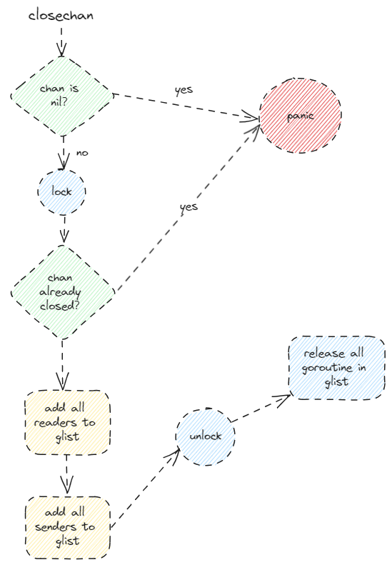

### GMP 模型原理

#### 1 线程、协程和 goroutine

##### 1.1 线程

* 内核态
* 操作系统最小的调度单元
* 创建、销毁、调度全部交由内核完成，cpu 需要完成用户态与内核态间的切换
* 可充分利用多核，实现并行

##### 1.2 协程

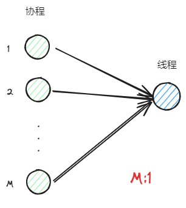

* 用户态（用户级线程）
* 与线程的关系为多对一 M：1
* 创建、销毁、调度在用户态完成，对内核透明，开销更小
* 从属于同一个内核级线程，**无法并行**；一个协程阻塞会导致从属同一线程的所有协程无法执行。

##### 1.3 goroutine

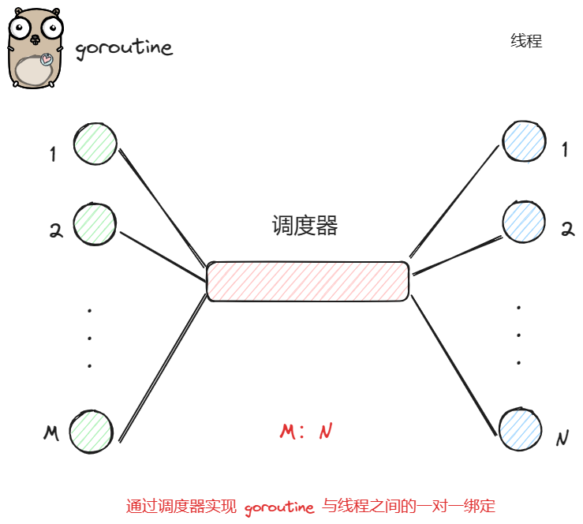

**goroutine，经过 golang 优化后的特殊“协程”（非阻塞）**

* 与线程存在映射关系，M：N
* 创建、销毁、调度在**用户态**完成，对内核透明，足够轻便
* 可利用多个线程，**实现并行**
* 通过调度去来实现线程间的**动态绑定**和**灵活调度**
* **栈空间**大小可**动态扩缩**，因地制宜（充分利用资源，同时防止爆栈）

#### 2 GMP 模型

##### 2.1 G（goroutine）

（1）G 即 `goroutine`，是 `golang` 中对**协程**的抽象

（2）G 有自己的运行栈、状态、以及执行的任务函数（go func 指定）

（3）G 要绑定到 P 才能执行（否则放在调度器对应的 G 队列中），P 相当于 G 的处理器，用来分配调度 `goroutine` 绑定到线程

##### 2.2 P（Processor）

（1）P 即 `Processor`，是 `golang` 中的调度器

（2）P 是 GMP 的中枢，通过 P 来实现 G 和 M 之间的动态结合

（3）对 G 而言，P 是其 CPU，G 只有被 P 调度，才能执行

（4）对 M 而言，P 是执行代理，为其提供必要的信息的同时（可执行的 G、内存分配情况等），并隐藏了繁杂的调度细节

（5）P 的数量决定了 G 最大并行数量，可由用户通过 `GOMAXPROCS` 进行设定（超过 CPU 核数就没意义了，因为线程的并行通过每个 CPU 内核进行）

##### 2.3 M（machine）

（1）M 即 `machine`，是 `golang` 中对线程的抽象

（2）M 不直接指定 G，而是线和 P 绑定，由其实现代理

（3）借由 P 的存在，M 无需和 G 绑死（动态绑定，P 的 goroutine 队列中存在多个等待与 M 绑定的 goroutine），也无需记录 G 的状态信息，因此 G 在全生命周期中可以实现跨 M 执行

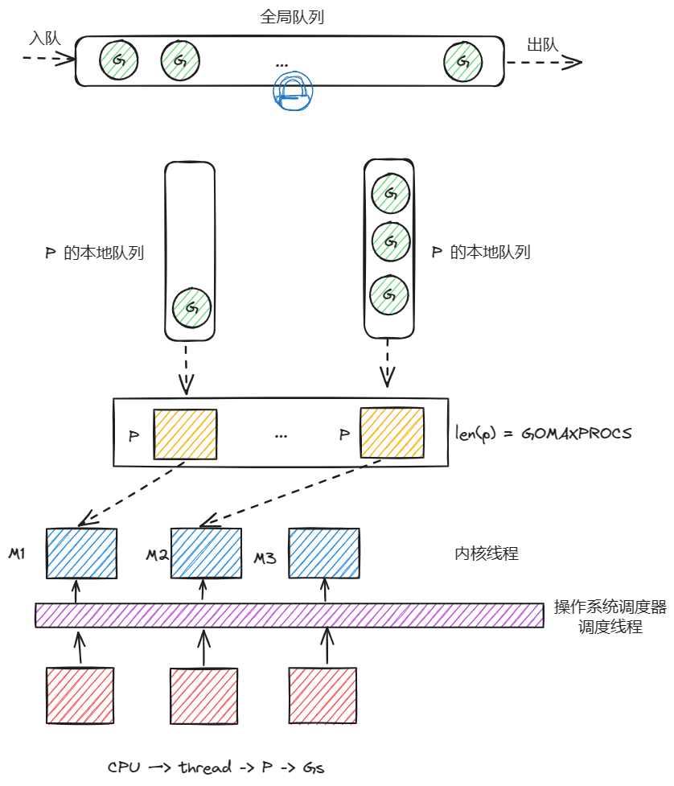

（1）**最低层的调度**：CPU 去调度线程（CPU 最小的调度单元，抽象为 M），内核态，多线程实现并行

（2）**goroutine 并发非阻塞的方法**：为了实现协程的并发不阻塞，使协程绑定线程去执行（goroutine 绑定 M）

（3）**goroutine 的并发**：为了进行绑定，实现了一个 P（Processor，CPU 的抽象，伪装成 CPU 调度 goroutine 执行），用来绑定 `goroutine`

（4）**提高线程的利用率**：为了使提高线程的利用率，实现一个本地队列，来动态获取 `goroutine`，这样就能不强绑定线程，让线程动态切换 `goroutine`

（5）**接收全局 goroutine 的工具**：全局为了收集 `goroutine`，需要做一个全局队列，用来接受 `goroutine`，然后传递给 P 的本地队列，为了防止 P 获取全局队列中的 `goroutine` 发生**并发冲突**，对全局队列加锁

（6）**动态窃取防止资源浪费**：为了防止有的线程没有对应 goroutine，而有的线程对应的 P 的本地队列有很多，有一个**窃取**机制（**无锁化**，给出的解释是发生并发冲突的概率很低）

#### 3 核心数据结构

##### 3.1 G 源码

```go
type g struct {
	stack       stack   // offset known to runtime/cgo
    m         *m      // current m; offset known to arm liblink
    sched     gobuf
    ...
}

type gobuf struct {
	sp   uintptr
	pc   uintptr
	g    guintptr
	ctxt unsafe.Pointer
	ret  uintptr
	lr   uintptr
	bp   uintptr // for framepointer-enabled architectures
}
    
```

* m：会进行动态指向
* sched.sp：保存 CPU 的 rsp 寄存器的值，指向函数调用栈栈顶
* sched.pc：保存 CPU 的 rip 寄存器的值，指向程序下一条执行指令的地址
* sched.ret：保存系统调用的返回值
* sched.bp：保存 CPU 的 rbp 寄存器的值，存储函数栈帧的起始位置

**g 生命周期的状态组成**


```go
const (
	// G status
	_Gidle = iota // 0

	_Grunnable // 1

	_Grunning // 2

	_Gsyscall // 3

	_Gwaiting // 4

	_Gmoribund_unused // 5

	_Gdead // 6

	_Genqueue_unused // 7

	_Gcopystack // 8

	_Gpreempted // 9

	_Gscan          = 0x1000
	_Gscanrunnable  = _Gscan + _Grunnable  // 0x1001
	_Gscanrunning   = _Gscan + _Grunning   // 0x1002
	_Gscansyscall   = _Gscan + _Gsyscall   // 0x1003
	_Gscanwaiting   = _Gscan + _Gwaiting   // 0x1004
	_Gscanpreempted = _Gscan + _Gpreempted // 0x1009
)

```

##### 3.2 M 源码

```go
type m struct {
    g0 *g    // g0 一个额外的 goroutine，并不是由用户创建
    // ...
    tls
    // ...
}
```

* g0：一类特殊的调度协程，负责执行 g 之间的切换**调度**
* tls：`thread-local storage`，线程本地存储，存储的是地址，`m.tls[0]` 访问当前运行的 g，通过这个运行的 g，可以找到当前的 m、p、g0 等信息。

##### 3.3 P 源码

```go
type p struct {
    // ...
    runqhead uint32
    runqtail uint32
    runq [256]guintptr
    
    runnext guintptr
    // ...
}
```

* runq：本地 `goroutine` 队列，用来存储获取的多个等候 `goroutine`，最大长度为 256
* runqhead：队列头部，用来取 `goroutine` 绑定到 M
* runqtail：队列的尾部（应该使用来窃取的）
* runnext：下一个可执行的 `goroutine`

##### 3.4 schedt

**用来获取全局队列的 goroutine（在本地队列中已经没有 goroutine 的时候）**

```go
type schedt struct {
    // ...
    lock mutex
    // ...
    runq gQueue
    runqsize int32
    // ...
}
```

**sched 是全局队列的封装**：

* lock：防止并发冲突的锁
* runq：全局 `goroutine` 队列
* runqsize：全局 `goroutine` 队列的容量

#### 4 调度流程

##### 4.1 两种 g 的转换（g0 与 g）

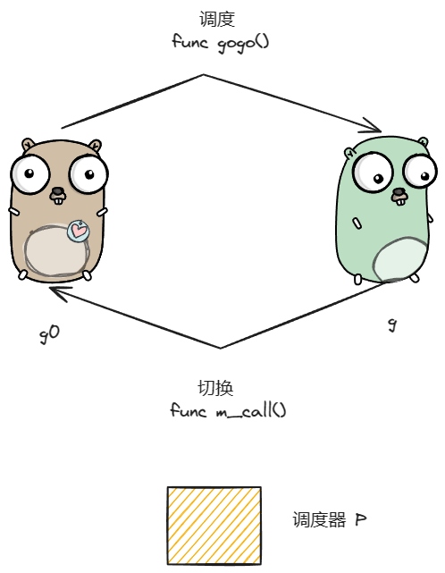

##### 4.2 调度类型

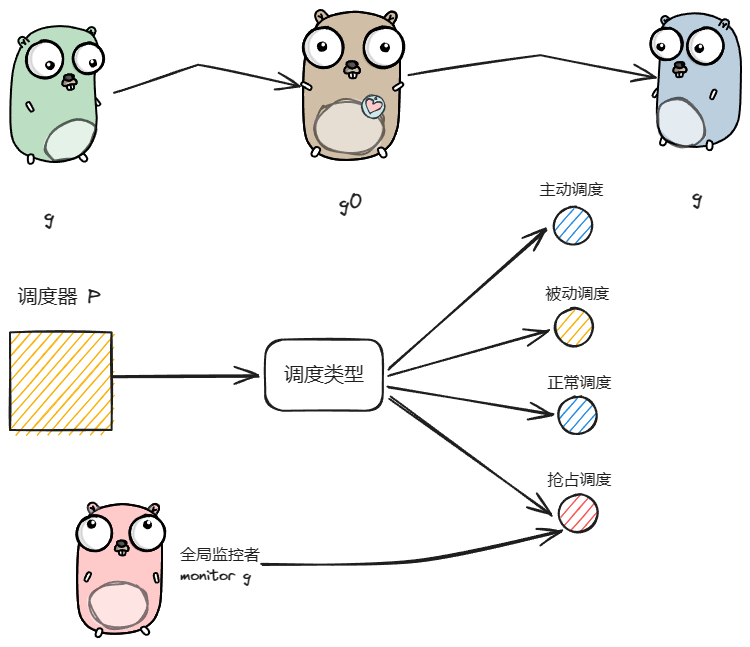

（1）**主动调度**，可以由用户通过函数进行自主调度

```go
func Gosched() {
    checkTimeouts()
    mcall(gosched_m)
}
```

* 用户主动执行让渡的方式，使当前 `goroutine` 停止执行，让出执行权，进入队列（g 的全局队列）等待下次执行

（2）**被动调度**，g 陷入阻塞的情况，被阻塞的时候是不会在被调度的

```go
```

* 由于 `channel` 的原因陷入阻塞，或者互斥锁导致的阻塞，会使 g 被动调度。为了**让出 M 的资源**。
  * 陷入阻塞：`func gopark()`
  * 唤醒：`func goready()`，没有被唤醒，就不会再被 p 调度

（3）**正常调度** ，正常执行结束

（4）**抢占调度**，发起系统调用，达到一定时常

* 当 g 发起系统调用，陷入内核态达到一定时常，全局异步的 `monitor g` 会让 g0 对其与 M 进行解绑

#####  4.3 宏观调度流程

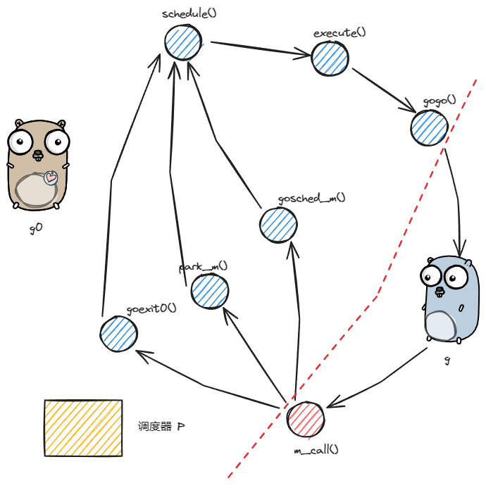


* 只有 `m_call()` 是 g 来操作，其他的都是 g0 来完成
* 调度流程
  * 首先是 g 被主动调度
  * 然后被调度之后可能出现三种方式（park 阻塞，goexit0 执行完成，gosched 主动让渡）
  * 这三种状态之后再回到调度的状态（schedule）
  * 最后在逐一执行退出

##### 4.4 schedule（g0 找到下一个可以执行的 goroutine）

**调度流程最终要的函数，也是一切的开始**

* g0 去找可以被调度的 g
* 然后将找到的 g，放到 `execute` 进行执行，也就是 `execute()` 这一步

##### 4.5 findRunnable（找到可以运行的 goroutine）

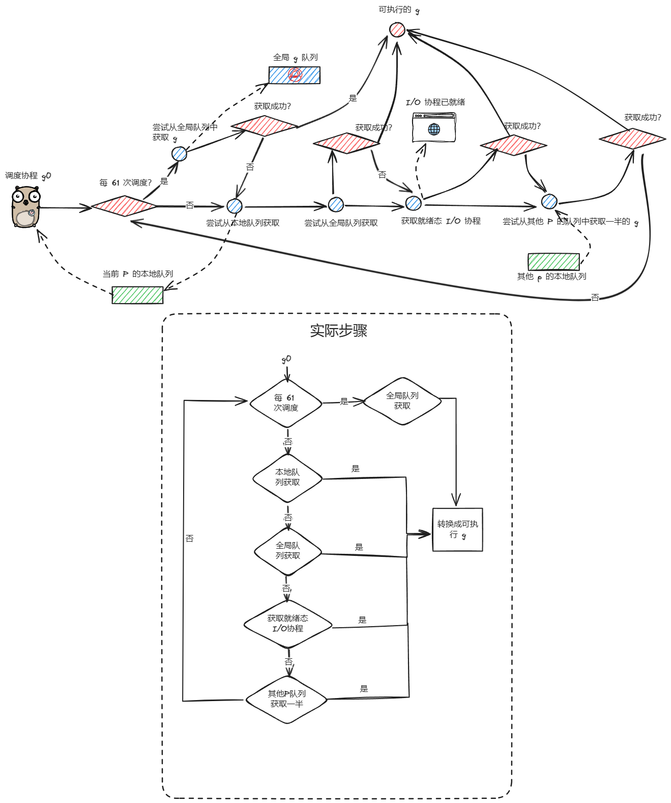

* 窃取其他 P 队列的时候需要注意：
  * 窃取的队列起点是随机的（使用随机因子）

##### 4.6 execute（找到 goroutine 之后是怎么执行的）

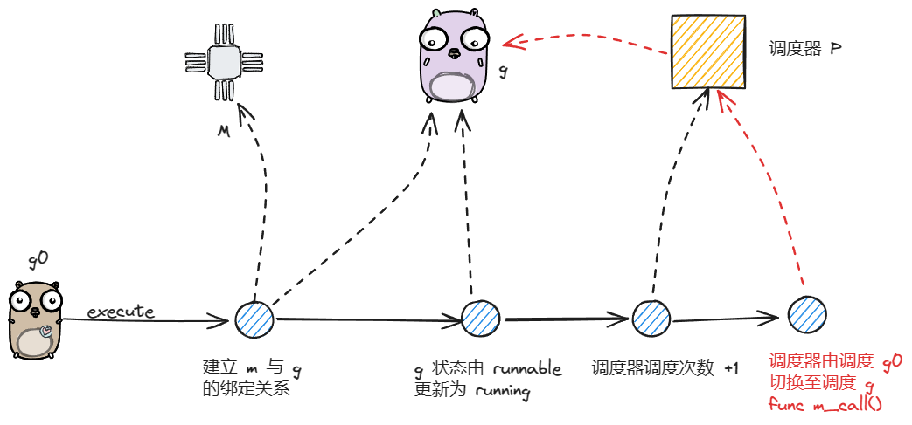

（1）建立与 g 的绑定

（2）更新 g 的信息

（3）更新 P 的调度次数（前面调度策略中的 61 次从全局队列调度）

（4）调用 `gogo()` 方法，执行 `goroutine` 中的任务（实际的 goroutine 执行）

##### 4.7 gosched_m（主动让渡的类型）

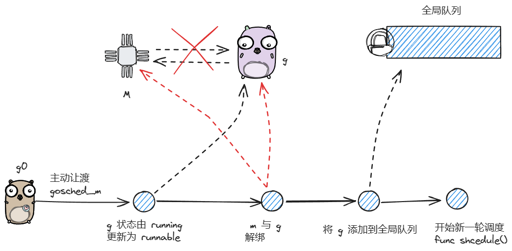

（1）先与 M 解绑

（2）在将 g 加入到全局队列中

##### 4.8 park_m 与 ready


* 先调用 `mcall` 切换至 `g0`
* 然后在调用 `park_m` 将 `g` 陷入阻塞
* 注意：
  * 使用 `park_m` 之后，`goroutine` **没有**被放到**全局队列**中
  * **唤醒**工作实在**应用层**（如：channel 中维护的一个阻塞队列）
  * `goready` 哪个 P **唤醒**的，会被放到哪个 P 的队列，由这个 P 来**执行**

##### 4.9 goexit0（goroutine 结束执行）

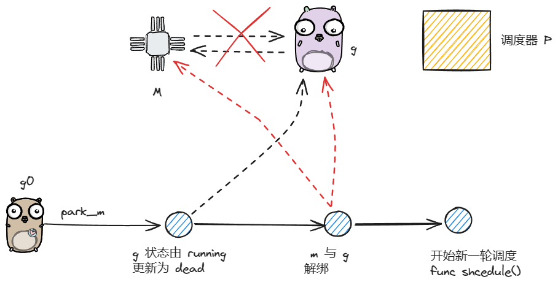

* 同上，修改状态：`running --> dead`

##### 4.10 retake（抢占调度）

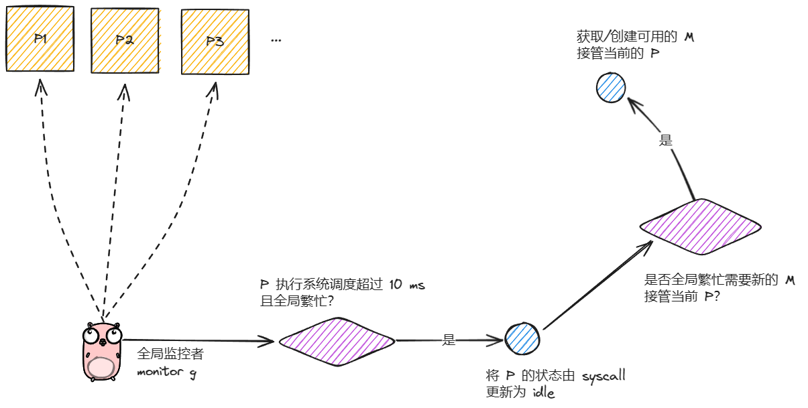

* g0 无法进行转换，因为 P 在执行系统调用，处于繁忙状态。
* `monitor g` 是一个其实异步起动的全局 `goroutine`

（1）加锁后，遍历全局的 p 队列，寻找需要被抢占的目标

（2）让若某个 p 同时满足下述条件，则会进行抢占调度

1. 执行系统调用超过 10 ms
2. p 本地队列有等待执行的 g
3. 或者当前没有空闲的 p 和 M

### GC 原理

#### 1  Golang 的内存模型

 **策略**：以空间换时间，一次缓存，多次复用（双倍空间）

* `mheap` 堆使用的就是这个策略
  * 对操作系统而言， `mheap` 就是用户进程中缓存的内存
  * 对 Go 进程内部而言，堆是所有对象的内存起源，都是从这里申请分配的

**内存分配**：多级缓存，实现无/细锁化

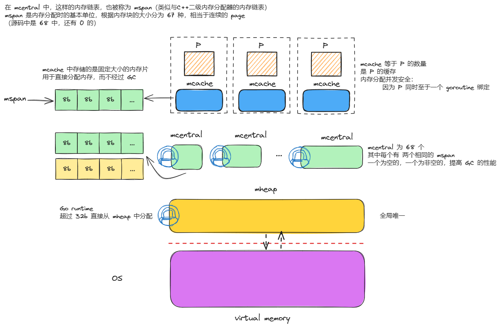

**自顶向下的结构组成**

**virtual memory**

* 操作系统为程序分配的内存

**mheap**

* Go 程序运行时的堆

**mcentral**

* 类似与 C++ 的二级内存分配器，其中存储的待分配的内存块
* 其中有 68 个 `mcentral`，每个 `mcentral` 对应着一种大小的内存块链表（mspan * 2）
* 为了提高 GC 的效率，利用内存换取时间（双倍 mspan，两条内存块链表）
* 因为全局 `goroutine` 从这里申请内存，所以需要加锁

**mcache**

* 每个 P（类似处理器）拥有一个自己的缓存空间（136 个 mspan，每种两个）
* 因为 P 和 `goroutine` 在运行时是绑定的，所以`goroutine` 并发申请小内存，是无锁化的

**mspan**

* 一个内存块链表，用来申请内存直接分配使用的，类似于 C++ 的二级内存分配器的内存列表挂载的内存链表（C++ 的同样大小的内存块一条链表上挂载 20 块 ）
* 和 C++ 一样大小是 8b 的倍数，但是数量比 C++ 多，C++ 列表长度只有 16
* 连续的内存页（page）

##### 1.1 mspan

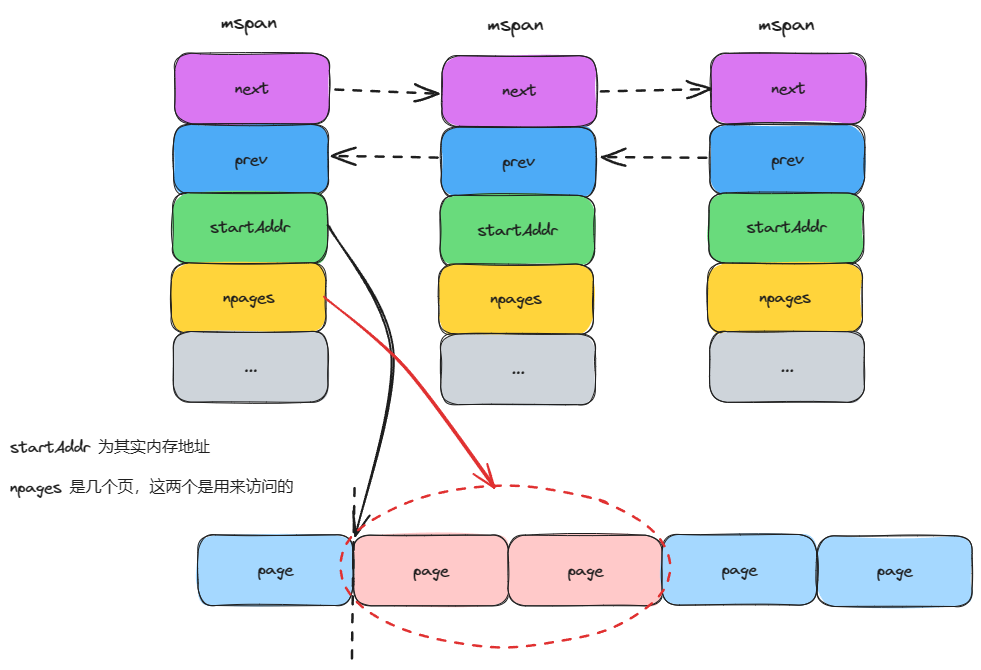

* `mspan` 之间以双向链表的形式进行连接的（有助于后续 GC 时扫描）
* `mspan` 的内存页是连续的，所以只需要起始地址，以及 pages 的数量，就能确定 `object` 的位置
* `mspan` 用过一个 `spanClass(uint8)` 来标记等级（1-67）
  * 高 7 位是等级
  * 低 1 位是 noscan 

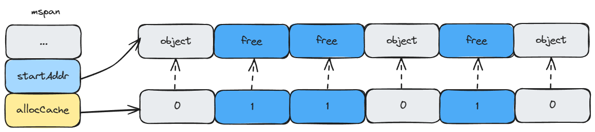


* `allocCache`，通过一个位图来标记那个页已经被使用了，用以快速查找空闲页

##### 1.2 mcache

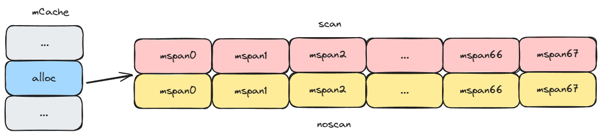

* 每个 `mCache` 有 136 个 `mspan`，每种类型的 `mspan` 有两个

##### 1.3 mcentral

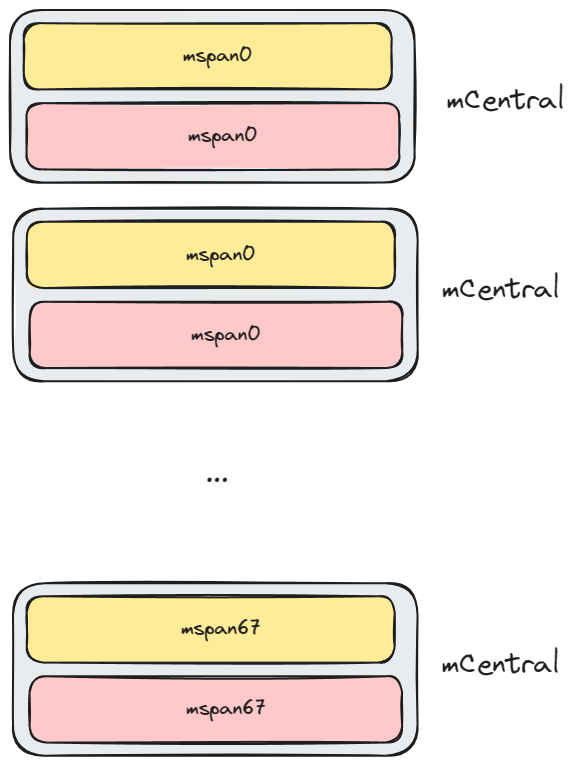

一个 mCentral 有两个相同 spanClass 等级的 mspan 组成

##### 1.4 mheap

* 以页（8KB）为单位，作为最小的内存存储单元
* 连续的页会组装成 `mspan`
* 全局内存同样使用 `bitMap` 进行**标识**是否使用（每页），0 为自由，1 为被 `mspan` 组装
* `mheap` 中的页与 `mspan` 的**映射信息**（去 mspan 查找），使用 `heapAreana` 聚合页来记录（用这个的原因是是在 GC 的时候，修改 mheap 中的 bitMap 的同时，也需要修改 mspan 中的 bitMap，就需要通过这个映射信息去找 mspan）
* **空闲页**的**快速查找**，通过建立空闲页**基数树索引**来进行
* `mCentral` 的**持有者**，持有所有的 `mCentral`
* `mheap` **内存不够**的时候会向**系统申请**（64M）

**索引页**

* 基数树：每棵数有 16G 的内存空间中页的索引信息
* mheap：其中有 2^14 棵基数树，索引可以覆盖 2^14 * 16GB - 256 TB 内存空间


**结构组成**

1. `mheap` 用以分配 `mCentral` 的内存
2. `mCentral` 中的 `mspan` 是用一种（统一类型的两个 mspan，一个是 partial，一个是满空间的 full），用于细粒度锁全局分配（mCache 中不够用了）
3. `mCache` 中的 `mspan` 是所有种类的，每种两个（用以 `goroutine` 并发无锁分配内存）

#### 2 对象分配

2.1 object 的三种类型

1. tiny（微对象）：（0，16B）
2. small（小对象）：（16B，32KB）
3. large（大对象）：（32KB，∞）

### Context 原理


# C++篇


