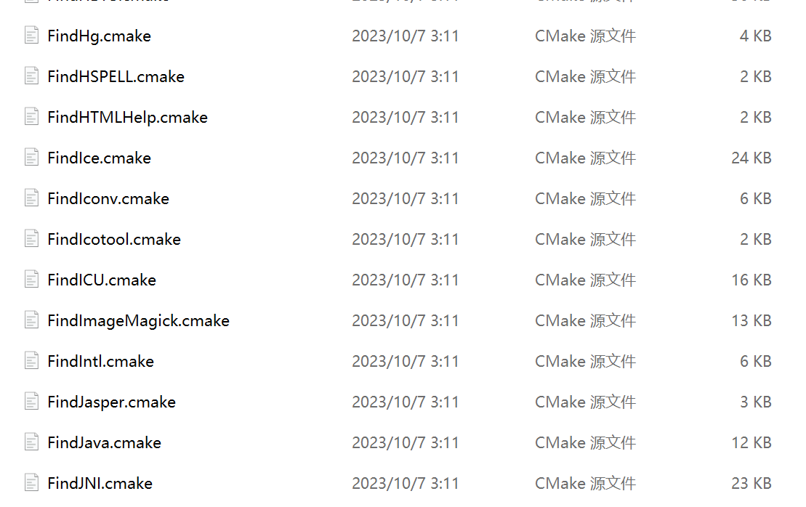

**CMake学习笔记**

# CMake 理论学习

## CMakeLists.txt

* **找子文件夹的内容**，`CMakeLists.txt` 可以**递归调用**，只需要让当前 `CMakeLists.txt` 包含当前文件夹路径下的子文件夹路径即可使用（`add_subdirectory(path)`） 

* **创建可执行文件**，同时为当前可执行文件的编译提供对应的**代码文件**（`add_executable(exec_file codefile1 codefile2)`）
* **设置 include 文件的路径（不推荐，减少依赖）**，避免每个调用的文件夹都加上头文件的路径，可以设置 `include` 文件的路径，直接 `include` 想要的头文件就可以，**不加入相对路径**（查找导入头文件的顺序：源文件所在目录 -》include_directories -》系统默认头文件路径）
  * **根** `CMakeLists.txt` 使用 `include_directories()`
  * **子** `CMakeLists.txt` 使用 `target_include_directories()` 

# CMake 与 依赖库

### find_package 的使用

**使用**

* `find_package(LZ4 REQUIRED)`

**原理**

* `find_package` 是从什么路径进行查找并导入？

  * `find_package` 是从 `CMake` 安装路径下的 `modules` 进行查找（常用格式是 Findxxx.cmake 文件，xxx 问库名）

    

    

* `CMakeLists.txt` 中使用 `find_package` 导入依赖库，而本地安装在新路径下，两者如何关联起来？

**解决方法**

1）在 `cmake/share/Modules` 中加入 `FindXXX.cmake`

2）在项目中增加 cmake 目录，在其中加入 `FindXXX.cmake` ，同时加入内容

* 本地安装软件包的头文件位置 `find_path`（XXX_INCLUDE_DIR）
* 本地安装软件包的动态库位置 `find_library`（XXX_LIBRARY）

3）在哪查找 `package`：通过设置参数位置进行查找 `package` `set(CMAKE_MODULE_PATH "${CMAKE_CURRENT_SOURCE_DIR}/cmake;${CMAKE_MODULE_PATH}")`

