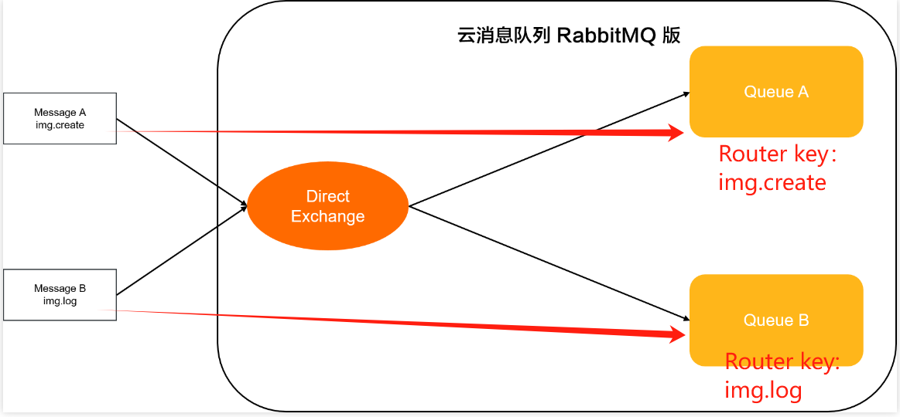
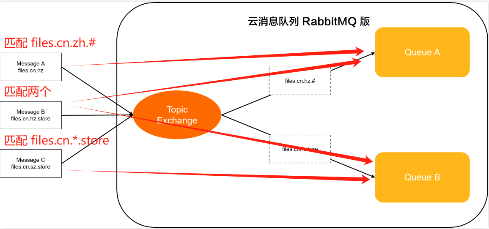
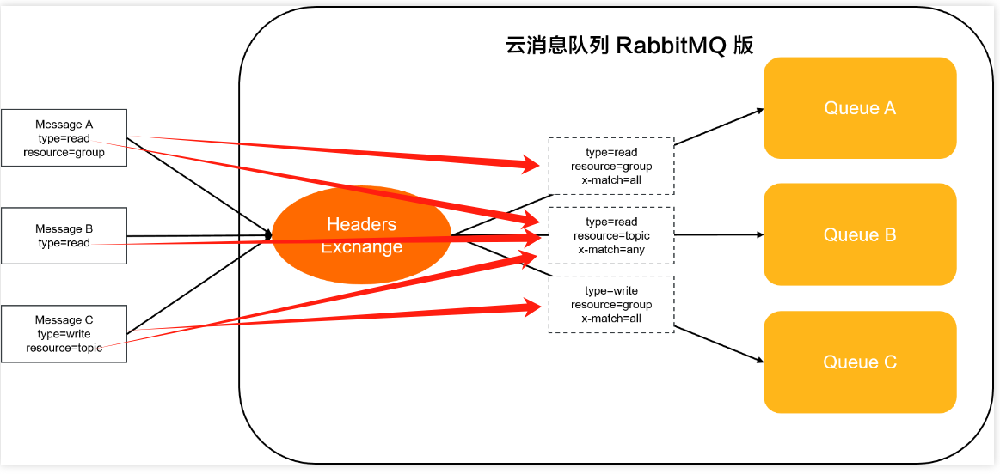

# RabbitMQ 学习

## 1 消息队列的使用场景

### 1.1 异步

* 生产者消费者模型
  * 将消息队列中的消息通过**消费者**进行**异步处理**

### 1.2 解耦

* 发布订阅
  * 一个组件将消息发布到消息队列中，另一个组件可以订阅并处理消息，进行组件间的解耦

### 1.3 削峰（限流）

* 削峰填谷
  * 将大量的消息放到消息队列中，减少服务器的压力，使服务器有能力的时候，在进行处理。即**限流**

## 2 消息队列中的名词定义

### 2.1 Exchange 交换机

**RabbitMQ 消息路由代理**：进行路由分发，类似与服务端的 `Router`，将消息中的 `Key`，根据模式分发到对应消息队列中

#### 2.1.1 Direct Exchange

* 路由规则
  * 直接路由，`Binding Key`（消息所绑定） 和 `Routing Key`（消息队列绑定的 Key） 完全对应
* 使用场景
  * 单播路由

#### 2.1.2 Topic Exchange

* 路由规则（模糊匹配）
  * 在 `Direct Exchange` 的基础上，使用通配符进行匹配
    * \*  代表一个英文单词
    * \# 代表零个、一个或多个英文单词

* 使用场景
  * 分发关于特定地理位置的数据

#### 2.1.3 Fanout Exchange 

* 路由规则（广播）
  * 忽略 `Routing Key` 和 `Binding Key` 的匹配规则，将消息路由到所有绑定的 `Queue`
* 使用场景
  * 广播各种状态和配置更新

#### 2.1.4 Headers Exchange

* 路由规则
  * `Direct Exchange` 的另一种形式，为消息自定义 `Headers`（key：value），来匹配 `Headers` 中的一个（any）或多个（all）
  * `all`：所有除**x-match**以外的绑定属性键值对必须和消息Headers属性键值对匹配才会路由消息
  * `any`：只要有一组除**x-match**以外的绑定属性键值对和消息Headers属性键值对匹配就会路由消息
  * 匹配：
    * 消息Headers属性的键和值与绑定属性的键和值完全相同。
    * 消息Headers属性的键和绑定属性的键完全相同，但绑定属性的值为空。
* 使用场景
  * 通过多组 Headers 属性区分消息的场景，用于多播路由（例如涉及到分类或者标签的新闻更新）

### 2.2 生产者（Producer）

**用来向消息队列中推送消息**

### 2.3 消费者（Consumer）

**用来从消息队列中获取消息**

### 2.4 队列（Queue）

**消息存储的地方，`MQ` 会有一个或多个队列，用来存储不同的消息，使用队列保证了顺序性**

* 使用的时候需要产生一个 `Channel`，然后绑定 `Channel` 的 `name`

### 2.5 绑定（Binding）

**将消息队列与交换机（Exchange）进行绑定，用来分发路由（消息），确定消息要发送到哪个对应的队列中**

* 将 `Channel` 的名字与对应的 `Key(Routing Key)` 进行绑定，使得交换机能够知道什么路由发送给这个 `Queue`

### 2.6 路由键（Routing Key）

**用来在交换机和队列之间进行消息路由的关键字**