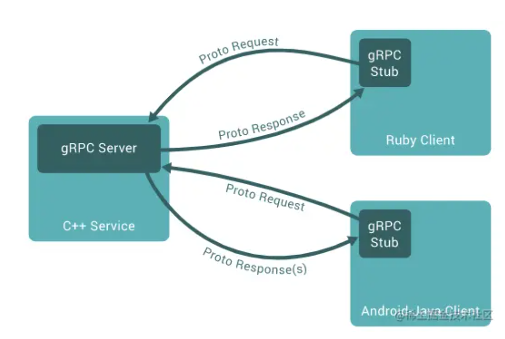

# gRPC 笔记

## 基本概念

### protocol buffers

**提供了一种可扩展、搞笑的数据序列化和接口定义语言**

1. 服务接口定义：服务接口的方法和消息类型（.proto 文件形式，描述了服务的输入和输出消息的结构和字段）

   个人理解：就是 RPC 过程调用是传入的请求参数，和过程调用的返回内容的结构体，用来在远程过程调用中，作为参数的载体，然后获取参数的结果

2. 代码生成：可以使用 Protobuf 工具，根据 .proto 文件自动生成多种变成语言的代码，包括服务器端代码和客户端代码。用于在应用程序中进行消息的序列化和反序列化

   个人理解：就是为了适应不同的语言处理 RPC 传递的参数，需要对参数进行不同的语言编写，然后在进行传输

3. 数据序列化：使Protobuf 使用二进制编码来序列化结构化数据。它将消息对象转换为紧凑的二进制格式，以便在网络中传输或持久化到存储系统中。相对于其他传统的文本协议，Protobuf 的二进制编码更加紧凑和高效，可以减少网络带宽的使用和数据传输的延迟。

   个人理解：就是在网络传输中，将消息内容转换为二进制格式，用来进行数据的传输，这样传输的数据更加紧凑和高效（二进制编码），可以减少网络带宽的使用和数据传输的延迟。

4. 跨语言和跨平台支持：于 Protobuf 是一种语言无关的格式，你可以使用它定义服务接口和消息格式，并在多种编程语言和平台上使用生成的代码。这使得不同语言的应用程序能够方便地进行跨语言的通信和交互。

   个人理解：就是因为这个工具对消息进行了转换，所以传递给什么语言编写的程序都无所谓。

### gRPC 的请求和响应模式

主要有四种响应模式：简单模式(Simple RPC)、服务端流式（Server-side streaming RPC）、客户端流式（Client-side streaming RPC）、和双向流式（Bidirectional streaming RPC）

* 简单模式(Simple RPC)：客户端发起请求并等待服务端响应。
* 服务端流式（Server-side streaming RPC）：客户端发送请求到服务器，拿到一个流去读取返回的消息序列。 客户端读取返回的流，直到里面没有任何消息。
* 客户端流式（Client-side streaming RPC）：与服务端数据流模式相反，这次是客户端源源不断的向服务端发送数据流，而在发送结束后，由服务端返回一个响应。
* 双向流式（Bidirectional streaming RPC）：双方使用读写流去发送一个消息序列，两个流独立操作，双方可以同时发送和同时接收。

## gRPC 安装

### protocol 编译器安装

* linux 下安装

  ```shell
  $ apt install -y protobuf-compiler
  $ protoc --version
  ```

* windows 下安装

  使用预编译的二进制文件进行安装，从 [protobuf仓库](https://link.zhihu.com/?target=https%3A//github.com/protocolbuffers/protobuf/releases) 选择 windows 版本进行下载

  下完完成后解压，将文件中 bin 目录的路径，加入到环境变量中

### 安装 go 插件

因为 go 16.1 之后在 `go install tools@version` 的时候需要增加版本才能进行下载

1. 安装 go 协议的编译器插件

   ```shell
   $ go install google.golang.org/protobuf/cmd/protoc-gen-go@v1.28
   $ go install google.golang.org/grpc/cmd/protoc-gen-go-grpc@v1.2
   ```

2. 更新`PATH` 以便 `protoc` 编译器可以找到插件

   ```shell
   $ export PATH="$PATH:$(go env GOPATH)/bin"
   ```

3. windows 将 bin 目录添加到环境变量中即可

## gRPC 使用

### 文件构成

1. proto 文件：用来定义 RPC 接口，以及消息类型（通过接口的参数类型，来实现不同的模式）
2. stub 文件：对外提供接口

### Proto 文件编写

* 定义消息（request，reply）
* 定义 RPC 服务以及其 RPC 方法
* 编译文件，产生 stub（通信接口） 文件

### 逻辑编写

* 服务端逻辑编写
* 客户端逻辑编写

## gPRC 原理梳理

**架构图**



**通信原理**

* 通信的数据流：
  * 使用 `Protocol Buffers` 来规定统一的**数据流格式**
    * 支持多种编写语言
    * 序列化速度快
    * 序列化和反序列化代码自动生成
    * 反序列化速度快

* 服务端通过与客户端的 `Stub`（接口） 进行通讯
* gPRC 基于 HTTP2， 所以支持流式消息（复用一个链接，并发通信）
* 通信中的三个概念：通道、RPC、消息
  * 通道：承载 RPC 的载体
  * RPC：发送消息（可能有多条）
  * 消息：RPC 通信的基本单位

**通信方式**

* **Unary RPC**：一元 `RPC`，单个请求类型
* **Server Streaming RPC**：服务器流式 `RPC`，服务端**返回**流式消息（`returns` 中的消息为服务端返回的，加 `stream` 修饰消息）
* **Client streaming RPC**：客户端流式 `RPC`，客户端发送流式消息（`RPC func` 传入的参数）
* **Bidirectional streaming RPC**：双向流式 `RPC`，因为是流式（建立连接通道），所有双方流式消息互不影响，因此服务端和客户端可以按照他们想要的顺序（消息在管道中还是按顺序的，只是读写的顺序可以自定义）进行读取和写入

**生命周期**

* gRPC 可以设置截至日期，判断超时
* 双方都可以取消 RPC

