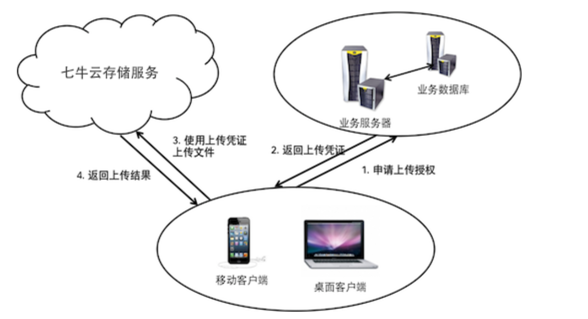
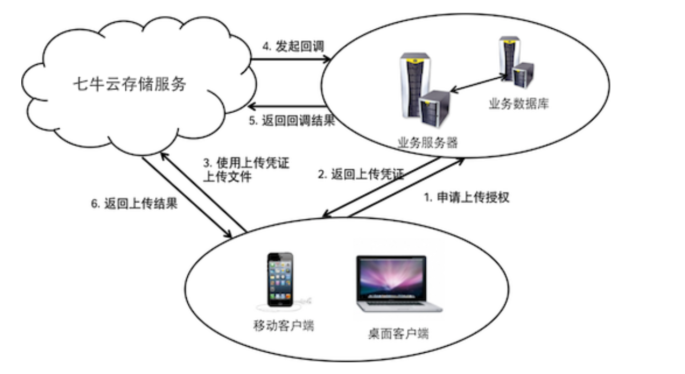

# 七牛云业务封装

# 1 各部分职能

## 1.1 服务端

* 生成凭证
* 将生成的**凭证和域名**下发给客户端
* 用关系型数据库保存**账号信息**，如果有多个云账号
* 使用数据库管理图片**元数据**和**资源**之间的关系
* 响应客户端请求，执行业务流程，返回结果

## 1.2 客户端

* 从**服务器**获取**元数据**信息
  * 不需要服务器获取图片，只需要**元数据信息**即可
  * 构造下载凭证：[下载凭证]([存储区域_产品简介_对象存储 - 七牛开发者中心 (qiniu.com)](https://developer.qiniu.com/kodo/1671/region-endpoint-fq))
* 使用**下载凭证**从七牛云获取待展示的内容
  * 压缩缩略图（公开资源）
  * 私有资源，需要购买或者其他的方式，下发凭证

# 2 业务流程

## 2.1  关键组成

**上传流程分为客户端上传和服务端上传**

* 七牛云存储服务
* 业务服务器：web 的后台服务器
* 客户端

## 2.2 业务流程

* **上传**
  * 客户端需要从**服务器**获取**上传凭证**
  
  * 上传的**域名与凭证**一起发给**客户端**
    * [各地域名]([存储区域_产品简介_对象存储 - 七牛开发者中心 (qiniu.com)](https://developer.qiniu.com/kodo/1671/region-endpoint-fq))
  
  * 
  
  * 如果设置**回调**
  
    
  
* **下载**

  * 从服务器获取**下载凭证**，和**元数据**
  * 然后使用下载凭证向七牛云存储请求数据
  
* **资源管理**

  * 资源管理应该只放在服务器端进行。不允许客户端进行资源管理，否则即使将管理凭证的生成放在服务器端进行，然就很容易被**第三方截获请求全文**，从而导致使用对应请求**再次发送**（修改请求被截获加以恶意利用）


* **安全凭证**（生成凭证需要 SecretKey）
  * 上传资源：上传凭证（[上传凭证]()）
  * 访问资源：下载凭证（[下载凭证]([存储区域_产品简介_对象存储 - 七牛开发者中心 (qiniu.com)](https://developer.qiniu.com/kodo/1671/region-endpoint-fq))）
  * 管理和修改资源：管理凭证

## 2.3 关键原则

* 整个架构中需要一个业务服务器组件。
* 无论如何，[访问密钥（AK/SK）](https://developer.qiniu.com/af/kb/1334)均不得包含在客户端的分发包中（如二进制代码、配置文件或网页中）。
* SecretKey不得在任何场景中的公网上传输，更不得传输到客户端。
* 业务服务器端应维持一个用于管理资源元数据的数据库和一个用于管理最终用户账号信息的数据库。
* 原则上客户端和七牛云存储之间的交互只有上传和下载，不应使用任何其他的API。

# 3 GO SDK 使用

## 3.1 提供的主要功能 

1. 提供生成客户端上传所需的**上传凭证**的功能
2. 提供文件从服务端**直接上传七牛**的功能
3. 提供对七牛空间中**文件进行管理**的功能
4. 提供对七牛空间中**文件进行处理**的功能
5. 提供七牛**CDN**相关的刷新，预取，日志功能
6. 提供七牛**视频监控QVS**的功能

## 3.2 开源代码

- [Go SDK 项目地址](https://github.com/qiniu/go-sdk)
- [Go SDK 发布地址](https://github.com/qiniu/go-sdk/releases)
- [Go SDK 历史文档](https://developer.qiniu.com/kodo/sdk/go-v6)

## 3.3 安装

* 使用 go mod，`github.com/qiniu/go-sdk/v7`
* `require github.com/qiniu/go-sdk/v7 v7.19.0`

## 3.4 鉴权

**功能需要进行合法授权**

* 需要获取 `Access Key` 和 `Secret Key`
* 获取方式：https://portal.qiniu.com/user/key

## 3.5 文件上传

* 上传流程
* 客户端上传凭证
  - 简单上传凭证
  - 覆盖上传凭证
  - 自定义上传回复凭证
  - 带回调业务服务器的凭证
  - 带数据处理的凭证
  - 带自定义参数的凭证
  - 综合上传凭证
* 服务器直传
  - 构建配置类
  - 文件上传（表单方式）
  - 字节数组上传（表单方式）
  - 数据流上传（表单方式）
  - 文件分片上传（断点续传）
  - 解析自定义回复内容
  - 业务服务器验证存储服务回调

## 3.6 获取上传凭证

* **storage.PutPolicy**：控制上传和返回结果的行为

  * **Scope**：指定存储空间（bucket）

    * 默认 bucket
    * 覆盖上传需自定义，增加覆盖文件的名字 `fmt.Sprintf("%s:%s", bucket, keyToOverwrite)`

  * **ReturnBody**：指定回复的格式

    * 默认：`{"hash":"Ftgm-CkWePC9fzMBTRNmPMhGBcSV","key":"qiniu.jpg"}`
    * 自定义：`{"key":"$(key)","hash":"$(etag)","fsize":$(fsize),"bucket":"$(bucket)","name":"$(x:name)"}`
      * 支持的[魔法变量](https://developer.qiniu.com/kodo/manual/1235/vars#magicvar)和[自定义变量](https://developer.qiniu.com/kodo/manual/1235/vars#xvar)
    * 需要自定义结构体进行解析，**在 put 之后解析**

  * **回调**

    * **CallbackURL**：回调 url，回调函数的**路由**

    * **CallbackBody**：回调 body，传给回调函数的 **body**

    * **CallbackBodyType**：回调 body 类型，对 body 进行**编码**，建议使用 `application/json`，但是也可以使用 `application/x-www-form-urlencoded` 组织内容

    * 服务端验证回调：是否有七牛发出

      ```go
      // VerifyCallback 验证上传回调请求是否来自存储服务
      func VerifyCallback(mac *Mac, req *http.Request) (bool, error) {
      	return mac.VerifyCallback(req)
      }
      ```

## 3.7 文件上传

**使用获取的 upToken 来进行文件上传**

* 需要一个上传器（Uploader），一个提取器（PutExtra）

**表单格式上传对象 NewFormUploader**

* 文件上传（PutFile）

* 字节流上传（Put）

* 数据流上传（PutFile）：`NewResumeUploaderV2` 的 `PutFile` 方法，同时结果提取需要使用 `storage.RputV2Extra`

* 文件断点续传：断点续传基于分片传输实现的，只需要传递 `Recorder(NewFileRecorder)` 参数，即可实现断点续传

  ```go
  putExtra := storage.RputV2Extra{
  		Recorder: recorder,
  	}
  ```

## 3.8 文件下载

**返回的是下载连接**

* 公开空间文件下载：不需要签名
  * 只需要绑定的域名（七牛云的默认域名或者绑定的自定义域名）然后**拼接**上**空间**里的**文件名**
    * 默认域名：http://domain/key， key 为**文件名**
  * 拼接之前需要对文件名进行 `urlencode`： `storage.MakePublicURL`
* 私有空间下载：需要签名
  * 构建**公开空间访问连接**，然后进行**私有授权签名**
  * 需要 Mac 来构建私有 URL：`storage.MakePrivateURL(mac, domain, key, deadline)`

**返回的是响应**

* 通过接口下载空间文件
  * 需要要 URL 签名配置


# 4 API 概述

