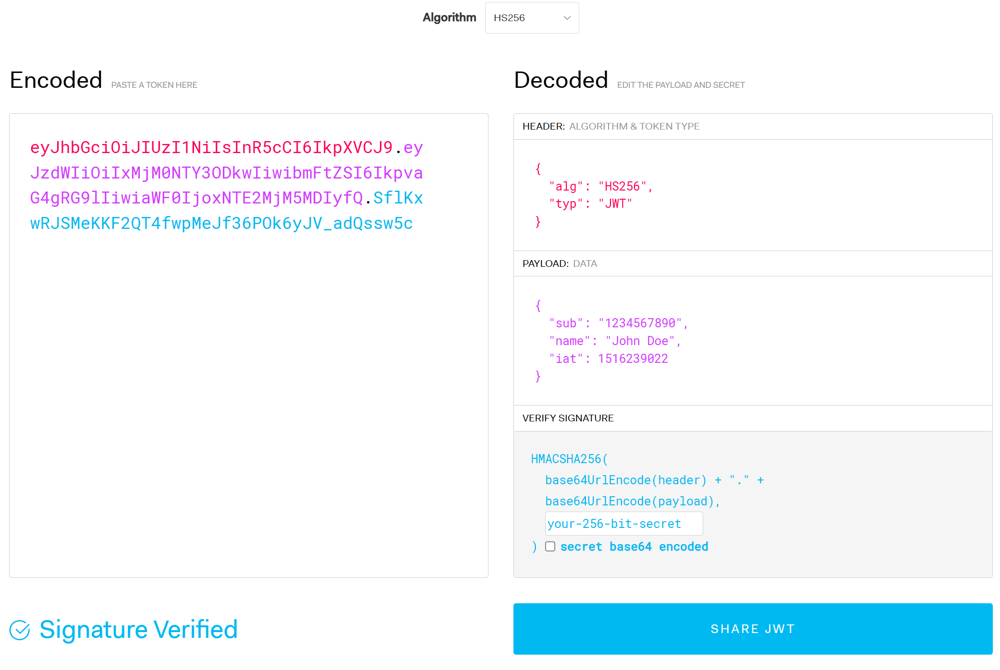
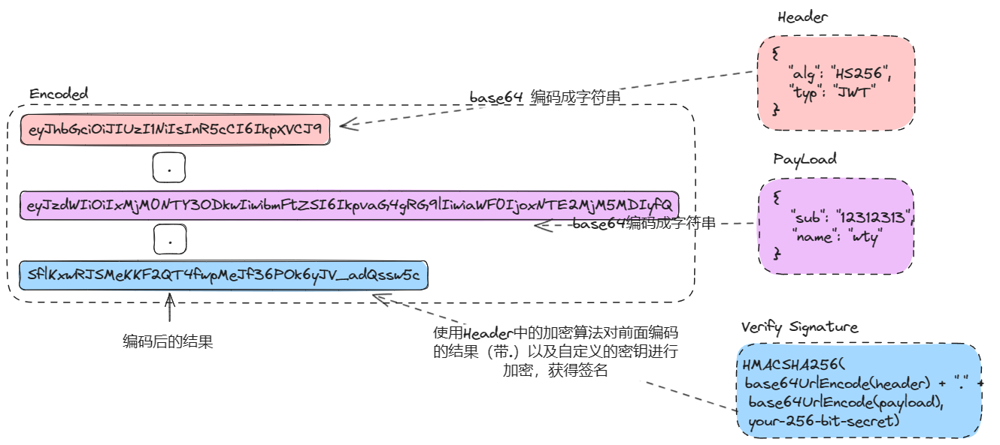

# JWT原理及流程

# JWT 的三个结构

## 1 Header

* 生成签名时使用的加密算法
* 类型

## 2 PAYLOAD（荷载）

在后端应用中，Payload 主要的功能就是编码后端需要的客户端数据，如用户名之类的内容，用来进行鉴权。

**注意**：Payload 不能放明文密码之类的内容

## 3 VERIFY SIGNATURE（签名）

对前面二者进行加密获得的结果

# JWT 加密

* 三段字符串，中间通过 `.` 进行连接
* 每段字符串都是加密后的结果
  * Header：通过 `Base64` 进行加密
  * Payload：通过 `Base64` 进行加密
  * Signature：使用 Header 中的加密算法，通过密钥，对前面加密的结果（Header.Payload）在进行加密

# JWT 解密

从后向前进行解密

* 首先验证签名：通过提供的密钥以及加密方法，利用 `Header.Payload` 进行解密，验证签名是否匹配
* 在对 `Base64` 加密的 `Header` 和 `Payload` 进行解密，获取到 `Payload` 中的信息（荷载中的每个 kv 被称为 claim）
* 通过解码的 `claims` 进行鉴权等操作

