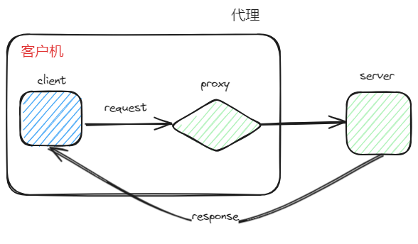
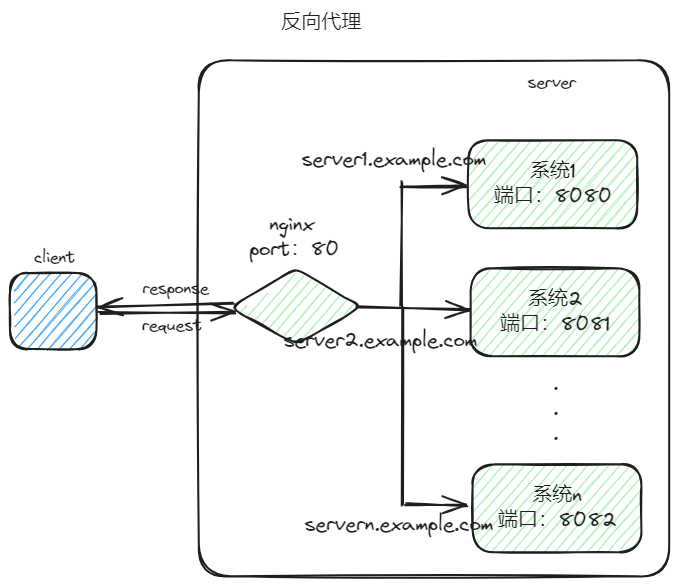
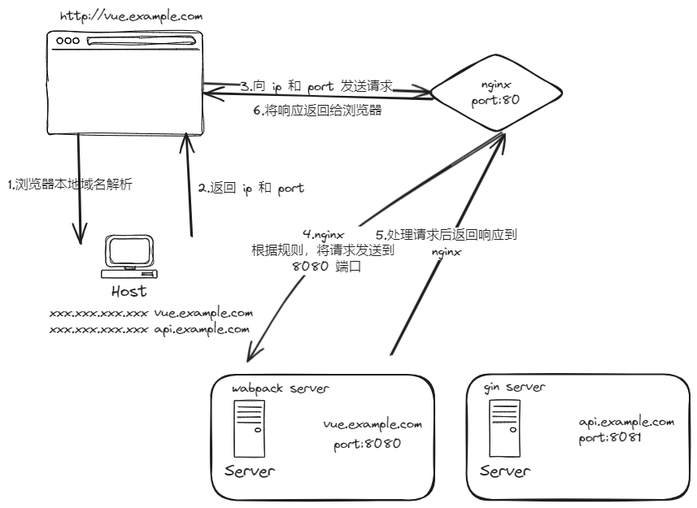
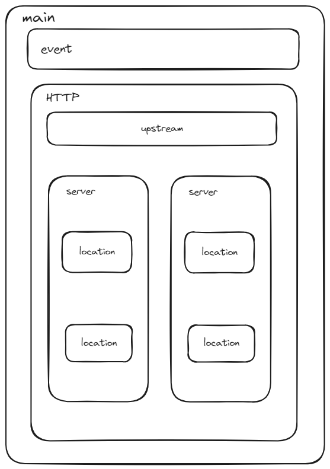

# nginx 部署 vue 项目

# nginx

## 1 nginx 功能

**nginx 相当于一个网关**

* 反向代理
* 负载均衡
* 动态路由
* 请求过滤

## 2 反向代理



* 代理（Proxy）：代理从**客户端的角度**出发。位于客户端和服务器之间的中间实体，代表着**客户端**与**服务器**进行**通信**，当客户端发送请求时，请求会先发送给代理服务器，代理服务器再将请求发送给目标服务器，然后**服务器**将**响应**返回给**客户端**。
  * 缓存：缓存服务器响应的数据，后续的请求中可以直接返回缓存的数据
  * 过滤和防火墙：过滤客户端请求和服务器响应
  * 匿名性：代理服务器可以隐藏客户端的真实 IP 地址
  * 访问控制：代理可以对客户端的访问进行控制



* 反向代理（Reverse Proxy）：反向代理从**服务器的角度**出发。代表服务器与客户端进行通信，将客户端请求转发到后端的多个服务器上，并将服务器的响应返回给客户端。客户端并不知道真正提供服务器的是哪个服务器。**客户端**只与**反向代理服务器**进行**通信**。
  * 负载均衡：将客户端请求分发到多个后端服务器上
  * 高可用性：可以监测后端服务器的状态，当某个服务器故障时，可以自动将请求转发到其他正常工作的服务器上，提高可用性
  * 安全性：反向代理可以作为防火墙，过滤拦截恶意请求，保护后端服务器的安全
  * 缓存：反向代理可以缓存后端服务器的响应结果，减轻服务器的负载并提高响应速度

## 3 nginx 流程

* 客户端会先把请求发送到 nginx（80 端口），nginx 会一直监听 80 端口。
* nginx 收到请求后根据域名解析，映射到不同的路径中
  * 直接使用域名的方式，不用暴漏 ip 和端口
* 根据域名解析到不同的 port，再将请求发送给对应的 port



## 4 nginx 代理配置文件

**配置文件结构**



* **main**：全局配置，用于配置与具体业务无关的参数，例如 `worker_processes` 用来配置要起几个线程
* **events**：用于配置影响 `nginx` 服务与用户之间链接的属性，如 `work_connections` 配置每个线程的最大连接数
* **http**：`nginx` 的业务功能（还有 email），`upstream` 上游块
* **server**：位于 http 内部，用于配置 `nginx` 的一个**主机**，其中 `listen` 指定监听的**端口号**；`server_name` 指定**主机名**；`location` 用于指定主机上的**资源位置**

```nginx
worker_processes 4;

events {
	worker_connects 10000;
}

http {
    # 上游块
    # 后端服务代理 名字为 api
    upstream api {
        # 后端的地址，替换成实际的地址
        server api.example.com
    }
    
    # 服务器块
    # 前端服务代理
    server {
        listen 80;
        server_name frontend.example.com;
        
        # loaction 表示映射规则，/ 代表映射一切请求路径
        location / {
            # 静态文件路径
            root /path/to/frontend/dist;
            # 静态文件的访问规则
            try_files $uri $uri/ /index.html
        }
    }
    
    # 用于反向代理
    server {
        # 监听端口
        listen 80;
        # 监听域名
        server_name mydomain.com;
        
        # /api 路径被代理到后端服务
        location /api {
            # 通过 proxy_pass 指令将请求代理到相应的上游服务器
            proxy_pass http://api;
            # 代理请求的 header 信息
            proxy_set_header Host $host;
            proxy_set_header X-Real-IP $remote_addr;
            proxy_set_header X-Forwarded_For $proxy_add_x_forwarded_for;
        }
        
        location / {
            proxy_pass http://frontend.example.com;
            proxy_set_header Host $host;
            proxy_set_header X-Real_IP $remote_addr;
            proxy_set_header X-Forwarded-For $proxy_add_x_forwarded_for;
        }
    }
}


```


# 编译项目

* `npm run build` 将项目编译出 `dist` 文件（存放网页代码的文件）
* `nginx` 反向代理需要这个文件（dist），去访问网页
* 配置 `nginx config` 文件
* 写 `dockerfile`
  * 复制静态文件
  * 复制本地的配置文件
* 编译 `dockerfile`，暴漏端口，`volume` 映射

