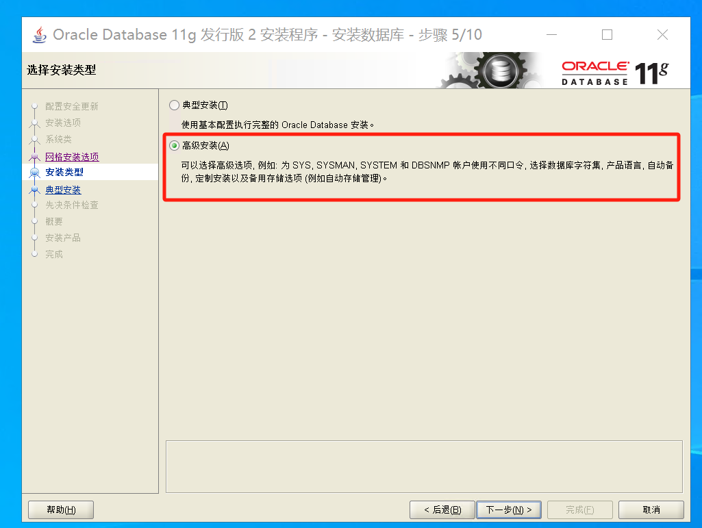
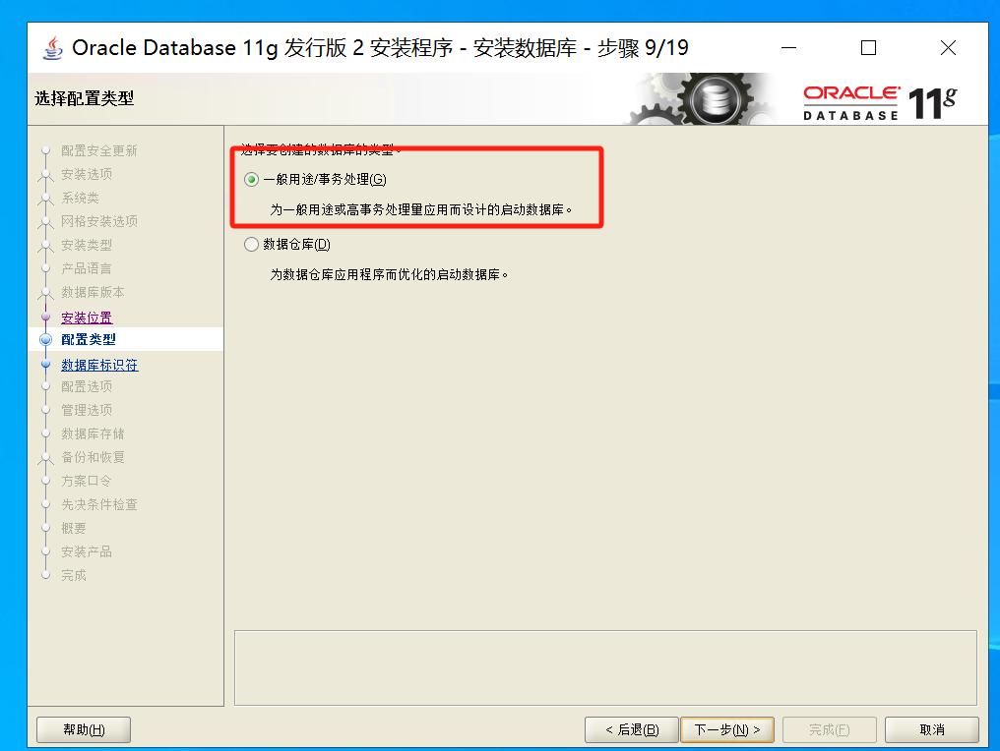

# 数据库安装

# windows 下mysql安装

参考博客：[Windows MYSQL社区版8.1下载安装（MSI）_mysql社区版下载-CSDN博客](https://blog.csdn.net/weixin_68256171/article/details/132107858)

提示缺少 `Microsoft Visual Studio 2019 Redistributable`，参考博客：[MySQL msi安装缺少‘Microsoft Visual Studio 2019 Redistributable’_vstdio2019redistributable-CSDN博客](https://blog.csdn.net/qq_41563277/article/details/104665146)

[点击这里](https://visualstudio.microsoft.com/downloads/)

点击最底部：**Other Tools and Frameworks**一栏，
下载
**Microsoft Visual C++ Redistributable for Visual Studio 2019**

# Ubuntu 安装 Mysql

* 直接使用包管理安装

  ```shell
  $ sudo apt install mysql-server
  ```

* 服务未开启，使用以下命令开启

  ```shell
  $ sudo /etc/init.d/mysql start
  ```

* 查看版本

  ```shell
  $ mysql -V
  ```

* 初始化数据库

  ```shell
  $ mysql_secure_installation
  ```

* 调整用户身份验证

  * 检查用户对应的身份验证方法

    ```mysql
    SELECT user,authentication_string,plugin,host FROM mysql.user;
    ```

    

  * 使用 'ALTER USER' 修身份验证方法

    ```mysql
    ALTER USER 'root'@'localhost' IDENTIFIED WITH mysql_native_password BY 'your_password';
    ```

  * 修改完成后重新加载权限更新到数据库中

    ```mysql
    FLUSH PRIVILEGES;
    ```

  * 再次登陆时需要验证

    ```shell
    $ mysql -u root -p
    ```

* 创建新用户

  ```mysql
  CREATE USER 'wty'@'localhost' IDENTIFIED BY 'password';
  GRANT ALL PRIVILEGES ON *.* TO 'wty'@'localhost' WITH GRANT OPTION;
  ```

* **配置服务器远程连接**

  * 在防火墙打开一个端口

    ```shell
    $ sudo ufw enable
    $ sudo ufw allow mysql
    ```

  * 安装 ufw 工具

    ```shell
    $ sudo apt install ufw
    ```

  * 也可以为 mysql 打开端口（默认3306）

    ```shell
    $ sudo ufw allow 3306
    ```

  * 将 mysql 启动时运行

    ```shell
    $ sudo systemctl enable mysql
    ```

  * 配置接口（默认127.0.0.1:3306）

    ```shell
    $ sudo vim /etc/mysql/mysql.conf.d/mysqld.cnf
    ```
    
  * 如果外部访问（暴漏公共接口）需要绑定外部接口
  
    ```shell
    $ sudo vim /etc/mysql/mysql.conf.d/mysqld.cnf
    ```
  
    修改 `bind-address` 成服务器的公开 `ip`
  
    会发生本地 `ip` 不被允许访问的问题；创建一个动态 ip 可以访问的用户
  
    ```mysql
    create user 'test'@'%' identified by 'wutianyu';  // '%' 动态ip，不限制ip
    grant all privileges on *.* to 'test'@'%'; // 授予权限
    flush privileges; // 刷新权限
    ```
  
    发生 `Public Key Retrieval is not allowed` 错误的时候，修改 mysql，使高版本服务器兼容低版本客户端，使用公钥检索（配置文件中修改）：**在设置中修改驱动属性**
  
    

# Ubuntu 安装 Redis

## Redis images 使用

* 查看镜像：`docker search redis`
* 拉取镜像：`docker pull 镜像名:标签`

* 挂载本地目录
  * 创建本地存放 `redis` 配置文件的文件夹，同时在该文件夹中创建 `redis.conf` 作为 `redis` 启动时加载的配置文件
  * 挂在数据存放的文件夹，默认进入控制台的工作目录

* docker 容器创建

  ```shell
  $ docker run -d --name redis \
  	-p 6379:6379 \
  	--restart unless-stopped \ # 容器退出时自动重启，除非显示停止
  	-v D:\project\go_project\redis\data:/data \ # 工作目录挂载的位置
  	-v D:\project\go_project\redis\conf\:/etc/redis/ \ # 配置文件挂挂载的位置
  	redis \   # 镜像名
  	redis-server /etc/redis/redis.conf # 服务启动加载的配置文件
  
  ```

* 配置 `redis.conf` 

  ```
  appendonly yes #  启动Redis持久化功能 (默认 no , 所有信息都存储在内存 [重启丢失] 。 设置为 yes , 将存储在硬盘 [重启还在])
  requirepass 密码
  ```

* 进入 `redis` 容器中

  * ```shell
    $ docker exec -it redis /bin/bash
    $ redis-cli # 进入 redis 控制台
    $ redis-cli -h 127.0.0.1 -p 6379 -a 密码  # 如果设置了密码，需要登陆才能有权限写入
    ```


## Ubuntu 安装 Redis

* 命令安装

  ```shell
  $ sudo apt install redis-server
  ```

* 进入 `redis` 的远程配置（默认不可以使用远程）

  ```
  bind 0.0.0.0   # 修改成 0.0.0.0
  protected-mode no # 修改成 no ，yes是保护模式，只允许本地连接
  daemonize no  # 加入 daemonize no，后台启用一个不占用一个主程窗口
  ```

  


# windows server 部署 oracle 11g

## 1 下载 oracle 11g

### 1.1 迅雷下载链接

http://download.oracle.com/otn/nt/oracle11g/112010/win64_11gR2_database_1of2.zip

http://download.oracle.com/otn/nt/oracle11g/112010/win64_11gR2_database_2of2.zip

## 2 安装

### 2.1 解压缩放置于同一路径

### 2.2 安装过程

* 直接 setup 安装
* 
  * 直接点**是**，进入下一步
* 
  * 取消配置安全更新
  * 警告直接点**是**
* 
  * 选择创建和配置数据库
* 
  * 选择服务器类
* 
  * 单实例数据库安装
* 
  * 高级安装
* 
  * 选择默认语言
* 
  * 选择安装企业版
* 
  * 只选择基目录就可以，本次不做选择，只有系统盘
* 
  * 选择一般用途
* 
  * 数据库标识符（默认即可）
* 
  * 进入**字符集配置**
  * 选择 `Unicode` 编码
* 
  * **不启用通知**，直接下一步
* 
  * 数据库存储，不需要改变，直接下一步
* 
  * 自动备份根据需求进行选择，这里选择不启动自动备份
* 
  * 根据需求选择口令，这里选择全部统一
* 其余都默认完成等待安装即可，口令根据后续需求在配置

### 2.3 修改 host

将 `listener.ora` 与 `tnsnames.ora` 中的 `HOST` 替换成本地的 `ip`

* 

  

  * 安装了 **服务器版**的应该不需要改这个

## 3 使用

### 3.1 远程连接的使用

* 使用 `DBeaver` 服务器管理软件进行远程登陆

  

* 但是会出现错误，所以要进入 `SQL Plus` 去修改权限

  * 找到 `SQL Plus`

    

  * 登陆

    

  * 输入 `alter user system account unlock;` 给用户解锁

    

  * 输入 `connect system/**** as sysdba;` 给用户授权

    * system 是用户名
    * \**** 是密码

    

* 登陆选项修改成 `Normal` 即可登陆

  

### 3.2 客户端使用

`SQL Plus`

## 4 基本操作

### 4.1 通过 `.sql` 导入表

* 需要进行进行编码转义，转成 `utf8` 打开，然后使用 `GB 23` 编码保存（带中文的情况下）

### 4.2 导入表数据（excel）

* 另存为 `csv` 格式，然后导入

## 5 后端连接

### 5.1 创建用户

* 用户创建

  ```sql
  create user username identified by password;
  ```

* 授权

  ```sql	
  grant connect, resource to username;
  ```

* 解锁账户

  ```sql
  alter user username account unlock;
  ```

* 测试连接

  ```sql
  connect username/password as sysdba;
  ```

### 5.2 找不到 `64 bit` 客户端

* 下载客户端，解压之后，将路径加入到环境变量
  * 解决方法地址：https://odpi-c.readthedocs.io/en/latest/user_guide/installation.html#windows
  * windows 客户端地址：https://www.oracle.com/database/technologies/instant-client/winx64-64-downloads.html

### 5.3 连接问题

#### 5.3.1 ORA-12638: 身份证明检索失败

* 在 `/product/11.2.0/dbhome_1/NETWORK/ADMIN` 中找到 `sqlnet.ora` 文件，修改其中的 `SQLNET.AUTHENTICATION_SERVICES= (NTS)`  成 `SQLNET.AUTHENTICATION_SERVICES= (NONE)`

> SQLNET.AUTHENTICATION_SERVICES 表示oracle使用哪种验证方式，NTS表示采用本地操作系统认证，NONE表示将采用口令文件方式认证。设定了none后，本地的操作系统认证将不被许可，oracle将采用口令文件认证(此时 remote_login_passwordfile=exclusive)如connect /as sysdba 登录，后报错RA-01031: insufficient privileges，实际上是要求你输入sysdba的用户名和密码


