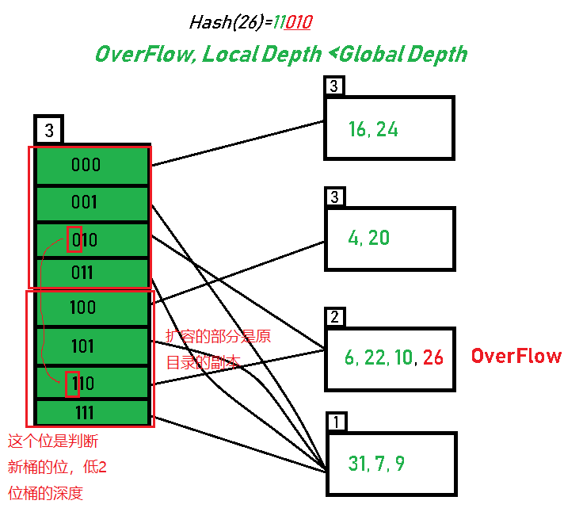

# C++知识
## std::shared_ptr
* `std::scoped_lock<std::mutex> lock(latch_);` 互斥锁包装器，在作用域对互斥锁进行锁定，超出作用域解锁
## 位运算
* 使用位运算，只有一个位为 1 的二进制数，与要判断的位进行 & 操作，即可判断可这个数的该位是否位 1
* 可以通过判断等于 == 0U 来判断， U 为无符号
## vector 容器
* `vector` 可以使用 `resize` 来改变容器大小
## std::find_if(begin(), end(), condition)
* 查找迭代器中满足条件的
* `condition` 可以使用`lambda`表达式:`[key](const std::pair<K, V> &p) { return p.first == key; }`
* lambda表达式：`[作用域捕获数据](传入参数){行为}`
## std::list
* `push_front()`，为`list`的头插法，`list`为双向链表
* `rbegin(), rend()`可以从后向前遍历列表
## 经验
* 新增一倍的vector元素，这些元素是原本元素的副本，使用 `vector[i + capcity] = vector[i]`  去为新增的元素复制以前的元素(capcity 为未新增时的容量)
* 为了加速访问某个元素在`list`中的位置，可以通过`unordered_map`去记录元素对应的`iterator`。`iterator`是一种智能指针，不回因为插入元素，这个迭代器的指向就会改变，后续仍旧可以通过这个`iterator`访问元素。但是在list中插入元素时，不能继续使用迭代器访问，因为插入或删除元素可能会改变链表中元素的位置，进而使得迭代器指向的位置不再是你期望的位置，导致迭代器失效。
  * 具体来说，当你向`list`中插入一个元素时，如果这个元素插入到当前迭代器指向的位置之前或之后，那么当前迭代器仍然有效，因为它所指向的元素的位置并没有改变。但是，如果你向list中插入一个元素，使得这个元素插入到当前迭代器指向的位置上，那么当前迭代器就会失效，因为它所指向的元素已经被移动到了链表中的其他位置。
* 如果想要快速访问`key`对应的`list`中的位置，可以使用`hash`表记录`key`对应的`iterator`
# Buffer Pool
缓冲池负责主存和磁盘之间来回移动物理页。 
需要实现 **线程安全** 的缓冲池
## ExtendibleHashTable + LRU-K + BufferPoolManager 扮演的角色
**自顶向下**
### BufferPoolManger
* 概念：从磁盘中读取的是`page`，`page`存入缓存池的`frame`中，`frame`相当于一个列表，用来不断存储磁盘中读取的页（内存中未命中），也在不断淘汰（LRU-K）长期不用的磁盘页，写回磁盘（脏页）
* 通过使用`LRU-K`以及`ExtendibleHashTable`来记录从磁盘中访问的页存储淘汰策略
* 将磁盘中的页读入内存：磁盘页（page）是存入内存的帧（frame）中的
  * 首先通过`ExtendibleHashTable`来记录`pair(page_id, frame_id)`
  * 同时将`frame_id`放入`LRU-K`中决定其淘汰策略（`LRU-K`是记录缓存池中的帧是否可以淘汰，淘汰后将帧存入新的`page`）
  * 最后是缓存池，用来控制可扩展哈希以及`LRU-K`，来达到缓存淘汰的管理作用
* 如果内存中存在，则不需要磁盘的读取操作
* 如果内存满了，需要使用`LRU-K`的`replacer`来获取可以被淘汰的`frame`，然后存入新的`page`
### LRU-K
* 用来管理缓存池的帧，是否能被淘汰的 == 腾出新的帧用来存储磁盘中读取的`page`
* LRU-K与磁盘的页没有关系，仅仅是控制帧的淘汰。为新磁盘页腾空间的
### ExtendibleHashTable
* 用来记录磁盘页与缓存池的帧的映射，以便寻找需要的内容（是否命中内存）
* 通过`hash table`进行记录，一方面可以减少查询时间，另一方面可扩展哈希可以动态控制容量的大小

## 可扩展哈希表
### 可扩展哈希主要原理
参考：https://www.geeksforgeeks.org/extendible-hashing-dynamic-approach-to-dbms/  
* 可扩展哈希的存储原理：使用分裂桶进行数据的存储
  * 目录：以指针的形式存储桶的地址。为每个目录分配一个 ID，每次进行扩容时，该 ID 可能会更改。其本质就等同于一个目录对应着所有 `hash` 值相同的数据，使用目录所谓索引
  * 桶：具体存储数据的容器，`hash` 值相同的数据存储到一个桶中，但是桶本身有深度（存储数据的容量），超出深度就需要扩容，然后对桶内数据进行重分配，因为目录扩容的时候会导致 hash 方案的改变
  * 深度：用于扩容和 `hash` 计算
    * 全局深度：用来对目录进行分配，`hash` 策略是数据使用`hash`转换成二进制后的 **后（全局深度[2]位）**
    * 局部深度：表示桶的个数，是否扩容
  * 扩容有两种主要的情况：
    * 1.桶溢出，同时局部深度（即扩容过的桶的个数）== 全局深度，就需要对目录进行扩容，目录扩容，对目录的 `hash` 策略进行更改：全局深度+1，`hash` 位数+1，然后对扩容桶的内容重新进行 hash，桶的数目也+1（即local depth），更改目录指向。
    * 2.桶溢出，同时局部深度 < 全局深度，只需要增加一个桶，更改目录指向即可，然后对数据进行重 `hash`
    * 注意事项：没有溢出的桶，即便目录进行了扩容，扩容后的目录也仍旧指向原来的桶,即扩容后的后半部分目录是原目录的副本
* 可扩展哈希操作流程：
  1. 分析数据类型
  2. 转换成而进行，通过 `global depth` 对数据进行 `hash` 操作
  3. 通过 `hash` 值确定目录
  4. 根据目录进入桶
  5. 分析 `global depth` 与 桶的 `local depth`,查看是否需要扩容，如果需要扩容，就判断上述两种情况是哪一种
  6. 根据溢出的问题做两种操作，最后对溢出桶进行在重 `hash` 操作
* 
### 实现中需要解决的问题
* 需要解决`目录`与`桶`之间对应关系如何存储
    * 不需要映射，只需要在扩容的时候，桶扩容后的指针，仍旧赋值给未扩容的指针，如果遇到扩容的桶，则重新生成一个桶，否则用之前的
    * `i + bucket_capcity = i` 即使用扩容前对应的桶
* 需要解决扩容的时候，`目录`与`桶`之间对应的关系如何更新
    * 目录的指向问题，当目录扩容后，不需要进行桶扩容的目录，在扩容后仍旧需要指向原来的桶-->通过对目录的桶指针进行复制，扩容后的多出的一倍的目录为扩容前的副本，具有相同的指向
    * 同时构建两个桶，分别对应需要更新的两个目录，同时将两个目录对应的桶替换（替换前需要将原桶的数据使用新的`Index`进行重分配）
* 需要解决如何根据`key`获取桶的`index`
    * `IndexOf`函数会获取桶的`index`
* `ExtendibleHashTable`的`Insert`为主要实现内容，具体实现流程如下
  * 判断key所在目录的桶是否已满，如果已满
    * 判断是否需要目录扩容：全局深度 == 局部深度，目录扩容的要点是扩容后的目录为扩容前目录的副本，通过复制桶的共享指针即可完成
    * 桶扩容是必须的，同扩容可以采取新建两个桶，更改两个目录指针进行更改，也可以单独生成一个桶，更改`1...`对应的桶即可(...表示目录对应桶深度的最低几位，桶的深度一方面也表示了当前目录的低多少位已经有桶)。前者如果桶深度高，会占用很多空间，后者有增删桶元素的开销
      * 新建两个桶，然后将原桶的数据进行重分配到这两个新桶。（使用一个区分新桶最高位的`mask`，`0001000`，来与数据相与，来获取新数据应该放在哪个桶中，因为低几位都是相同的）
      * 分配完数据之后，去目录中找这个桶，将新的桶进行替换（使用目录的`index & mask`来区分应该替换哪个桶）
  * 扩容完成之后，还需要考虑`key`已经存在的情况，已经存在就更改`value`，不存在就`insert`
* `Bucket`是不需要考虑对里面的数据个数进行更改的，因为`IsFull`是获取的`list`的`size`
## LRU-K 替换策略
### LRU-K 原理
* LRU + LFU 策略相互组合
* K：需要记录的同一数据的访问次数，用以计算时间间隔
* LRU 缺点：在对表进行访问的时候访问大表时，会造成表扫描泛洪，将可能经常访问的数据给驱逐
* LRU-K 需要多维护一个队列，用于记录所有缓存数据被访问的历史，从历史中选取达到K次的数据，放入缓存，LRU-K的淘汰的策略是淘汰第k次访问的时间距当前时间最大的数据，即是最久未访问的数据
* LRU-K 操作流程：
  * 当数据第一次访问，加入到访问历史列表
  * 如果数据在访问历史列表里没有达到K次访问，按规则（FIFO，LRU）淘汰
  * 当访问历史列表中数据访问到达K次后，将数据从历史列表中删除，移入缓存队列，同时缓存队列进行排序，按照第二次访问时间距当前时间的大小进行排列
  * 需要淘汰数据的时候，淘汰缓存队列中排在末尾的数据
### 实现中需要解决的问题
* 历史列表长度，历史列表数据满了，清除的策略
  * 历史数据的缓冲池没有长度，同时Evict首先驱逐历史队列中时间戳最长的帧，如果没有能驱逐的再驱逐缓存队列中的可驱逐的帧
* 访问数据的问题：K次访问数据如何记录，时间步如何记录
  * 首先，队列只需要记录访问的次数，使用unordered_map进行记录次数
  * 时间步用链表进行操作，时间链表头插，头部为时间最早的帧
  * 当历史列表中的元素不是首次被访问，同时小于k次，不需要操作历史列表，即不需要放到头部，只需要增加访问次数即可（但是按理说应该使用头插放到头部）
* 移入缓存的时候，如果有新的数据，需要更新缓存列表的顺序
  * 头插法
## 缓冲池管理器实例
### 缓存池管理器功能
* 从磁盘获取数据库页，存入内存
* 驱除页，为新页腾空间，同时将脏页写回
### 需要注意的问题
* 缓存池的`pages_`的每个`page`是重复使用的，该`page`与磁盘的`page`不同，该`page`相当于将磁盘的`page`进行了封装，里面有磁盘`page`的数据以及一些元数据
* 在每次`frame`映射的磁盘`page`进行更改的时候，需要对缓存池的`pages_`对应的`frame`进行元数据的初始化
# 调试经验
## 单测
### extendible_hash_table
* `extendible_hash_table` 在实例化的时候会设置 `bucket size`
    * 初始化实例的 bucket_size_
    * bucket 使用vector 存储，因此目录即使用下表来进行获取：`hash` 结果与 `下标` 相关
    * 初始化的时候，要实例化 bucket
* `table->find(key, result)` 会将结果写入 `result`
* `table->GetLocalDepth(0)` `bucket` 是使用 `vector` 存储的，这个方法会返回下标为 `0` 的 `bucket` 的 `local depth`
* `table->Remove(8)` `remove` `key`，返回 `true` 或者 `false`
* `table->Find(9, result)` 会将查到的`key`对应的`value`复制到`result`中，所以在写`Find`的时候要注意不仅仅是`return true`的部分
### 