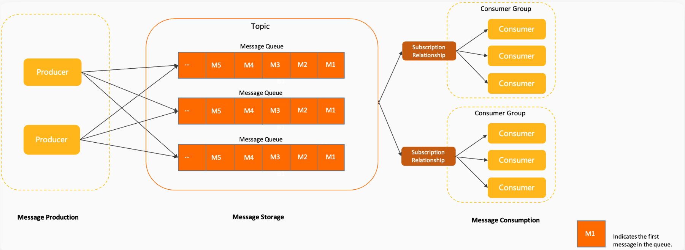
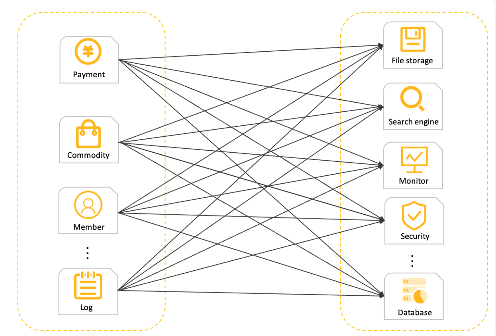
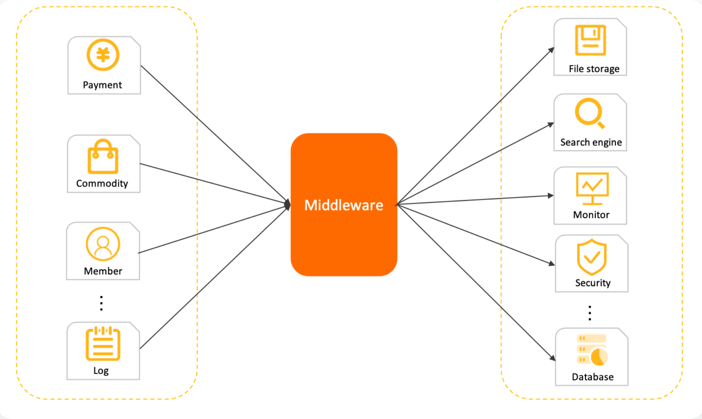
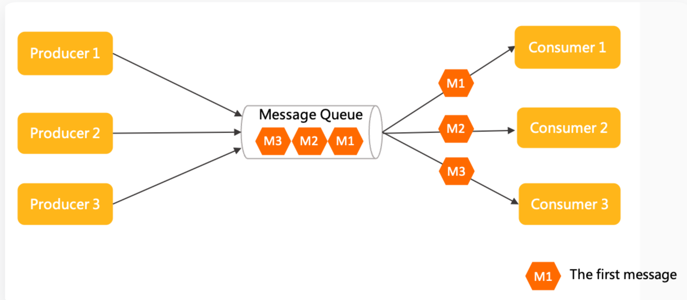
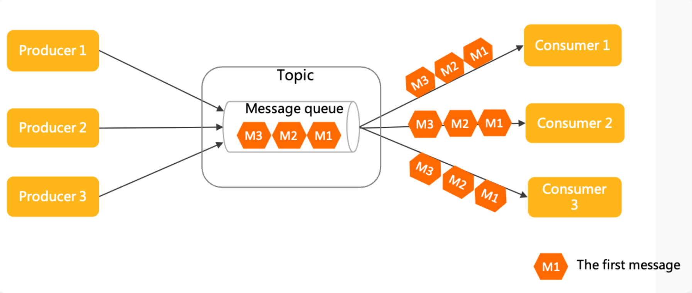

# RocketMQ 学习

## 1 基本概念

- [主题（Topic）](https://rocketmq.apache.org/zh/docs/introduction/02concepts#主题topic)
- [消息类型（MessageType）](https://rocketmq.apache.org/zh/docs/introduction/02concepts#消息类型messagetype)
- [消息队列（MessageQueue）](https://rocketmq.apache.org/zh/docs/introduction/02concepts#消息队列messagequeue)
- [消息（Message）](https://rocketmq.apache.org/zh/docs/introduction/02concepts#消息message)
- [消息视图（MessageView）](https://rocketmq.apache.org/zh/docs/introduction/02concepts#消息视图messageview)
- [消息标签（MessageTag）](https://rocketmq.apache.org/zh/docs/introduction/02concepts#消息标签messagetag)
- [消息位点（MessageQueueOffset）](https://rocketmq.apache.org/zh/docs/introduction/02concepts#消息位点messagequeueoffset)
- [消费位点（ConsumerOffset）](https://rocketmq.apache.org/zh/docs/introduction/02concepts#消费位点consumeroffset)
- [消息索引（MessageKey）](https://rocketmq.apache.org/zh/docs/introduction/02concepts#消息索引messagekey)
- [生产者（Producer）](https://rocketmq.apache.org/zh/docs/introduction/02concepts#生产者producer)
- [事务检查器（TransactionChecker）](https://rocketmq.apache.org/zh/docs/introduction/02concepts#事务检查器transactionchecker)
- [事务状态（TransactionResolution）](https://rocketmq.apache.org/zh/docs/introduction/02concepts#事务状态transactionresolution)
- [消费者分组（ConsumerGroup）](https://rocketmq.apache.org/zh/docs/introduction/02concepts#消费者分组consumergroup)
- [消费者（Consumer）](https://rocketmq.apache.org/zh/docs/introduction/02concepts#消费者consumer)
- [消费结果（ConsumeResult）](https://rocketmq.apache.org/zh/docs/introduction/02concepts#消费结果consumeresult)
- [订阅关系（Subscription）](https://rocketmq.apache.org/zh/docs/introduction/02concepts#订阅关系subscription)
- [消息过滤](https://rocketmq.apache.org/zh/docs/introduction/02concepts#消息过滤)
- [重置消费位点](https://rocketmq.apache.org/zh/docs/introduction/02concepts#重置消费位点)
- [消息轨迹](https://rocketmq.apache.org/zh/docs/introduction/02concepts#消息轨迹)
- [消息堆积](https://rocketmq.apache.org/zh/docs/introduction/02concepts#消息堆积)
- [事务消息](https://rocketmq.apache.org/zh/docs/introduction/02concepts#事务消息)
- [定时/延时消息](https://rocketmq.apache.org/zh/docs/introduction/02concepts#定时延时消息)
- [顺序消息](https://rocketmq.apache.org/zh/docs/introduction/02concepts#顺序消息)

### 1.1 主题（Topic）

* 表示同类业务逻辑，相当于区分**消息的分发** 

### 1.2 消息类型（MessageType）

* 按照消息传输特性的不同而定义的分类，同于消息管理和安全校验（与 `rabbitMQ` 不同，消息类型**不是**放在消息上的 `tag` 用来分发给不同队列的）
  * 普通消息
  * 顺序消息
  * 事务消息
  * 定时/延时消息
* 从 5.0 开始每个 `Topic` 只允许发送一种消息类型，但是向下兼容（强制校验功能默认关闭，推荐通过服务端参数 `enableTopicMessageTypeCheck` 手动开启校验）

### 1.3 消息队列（MessageQueue）

* 消息的**最小存储单元**
* 所有 `Topic` 都由**多个队列**组成，以此实现队列数量的**水平拆分**和队列内部的**流式存储**
* 队列通过`QueueId`来做**唯一标识**和**区分**

### 1.4 消息（Message）

* 最小**数据传输单元**
* 生产者将业务数据的**负载**和**拓展属性**包装成消息发送到服务端，服务端按照相关语义将消息投递到消费端进行消费

### 1.5 消息视图（MessageView）

* 为开发者提供一个消息**只读接口**，用来读取消息内部信息，同时不能修改消息

### 1.6 消息标签（MessageTag）

* 细粒度**消息分类**，可以在主题层级之下做消息类型的分类
* **消费者**通过**订阅特定标签**来实现消息**细粒度过滤**：选择对应的**消息标签**

### 1.7 消息位点（MessageQueueOffset）

* 每条消息在队列中都有一个**唯一**的**Long类型坐标**，这个坐标被定义为**消息位点**

### 1.8 消费位点（ConsumerOffset）

* 一条消息被某个消费者消费完成后**不会**立即从队列中**删除**，Apache RocketMQ 会基于**每个消费者分组**记录消费过的最新一条**消息的位点**，即**消费位点**：讲人话就是：消费者分组记录消费过的消息位点

### 1.9 消息索引（MessageKey）

* 面向消息的索引属性，用来快速查找**对应的消息内容**

### 1.10 生产者（Producer）

* 封装消息，同时传输到服务器的组件，通常是**消息中间件**

### 1.11 事务检查器（TransactionChecker）

* **生产者**用来执行**本地事务检查**和**异常事务恢复**的监听器
* **事务检查器**应该通过**业务侧数据**的状态来检查和判断事务消息的状态

### 1.12 事务状态（TransactionResolution）

* 事务消息发送过程中，**事务提交的状态标识**，服务端通过事务状态控制事务消息是否应该提交和投递。
* **事务状态**包括事务提交、事务回滚和事务未决

### 1.13 消费者分组（ConsumerGroup）

* 用来**负载均衡**，**水平扩展高可用**
* 将多个相同消费行为的消费者进行分组，消费者分组并不是运行实体，而是一个**逻辑资源**。
* 消费者分组内初始化多个消费者实现消费性能的**水平扩展**以及**高可用容灾**

### 1.14 消费者（Consumer）

* 接收并处理消息的**运行实体**
* 通常被集成在业务系统中，从服务端获取消息，并将消息转化成业务可理解的信息，供业务逻辑处理
* 消费者根本就是**获取消息**，**转换**成业务模块所需要的形式

### 1.15 消费结果（ConsumeResult）

* `PushConsumer`消费监听器**处理**消息完成后返回的**处理结果**，用来标识本次消息**是否正确处理**
* 消费结果包含**消费成功**和**消费失败**

### 1.16 订阅关系（Subscription）

* 和**消费者**有关，使消费者能够获取所需的消息

* 消费者**获取消息**、**处理消息的规则**和**状态配置**
* 订阅关系由消费者分组动态注册到服务端系统，并在后续的消息传输中按照订阅关系定义的**过滤规则**进行**消息匹配**和**消费进度**维护

### 1.17 消息过滤

* 消费者可以通过订阅指定**消息标签**（Tag）对消息进行**过滤**，确保最终只接收被过滤后的消息合集
* 规律规则的**计算**和**匹配**在 `RocketMQ` 的**服务端完**成

### 1.18 重置消费位点

* 以时间轴为坐标，在**消息持久化存储**的时间范围内，**重新设置**消费者分组对**已订阅主题**的**消费进度**，设置完成后消费者将**接收**设定**时间点之后**，由生产者发送到Apache RocketMQ 服务端的消息
* 讲人话：重新设置消费的时间点，使消费者接受新时间点之后的消息

### 1.19 消息轨迹

* 在一条消息从生产者发出到消费者接收并处理过程中，由各个**相关节点**的时间、地点等数据汇聚而成的**完整链路信息**
* 消息所经历的链路信息，用来排错用的

### 1.20 消息堆积

* 生产者已经将消息发送到Apache RocketMQ 的服务端，但由于消费者的消费能力有限，未能在短时间内将所有消息**正确消费掉**，此时在服务端保存着未被消费的消息，该状态即消息堆积
* 讲人话：未及时消费的消息堆积在了服务器

### 1.21 事务消息

* 高级消息类型，支持在分布式场景下保障消息生产和本地事务的最终一致性
* **分布式事务**，保证分布式场景下的**最终一致性**

### 1.22 定时/延时消息

* 高级消息类型，消息被发送至服务端后，在**指定时间后**才能被消费者**消费**。通过设置一定的定时时间可以实现分布式场景的**延时调度触发**效果
* 延迟消费

### 1.23 顺序消息

* 高级消息类型，支持消费者按照发送消息的**先后顺序**获取消息，从而实现业务场景中的顺序处理

## 2 参数约束和建议

| 参数                         | 建议范围                                                     | 说明                                                         |
| ---------------------------- | ------------------------------------------------------------ | ------------------------------------------------------------ |
| Topic名称                    | 字符建议：字母a~z或A~Z、数字0~9以及下划线（*）、短划线（-）和百分号（%）。 长度建议：1~64个字符。 系统保留字符：Topic名称不允许使用以下保留字符或含有特殊前缀的字符命名。 保留字符: TBW102 \*BenchmarkTest\* SELF_TEST_TOPIC \*OFFSET_MOVED_EVENT\* SCHEDULE_TOPIC_XXXX \*RMQ_SYS_TRANS_HALF_TOPIC\* RMQ_SYS_TRACE_TOPIC \*RMQ_SYS_TRANS_OP_HALF_TOPIC 特殊前缀:\* rmq_sys* %RETRY% *%DLQ%* rocketmq-broker- | Topic命名应该尽量使用简短、常用的字符，避免使用特殊字符。特殊字符会导致系统解析出现异常，字符过长可能会导致消息收发被拒绝。 |
| ConsumerGroup名称            | 字符建议：支持字母a~z或A~Z、数字0~9以及下划线（*）、短划线（-）和百分号（%）。 长度建议：1~64个字符。 系统保留字符：ConsumerGroup不允许使用以下保留字符或含有特殊前缀的字符命名。 保留字符: \*DEFAULT_CONSUMER\* DEFAULT_PRODUCER \*TOOLS_CONSUMER\* FILTERSRV_CONSUMER \*__MONITOR_CONSUMER\* CLIENT_INNER_PRODUCER \*SELF_TEST_P_GROUP\* SELF_TEST_C_GROUP \*CID_ONS-HTTP-PROXY\* CID_ONSAPI_PERMISSION \*CID_ONSAPI_OWNER\* CID_ONSAPI_PULL \*CID_RMQ_SYS_TRANS\* 特殊字符 \* CID_RMQ_SYS* * CID_HOUSEKEEPING | 无。                                                         |
| ACL Credentials              | 字符建议：AK（AccessKey ID）、SK（AccessKey Secret）和Token仅支持字母a~z或A~Z、数字0~9。 长度建议：不超过1024个字符。 | 无。                                                         |
| 请求超时时间                 | 默认值：3000毫秒。 取值范围：该参数为客户端本地行为，取值范围建议不要超过30000毫秒。 | 请求超时时间是客户端本地同步调用的等待时间，请根据实际应用设置合理的取值，避免线程阻塞时间过长。 |
| 消息大小                     | 默认值：不超过4 MB。不涉及消息压缩，仅计算消息体body的大小。 取值范围：建议不超过4 MB。 | 消息传输应尽量压缩和控制负载大小，避免超大文件传输。若消息大小不满足限制要求，可以尝试分割消息或使用OSS存储，用消息传输URL。 |
| 消息自定义属性               | 字符限制：所有可见字符。 长度建议：属性的Key和Value总长度不超过16 KB。 系统保留属性：不允许使用以下保留属性作为自定义属性的Key。 保留属性Key | 无。                                                         |
| MessageGroup                 | 字符限制：所有可见字符。 长度建议：1~64字节。                | MessageGroup是顺序消息的分组标识。一般设置为需要保证顺序的一组消息标识，例如订单ID、用户ID等。 |
| 消息发送重试次数             | 默认值：3次。 取值范围：无限制。                             | 消息发送重试是客户端SDK内置的重试策略，对应用不可见，建议取值不要过大，避免阻塞业务线程。 如果消息达到最大重试次数后还未发送成功，建议业务侧做好兜底处理，保证消息可靠性。 |
| 消息消费重试次数             | 默认值：16次。                                               | 消费重试次数应根据实际业务需求设置合理的参数值，避免使用重试进行无限触发。重试次数过大容易造成系统压力过量增加。 |
| 事务异常检查间隔             | 默认值：60秒。                                               | 事务异常检查间隔指的是，半事务消息因系统重启或异常情况导致没有提交，生产者客户端会按照该间隔时间进行事务状态回查。 间隔时长不建议设置过短，否则频繁的回查调用会影响系统性能。 |
| 半事务消息第一次回查时间     | 默认值：取值等于[事务异常检查间隔] * 最大限制：不超过1小时。 | 无。                                                         |
| 半事务消息最大超时时长       | 默认值：4小时。 * 取值范围：不支持自定义修改。               | 半事务消息因系统重启或异常情况导致没有提交，生产者客户端会按照事务异常检查间隔时间进行回查，若超过半事务消息超时时长后没有返回结果，半事务消息将会被强制回滚。 您可以通过监控该指标避免异常事务。 |
| PushConsumer本地缓存         | 默认值： *最大缓存数量：1024条。 *最大缓存大小：64 M。 取值范围：支持用户自定义设置，无限制。 | 消费者类型为PushConsumer时，为提高消费者吞吐量和性能，客户端会在SDK本地缓存部分消息。缓存的消息的数量和大小应设置在系统内存允许的范围内。 |
| PushConsumer重试间隔时长     | 默认值： *非顺序性投递：间隔时间阶梯变化，具体取值，请参见PushConsumer消费重试策略。 *顺序性投递：3000毫秒。 | 无。                                                         |
| PushConsumer消费并发度       | 默认值：20个线程。                                           | 无。                                                         |
| 获取消息最大批次             | 默认值：32条。                                               | 消费者从服务端获取消息时，一次获取到最大消息条数。建议按照实际业务设置合理的参数值，一次获取消息数量过大容易在消费失败时造成大批量消息重复。 |
| SimpleConsumer最大不可见时间 | 默认值：用户必填参数，无默认值。 取值范围建议：最小10秒；最大12小时。 | 消费不可见时间指的是消息处理+失败后重试间隔的总时长，建议设置时取值比实际需要耗费的时间稍微长一些。 |

## 3 领域模型

### 3.1 领域模型

**异步解耦，流量削峰填谷**

* `Producer`：**中间件**，封装消息，发送到 `RocketMQ` 服务器
* `Message Storage`：由 `Topic`，`MessageQueue`，`Message` 组成
  * `Topic`： 消息传输和存储的**分组容器**，主题内部由多个队列组成，消息的存储和水平扩展实际是通过主题内的队列实现的
  * `MessageQueue`：消息传输和存储的实际**单元容器**，类比于其他消息队列中的分区。 Apache RocketMQ 通过流式特性的**无限队列结构**来存储消息，消息在队列内具备顺序性存储特征
  * `Message`：**最小传输单元**。消息具备不可变性，在初始化发送和完成存储后即不可变
* `Message Consumption`：从队列中消费消息
  * `ConsumerGroup`：消费分组，消费能力水平扩展，负载均衡，保证高可用
  * `Consumer`：消费消息运行的实体
  * `Subscription`：订阅关系

### 3.2 通信方式

**微服务模块之间的通信方式，主要有两种：同步的RPC远程调用；基于中间件代理的异步通信**

* **同步`RPC`调用模型**

  

* **异步中间件通信模型**

  

  **异步通信优势**

  * 系统拓扑简单。由于调用方和被调用方统一和中间代理通信，系统是星型结构，易于维护和管理。
  * 上下游耦合性弱。上下游系统之间弱耦合，结构更灵活，由中间代理负责缓冲和异步恢复。 上下游系统间可以独立升级和变更，不会互相影响。
  * 容量削峰填谷。基于消息的中间代理往往具备很强的流量缓冲和整形能力，业务流量高峰到来时不会击垮下游。

### 3.3 消息传输模型

* **点对点模型**

  

  **特点**

  * 消费匿名：消息上下游沟通的唯一的身份就是队列，下游消费者从队列获取消息无法申明独立身份。
  * 一对一通信：基于消费匿名特点，下游消费者即使有多个，但都没有自己独立的身份，因此共享队列中的消息，每一条消息都只会被唯一一个消费者处理。因此点对点模型只能实现一对一通信。

* **发布订阅模型**

  

  **特点**

  * 消费独立：相比队列模型的匿名消费方式，发布订阅模型中消费方都会具备的身份，一般叫做订阅组（订阅关系），不同订阅组之间相互独立不会相互影响。
  * 一对多通信：基于独立身份的设计，同一个主题内的消息可以被多个订阅组处理，每个订阅组都可以拿到全量消息。因此发布订阅模型可以实现一对多通信。

## 4 功能特性

### 4.1 普通消息

**基础消息**

* 微服务异步解耦的原理： 
  * Event to Message： 事件到消息的转化表示
  * Message to Event：消息到事件的转换
* 数据集成传输的原理：
  * 多点投递消息（数据转换成的消息）到 RocketMQ，然后 RocketMQ 在传递给下游
  * RocketMQ 负责消息收集和暂存

**生命周期**

* 初始化：生产者构建消息并初始化完成，发送到服务端的状态
* 待消费：消息被发送到服务端，对消费者可见，等待消费者消费的状态
* 消费中：消息被消费者获取，并按照消费者本地的业务逻辑进行处理的过程。 此时服务端会等待消费者完成消费并提交消费结果，如果一定时间后没有收到消费者的响应，Apache RocketMQ会对消息进行重试处理
* 消费提交：消费者完成消费处理，并向服务端提交消费结果，服务端标记当前消息已经被处理（包括消费成功和失败）。 Apache RocketMQ默认支持保留所有消息，此时消息数据并不会立即被删除，只是逻辑标记已消费。消息在保存时间到期或存储空间不足被删除前，消费者仍然可以回溯消息重新消费
* 消息删除：Apache RocketMQ按照消息保存机制滚动清理最早的消息数据，将消息从物理文件中删除

**使用限制**

* 消息类型要和主题对应：**Normal 主题**接收普通消息

**使用建议**

* **设置全局唯一业务索引键，方便问题追踪**

### 4.2 定时/延时消息

* 分布式定时调度：确定消息发送的时间，然后发给 RocketMQ， 然后延迟消息会到时间推送给下游
* 任务超时处理：超时任务的检查触发
  * 精度高、开发门槛低：基于消息通知方式不存在定时阶梯间隔。可以轻松实现任意精度事件触发，无需业务去重。
  * 高性能可扩展：传统的数据库扫描方式较为复杂，需要频繁调用接口扫描，容易产生性能瓶颈。 Apache RocketMQ 的定时消息具有高并发和水平扩展的能力。

**定时时间原则**

* 转换成某一时间的时间戳，而不是一段时间
* 定时时间的格式为毫秒级的Unix时间戳，需要将时刻转换成时间戳格式
* 定时时长必须在范围内，不然服务器会立刻发送
* 定时时长最大默认值为24小时，不支持自定义修改
* 不能定时在当前时间之前，不然立刻发送

**定时消息的生命周期**

* 初始化：消息被生产者构建并完成初始化，待发送到服务端的状态。
* 定时中：消息被发送到服务端，和普通消息不同的是，服务端不会直接构建消息索引，而是会将定时消息单独存储在定时存储系统中，等待定时时刻到达。
* 待消费：定时时刻到达后，服务端将消息重新写入普通存储引擎，对下游消费者可见，等待消费者消费的状态。
* 消费中：消息被消费者获取，并按照消费者本地的业务逻辑进行处理的过程。 此时服务端会等待消费者完成消费并提交消费结果，如果一定时间后没有收到消费者的响应，Apache RocketMQ会对消息进行重试处理。具体信息，请参见[消费重试](https://rocketmq.apache.org/zh/docs/featureBehavior/10consumerretrypolicy)。
* 消费提交：消费者完成消费处理，并向服务端提交消费结果，服务端标记当前消息已经被处理（包括消费成功和失败）。 Apache RocketMQ 默认支持保留所有消息，此时消息数据并不会立即被删除，只是逻辑标记已消费。消息在保存时间到期或存储空间不足被删除前，消费者仍然可以回溯消息重新消费。
* 消息删除：Apache RocketMQ按照消息保存机制滚动清理最早的消息数据，将消息从物理文件中删除。更多信息，请参见[消息存储和清理机制](https://rocketmq.apache.org/zh/docs/featureBehavior/11messagestorepolicy)。

**使用限制**

* 消息类型一致：Delay主题内使用，定时消息只能发送至类型为定时消息的主题
* 定时精度约束：毫秒级，默认精度 1000 ms

**创建主题**

`sh mqadmin updateTopic -n <nameserver_address> -t <topic_name> -c <cluster_name> -a +message.type=DELAY`

### 4.3 顺序消息

* 撮合交易
* 数据实时增量同步

**顺序消息的原理**

* 只有在消息组（MessageGroup）中消息才有顺序性
  * 不同消息组没有顺序性
  * 无消息组也没有顺序

**保证消息的顺序性**

* 生产顺序性
  * 保证消息顺序的条件
    * 单一生产者
    * 串行发送：即生产者客户端不能使用多线程并行发送
  * 服务端顺序存储的逻辑
    * **相同消息组**的消息按照**先后顺序**被存储在**同一个队列**
    * **不同消息组**的消息可以混合在**同一个队列**中，且**不保证连续**
* 消费顺序性
  * 投递顺序
  * 有限重试

| 生产顺序                       | 消费顺序 | 顺序性效果                                                   |
| ------------------------------ | -------- | ------------------------------------------------------------ |
| 设置消息组，保证消息顺序发送。 | 顺序消费 | 按照消息组粒度，严格保证消息顺序。 同一消息组内的消息的消费顺序和发送顺序完全一致。 |
| 设置消息组，保证消息顺序发送。 | 并发消费 | 并发消费，尽可能按时间顺序处理。                             |
| 未设置消息组，消息乱序发送。   | 顺序消费 | 按队列存储粒度，严格顺序。 基于 Apache RocketMQ 本身队列的属性，消费顺序和队列存储的顺序一致，但不保证和发送顺序一致。 |
| 未设置消息组，消息乱序发送。   | 并发消费 | 并发消费，尽可能按照时间顺序处理。                           |

**使用建议**

* 串行消费
* 消费组尽可能打散，避免集中导致热点

### 4.* 主题创建

**创建普通主题**

`./bin/mqadmin updateTopic -c DefaultCluster -t DelayTopic -n 127.0.0.1:9876 -a +message.type=NORMAL`

* -c 集群名称
* -t Topic名称
* -n nameserver地址
* -a 额外属性，本例给主题添加了`message.type`为`NORMAL`的属性用来支持普通消息

**创建延迟主题**

`./bin/mqadmin updateTopic -c DefaultCluster -t DelayTopic -n 127.0.0.1:9876 -a +message.type=DELAY`

* -c 集群名称
* -t Topic名称
* -n nameserver地址
* -a 额外属性，本例给主题添加了`message.type`为`DELAY`的属性用来支持延迟消息

**创建FIFO主题**

`./bin/mqadmin updateTopic -c DefaultCluster -t FIFOTopic -o true -n 127.0.0.1:9876 -a +message.type=FIFO`

* -c 集群名称
* -t Topic名称
* -n nameserver地址
* -o 创建顺序消息

## * 名词解释

* **流式存储（Streaming storage）**

  流式存储（Streaming storage）是一种数据存储和处理的模式，它基于流式数据处理的概念。与传统的批处理或请求-响应模型不同，流式存储将数据视为连续的数据流，可以实时地对数据进行处理和分析。

  在流式存储中，数据以连续的流的形式被传输和处理，而不是一次性地加载和处理整个数据集。数据流可以是来自传感器、日志、消息队列、事件流等等。流式存储通常包括以下几个核心组件：

  1. 数据源（Data Source）：数据源是产生数据流的来源，可以是传感器、网络设备、应用程序产生的事件等。数据源将实时或准实时地产生数据，并将其发送到流式存储系统。

  2. 流式存储引擎（Streaming Storage Engine）：流式存储引擎是用于接收、存储和处理数据流的组件。它可以是一个分布式数据存储系统，如Apache Kafka、Apache Pulsar等，也可以是专门设计用于流式处理的数据库。

  3. 流式处理（Stream Processing）：流式处理是对数据流进行实时处理和分析的过程。它可以包括各种数据处理操作，如过滤、转换、聚合、计算等。流式处理通常使用流处理框架（如Apache Flink、Apache Storm、Apache Samza等）来实现。

  4. 消费者（Consumer）：消费者是从流式存储系统中读取和处理数据的组件。消费者可以是实时应用程序、分析任务、报警系统等。消费者从流式存储中订阅数据流，并根据自身的需求进行数据处理。

  流式存储的优点包括：

  * 实时性：流式存储能够实时地接收和处理数据流，使得实时应用和实时分析成为可能。
  * 可扩展性：流式存储系统通常是分布式的，可以通过水平扩展来处理大规模的数据流和高并发的请求。
  * 弹性和容错性：流式存储系统具有容错机制，能够自动处理故障和数据丢失，并具备数据冗余和数据恢复的能力。
  * 灵活性：流式存储系统支持各种数据处理操作，可以根据需要进行数据转换、过滤、聚合等操作。

  然而，流式存储也存在一些挑战和考虑因素，例如数据一致性、容量规划、数据恢复、数据安全等问题。在设计和使用流式存储系统时，需要综合考虑应用需求、数据特性以及系统的可用性、性能和成本等方面的因素。

* **流式操作语义（Stream Processing Semantics）**

  流式操作语义（Stream Processing Semantics）指的是在流式处理中定义和描述数据操作的行为和语义。它描述了数据流如何在流式处理系统中进行处理、转换和分析。

  以下是一些常见的流式操作语义：

  1. 无状态操作（Stateless Operations）：无状态操作是指每个输入元素的处理都是独立的，不依赖于其他元素的状态。例如，数据的过滤、映射、过滤、计数等操作都是无状态操作。无状态操作不需要维护状态信息，因此在并行化和分布式处理中更容易实现。
  2. 窗口操作（Window Operations）：窗口操作是将数据流划分为固定大小或基于时间的窗口，并对每个窗口中的数据进行操作。窗口操作可以用于实现聚合、统计、滑动窗口计算等功能。常见的窗口类型包括滚动窗口、滑动窗口和会话窗口。
  3. 有状态操作（Stateful Operations）：有状态操作是指操作的结果依赖于之前的输入元素和操作的状态。有状态操作需要在处理过程中维护和更新状态信息，以便正确地处理数据。例如，状态机、窗口聚合操作、排序等都是有状态操作。有状态操作在流式处理中常用于处理需要跨多个输入元素的逻辑和计算。
  4. 容错和Exactly-once语义（Fault Tolerance and Exactly-once Semantics）：流式处理系统通常提供容错机制，以确保在发生故障或错误时能够保证数据的正确性和一致性。Exactly-once语义是指流式处理系统能够确保每个输入元素仅被处理一次，而不会发生重复处理或丢失处理的情况。
  5. 时间语义（Event Time Semantics）：流式处理系统通常支持事件时间（Event Time）的语义，这是指根据事件实际发生的时间来处理数据，而不是根据数据到达处理系统的时间。事件时间语义可以解决数据乱序、延迟和窗口计算中的一致性问题。

* **聚合读取（Aggregated Reading）和回溯读取（Backfill Reading）**

  聚合读取（Aggregated Reading）和回溯读取（Backfill Reading）是两种常见的读取模式，用于从流式存储系统中获取数据。

  1. 聚合读取：聚合读取是指从流式存储系统中读取并聚合一定时间范围内的数据。聚合读取通常用于生成报表、统计数据或进行批处理分析。它可以按照时间窗口、固定大小的数据块或其他聚合规则来聚合数据。聚合读取可以提高读取效率和减少数据传输量，适用于一些需要对一段时间内的数据进行汇总和分析的场景。
  2. 回溯读取：回溯读取是指从流式存储系统中以回溯的方式读取数据，即读取过去某个时间点之前的数据。回溯读取通常用于数据重放、故障恢复、历史数据分析等场景。它允许开发者根据需要选择一个特定的时间戳或偏移量，从存储系统中获取该时间点之前的数据。回溯读取可以帮助开发者分析过去的数据状态、重新处理数据或进行历史趋势分析。

  这两种读取模式在流式存储系统中具有不同的应用场景和目的。聚合读取适用于实时分析和报表生成，而回溯读取适用于历史数据分析和数据重放。具体选择哪种读取模式取决于应用需求和业务场景。流式存储系统通常提供相应的API和功能来支持这两种读取模式。

[官方文档](https://rocketmq.apache.org/zh/docs/)
