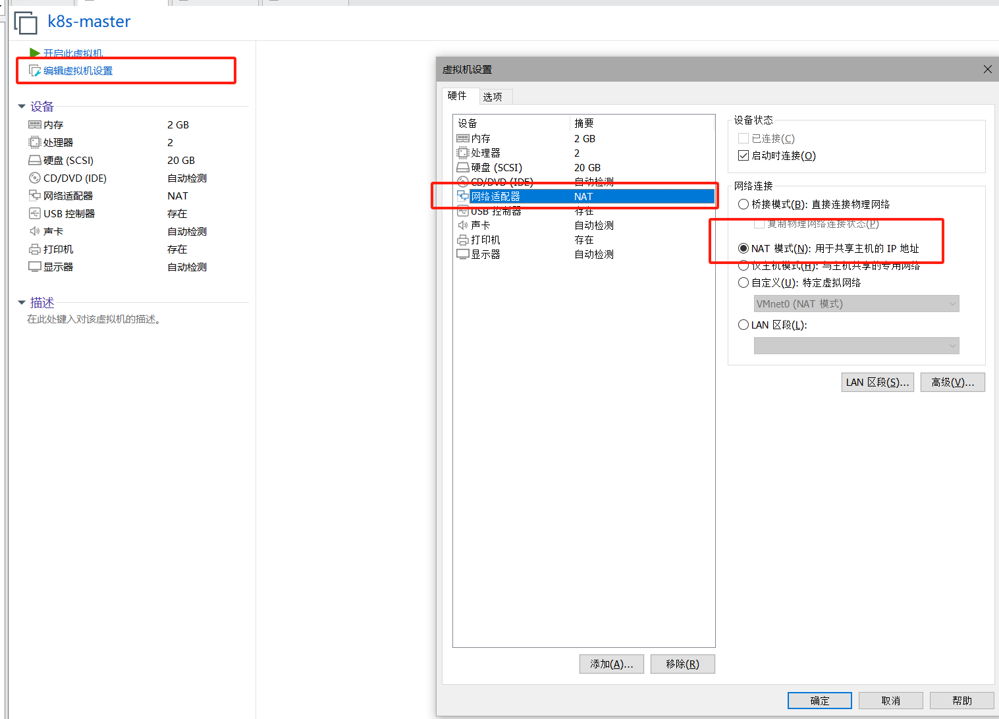
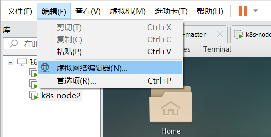
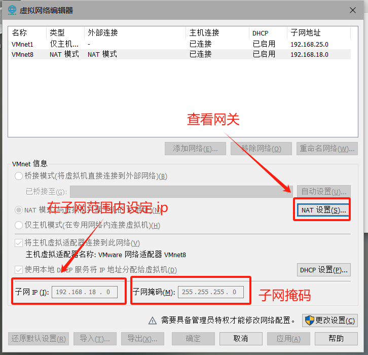
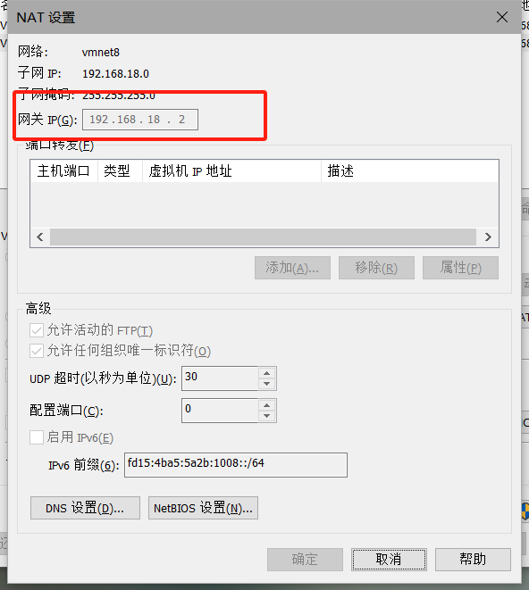
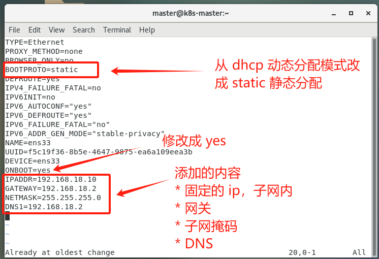

# k8s 配置踩坑日志

# 1 docker 安装

* centos 7 的镜像安装，参照[阿里云]([CentOS7 安装 Docker-阿里云开发者社区 (aliyun.com)](https://developer.aliyun.com/article/765545#:~:text=执行命令 %3A %24 mkdir -p %2Fetc%2Fdocker %24 tee,install docker-ce- (指定安装版本) 例： yum install docker-ce-18.03.1.ce 8、启动并加入开机启动)
* 镜像仓库地址："registry-mirrors":["https://w8xcoaj0.mirror.aliyuncs.com"]

* 安装完成后镜像拉不下来，报错：`dial tcp [2600:1f18:2148:bc01:20a3:9c3e:d4a7:9fb]:443: connect: network is unreachable.` ，是**因为 DNS 的问题**

  * 修改一下配置：`vim /etc/resolv.conf`

    ```txt
    search localdomain
    nameserver 223.5.5.5
    ```

    

# 2 k8s 安装

* 换源：`vim /etc/yum.repos.d/kubernetes.repo`

  ```txt
  [kubernetes]
  
  name=Kubernetes
  
  baseurl=https://mirrors.aliyun.com/kubernetes/yum/repos/kubernetes-el7-x86_64
  
  enabled=1
  
  gpgcheck=0
  
  repo_gpgcheck=0
  
  gpgkey=https://mirrors.aliyun.com/kubernetes/yum/doc/yum-key.gpg https://mirrors.aliyun.com/kubernetes/yum/doc/rpm-package-key.gpg
  ```

  * 第一行**一定**要**加括号**，是**标准格式**，里面加名字

* k8s init

  ```txt
  kubeadm init \
  
    --apiserver-advertise-address=192.168.18.10  \   # 集群告知地址，master 的地址
  
    --image-repository registry.aliyuncs.com/google_containers \
  
    --kubernetes-version v1.28.2 \   # 默认安装，需要查看版本， kubectl version
  
    --service-cidr=10.96.0.0/12 \  # 集群虚拟地址的网段
  
    --pod-network-cidr=10.244.0.0/16 \   # 这是 Pod 网络的地址段，用于定义 Pod 的网络地址
  
    --ignore-preflight-errors=all   #这是忽略预检错误的选项，用于在初始化集群时忽略所有预检错误
  ```

* 初始化时发生错误：`The HTTP call equal to 'curl -sSL http://localhost:10248/healthz' failed with error: Get "http://localhost:10248/healthz": dial tcp [::1]:10248: connect: connection refused.`

  * docker cgroup driver 是 systemd，而 k8s 是 c
  *  

# 3 centos 设置成静态 ip

* 将虚拟机的网络模式设置成 NET 模式

  

* 先查看虚拟机网络的**网关和子网**，然后为后续静态 ip 做准备

  * 
  * 
  * 

* 先获取 root 权限：`su root`

* 然后去网络配置文件中找到 ensxx 配置文件（ifcfg-ens33）

  * `cd /etc/sysconfig/network-scripts/`，文件在这里面，xx表示数值， ipconfig 中查看的网络适配器的名字就是这个名（ens33，看自己是多少）

* 修改配置文件：`vim ifcfg-ens33`

  * 添加内容

    ```
    IPADDR=192.168.18.10
    GATEWAY=192.168.18.2
    NETMASK=255.255.255.0
    DNS1=192.168.18.2
    ```

    修改内容

    ```
    BOOTPROTO=static
    ONBOOT=yes
    ```

    

* 重启提下网络服务：`service network restart`

