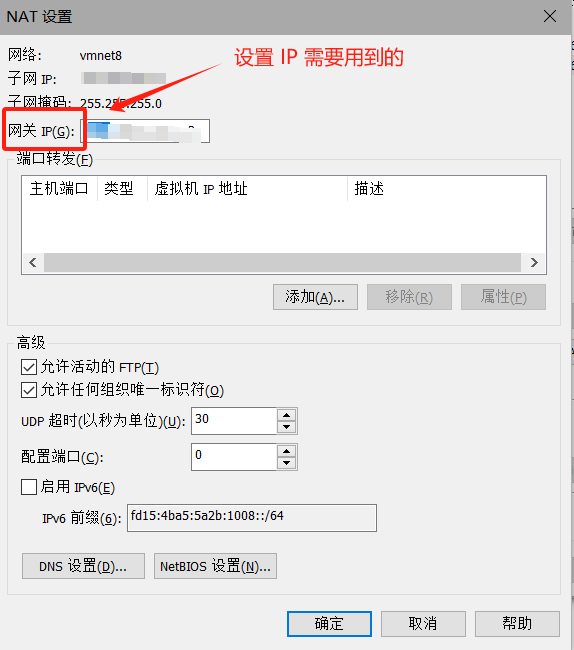
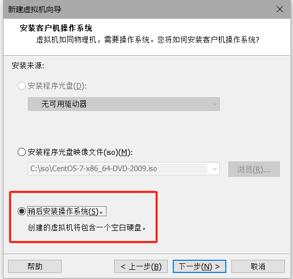

# 从零开始搭建 k8s 环境

# 1 VMWare 系统安装 Centos

## 1.1 镜像下载

* [centos 7 下载地址](https://mirrors.aliyun.com/centos/7.9.2009/isos/x86_64/?spm=a2c6h.25603864.0.0.3fc0f5adaRLb1C)（阿里云镜像）

## 1.2 VMWare 配置静态 IP

**虚拟机虚拟网络编辑器设置**

* **虚拟网络编辑器**设置成 **NAT 模式**，用来**固定 IP**

  

  * 首先记住 **NAT 模式网络适配器**的名字，后续要去固定网络适配器的 IP
  * 关闭 NAT 模式的 **DHCP 功能**，不允许本地 DHCP 服务动态分配 IP
  * 记住三个地址，后续所有固定 IP 的设置都需要这三个
    * 子网 IP：用来设置系统的 IP
    * 子网掩码
    * 网关：**通过 NAT 设置查看网关**

  

  

  


* 安装系统的时候会将网络设置成 **NAT 模式**

**虚拟机网络适配器固定 IP**

* 去**本机网络适配器**配置上面提到的虚拟机网络适配器（VMnet8）的 IP

  

* 选择上面 **NAT 模式**的网络适配器（VMnet8 是我自己的）

  

* 找到 IPv4（坑：不设置会导致 **ssh 无法连接**的问题）

  * 首先**固定 IP**，这个 IP 划分到上面虚拟机网络配置分配的**子网内**就行，不能占用网关的和一些必要的 IP
  * 然后**修改 DNS**

  

## 1.3 centos 安装

* **不建议**直接使用 ISO 安装，后面**手动安装**需要**设置一些东西**（未提到的**默认下一步**就行）

  

  

  

  

* 修改**虚拟机设置**

  

  

  

* **手动安装系统**

  

  * 安装系统

  

  

  * 修改时间
  * 本地介质，不同修改
  * 软件选择：我选择的**最小安装**，**不需要 UI**，需要的自行安装**带 GUI 的服务器**

  

  

  * 修改安装位置，设置分区，我选择的**自动分区**，也可以**自行挂载**
  * 网络和主机名，需要设置，就不用在系统内进行手动设置了，**直接固定 IP**
    * **子网，子网掩码，网关**都是上面提到的，这个会**一直用**

  

  

  

  

  

  

  * 设置一下 root 密码，然后等待安装就行了

  

# 2 Centos 系统配置

## 2.1 配置 SSH

* 查看 SSH **安装状态**（默认是安装好的）

  ```shell
  $ rpm -qa | grep ssh
  ```

* 如果没有安装或者安装缺失（建议无脑安装就行，不管有没有安装），使用命令进行安装

  ```shell
  $ yum install openssh*
  ```

* ssh 服务开机自启

  ```shell
  $ systemctl enable sshd
  ```

* 配置 SSH 服务（/etc/ssh/sshd_config 文件）
  ```shell
  $ vi /etc/ssh/sshd_config
  ```

* **修改**的部分：命令模式使用 / 进行查找

  * `Port 22`：**取消注释**，监听端口
  * `ListenAddress 0.0.0.0`：**取消注释**，这个是监听 ipv4
  * `ListenAddress ::`：**取消注释**，监听 ipv6
  * `PermitRootLogin yes`：**取消注释**，允许 root 登录

  

* 重启服务

  ```shell
  $ service sshd restart
  ```

* 使用远程连接

  * xshell

  * windows 命令行

    ```shell
    $ ssh root@ip
    ```

**如果无法连接，可能是防火墙未打开**（一般不会）

* 查看端口是否被监听

  * 先安装 net-tools 工具

    ```shell
    $ yum install net-tools
    ```

  * 使用 netstat 命令查看

    ```shell
    $ netstat -nltp|grep 22
    ```

    

  * 一般 config 文件修改后就有端口监听了，没有的话使用 firewalld-cmd 工具打开一下端口

* firewall-cmd 防火墙开放端口

  * 配置端口

    ```shell
    $ firewall-cmd --zone=public --add-port=22/tcp --permanent
    ```

  * 重载防火墙

    ```shell
    $ firewall-cmd --reload
    ```

## 2.2 换源

* **安装** wget（不先安装你会发现，你备份下载源之后，你又没有 wget 的尴尬）

  ```shell
  $ yum install wget
  ```

* **备份**原始下载源

  ```shell
  $ mv /etc/yum.repos.d/CentOS-Base.repo /etc/yum.repos.d/CentOS-Base.repo.backup
  ```

* **下载**阿里云下载源

  ```shell
  $ wget -O /etc/yum.repos.d/CentOS-Base.repo http://mirrors.aliyun.com/repo/Centos-7.repo
  ```

* 清除缓存同时 make 新的缓存

  ```shell
  $ yum clean all
  $ yum makecache
  ```

* 更新一下（随意）

  ```shell
  $ yum update
  ```

## 2.3 固定 IP

**手动固定 IP 操作**（安装系统的时候未设置静态 IP）

* 去网络适配器的配置文件中**修改**相应的记录

  ```shell
  $ vim/etc/sysconfig/network-scripts/ifcfg-ens33
  ```

  * `ens33` 和你的网络适配器的名字有关，可以自己 `$ ls` 看， `$ ip addr` 也会有名字，一般是 `ensxx`

  ```
  BOOTPROTO=static   # 从 dhcp 修改成 static，不动态获取
  ONBOOT=yes
  
  IPADDR=192.168.0.10 # 上面提到的子网，自己设置一个子网内的 ip，不能和其他的有冲突
  GATEWAY=192.168.0.2 # 同样是上面提到的网关地址
  NETMASK=255.255.255.0 # 子网掩码
  DNS1=114.114.114.114
  DNS2=223.8.8.8
  ```

* 重启一下网络服务

  ```shell
  $ service network restart
  ```

* 查看配置的 ip

  ```shell
  $ ip addr
  ```

## 2.4 关闭防火墙

* 关闭防火墙和自启动

  ```shell
  $ systemctl stop firewalld
  $ systemctl disable firewalld
  ```

## 2.5 关闭 selinux

* 关闭安全增强功能 SELinux（Security-Enhanced Linux）

  ```shell
  $ sed -i 's/enforcing/disabled/' /etc/selinux/config   # 永久关闭
  $ setenforce 0  # 暂时关闭
  ```

## 2.6 关闭 swap

* 关闭交换空间

  ```shell
  $ sed -ri 's/.*swap.*/#&/' /etc/fstab   # 永久
  $ swapoff -a
  ```

## 2.7 设置主机名

* 设置主机名，用来访问

  ```shell
  $ hostnamectl set-hostname 自己的主机名
  ```

* 查看编辑主机名

  ```shell
  $ vim /etc/hostname
  ```


## 2.8 k8s 的 master 节点需要配置 hosts

* 加入其他节点的 host

  ```shell
  $ cat >> /etc/hosts << EOF
  192.168.0.10 k8s-master
  192.168.0.11 k8s-node1
  192.168.0.12 k8s-node2
  EOF
  ```

* 也可以直接打开文件编辑

  ```shell
  $ vim /etc/hosts
  ```

2.9 桥接的 IPv4 流量传递到 iptables 

* 增加配置，同样可以修改文件：`/etc/sysctl.d/k8s.conf`

  ```shell
  $ cat > /etc/sysctl.d/k8s.conf << EOF
  net.bridge.bridge-nf-call-ip6tables = 1
  net.bridge.bridge-nf-call-iptables = 1
  EOF
  ```

* 加载并应用系统范围内的配置更改：即重新加载 `/etc/sysctl.conf` 的配置文件

  ```shell
  $ sysctl --system
  ```

## 2.9 设置时间同步

* 安装工具

  ```shell
  $ yum install ntpdate -y
  ```

* 进行时间同步

  ```shell
  $ ntpdate time.windows.com
  ```

# 3 docker 安装

## 3.1 安装 docker

* 更新软件包

  ```shell
  $ yum update
  ```

* 卸载旧版（如果安装过旧版）

  ```shell
  $ yum -y remove docker docker-common docker-selinux docker-engine
  ```

* 设置 yum 源：安装 yum-utils , 使用 yum-config-manager 工具设置Yum源, 后面两个是 devicemapper驱动依赖

  ```shell
  $ yum install -y yum-utils device-mapper-persistent-data lvm2
  ```

* 添加 docker 的 yum 源（官方源）

  ```shell
  $ yum-config-manager --add-repo https://download.docker.com/linux/centos/docker-ce.repo
  ```

* 添加阿里源（如果报错的话）

  ```shell
  $ yum-config-manager --add-repo http://mirrors.aliyun.com/docker-ce/linux/centos/docker-ce.repo
  ```

* 查看仓库的 docker 版本，在这里 docker 版本可以随意一些

  ```shell
  $ yum list docker-ce --showduplicates | sort -r
  ```

* 配置镜像加速

  * 创建文件夹

    ```shell
    $ mkdir -p /etc/docker
    ```

  * 创建 docker 守护进程配置文件（坑：同时 [],要是上面有，下面也需要加上，不然会报 json 语法错误）

    ```shell
    $ tee /etc/docker/daemon.json <<-'EOF'
    { 
     "registry-mirrors": ["https://w8xcoaj0.mirror.aliyuncs.com",
     						"https://docker.mirrors.ustc.edu.cn",
    						"https://registry.docker-cn.com"],
     "exec-opts": ["native.cgroupdriver=systemd"]    # 修改cgroup管理器,不设置后面装 k8s 进行初始化的时候会报错，不匹配
    }
    EOF
    ```

  * 也可以直接编辑 daemon.json 文件：`$ vim /etc/docker/daemon.json`

  * 导入配置

    ```shell
    $ systemctl daemon-reload
    ```

* 安装 docker（社区版 docker-ce）

  ```shell
  $ yum install docker-ce
  $ yum install docker-ce-18.03.1.ce # 指定版本
  ```

* 启动同时加入开机自启

  ```shell
  $ systemctl start docker
  $ systemctl enable docker
  ```

* 查看 docker 版本号和运行情况

  ```shell
  $ docker version
  $ systemctl status docker
  ```

# 4 k8s 安装

## 4.1 安装 k8s

* 设置 k8s 仓库源：直接编辑文件 `$ vim /etc/yum.repos.d/kubernetes.repo`

  ```shell
  $ cat <<EOF > /etc/yum.repos.d/kubernetes.repo
  [kubernetes]
  name=Kubernetes
  baseurl=https://mirrors.aliyun.com/kubernetes/yum/repos/kubernetes-el7-x86_64/
  enabled=1
  gpgcheck=1
  repo_gpgcheck=1
  gpgkey=https://mirrors.aliyun.com/kubernetes/yum/doc/yum-key.gpg https://mirrors.aliyun.com/kubernetes/yum/doc/rpm-package-key.gpg
  EOF
  ```

* 安装 k8s：使用 init 参数需要安装**低版本的 k8s**

  ```shell
  $ yum install -y kubelet-1.18.8 kubeadm-1.18.8 kubectl-1.18.8
  ```

* 启动同时开机自启

  ```shell
  $ systemctl enable kubelet && systemctl start kubelet
  ```

## 4.2 Master 节点初始化（使用 kubeadm）

* master 节点初始化配置

  ```shell
  $ kubeadm init \
    --apiserver-advertise-address=192.168.0.10 \   
    --image-repository registry.aliyuncs.com/google_containers \
    --kubernetes-version v1.18.8 \
    --service-cidr=10.96.0.0/12 \
    --pod-network-cidr=10.244.0.0/16 \
    --ignore-preflight-errors=all
  ```

  ```shell
    --apiserver-advertise-address=192.168.0.10     # master节点的 ip
    --image-repository registry.aliyuncs.com/google_containers  # 镜像仓库  
    --kubernetes-version v1.18.8    # k8s 版本 
    --service-cidr=10.96.0.0/12     # Kubernetes 集群中 Service（服务）所使用的 IP 地址范围
    --pod-network-cidr=10.244.0.0/16 # Kubernetes 集群中 Pod（容器组）所使用的 IP 地址范围
    --ignore-preflight-errors=all  # Kubernetes 工具在进行预检查时忽略所有错误
  ```

  * `Pod` 是 Kubernetes 中最小的可调度和可管理的单元，它包含一个或多个容器。这个参数指定了 `Pod` 的 IP 地址分配范围，即 Pod IP 的分配将在 10.244.0.0/16 网段内进行

* 拷贝 k8s 认证文件（初始化之后提示执行的命令）

  ```shell
  $ mkdir -p $HOME/.kube
  $ cp -i /etc/kubernetes/admin.conf $HOME/.kube/config
  $ chown $(id -u):$(id -g) $HOME/.kube/config
  ```
  
* 同时会输出一个 token，用来其他节点加入使用（24 小时过期，后续可以自己生成）

  ```shell
  $ kubeadm token create --print-join-command
  ```

* 查看工作节点

  ```shell
  $ kubectl get nodes
  ```

  

  一般是 NotReady，需要配置文件

## 4.3 部署 CNI 网络插件，解决 NotReady（master节点）

* 坑：查看插件对应支持的版本[k8s版本对应文档](**https://projectcalico.docs.tigera.io/archive/v3.20/getting-started/kubernetes/requirements**)

  * 找到对应版本

    

* 下载支持的版本，这里是 v3.20 可以支持

  ```shell
  $ curl https://docs.projectcalico.org/v3.20/manifests/calico.yaml -O
  ```

* 执行文件

  ```shell
  $ kubectl apply -f calico.yaml
  ```

## 4.4 子节点加入 Master 节点

* 子节点通过 master 节点产生的 token 加入到集群中

  * 产生新 token 的方法

    ```shell
    $ kubeadm token create --print-join-command
    ```

  * 子节点执行

    ```shell
    $kubeadm join 192.168.0.10:6443 --token 3ld0l5.qaw43ddfsug6s0or     --discovery-token-ca-cert-hash sha256:96783b456172e6008481fcbe4feb36cccbc565ffsgdfgd0c3b86978a52aba86f3 

* 坑：但是会发生报错（因为子节点没有配置文件，将 master 的文件复制过去）

  

  * 将 master 节点的配置文件复制过去

    ```shell
    $ scp /etc/kubernetes/admin.conf root@192.168.0.11:/etc/kubernetes/admin.conf
    ```

  * 子节点执行

    ```shell
    $ echo "export KUBECONFIG=/etc/kubernetes/admin.conf" >> ~/.bash_profile
    $ source ~/.bash_profile
    ```

    

## 4.5 不同系统安装 k8s

[kubernetes镜像_kubernetes下载地址_kubernetes安装教程-阿里巴巴开源镜像站 (aliyun.com)](https://developer.aliyun.com/mirror/kubernetes)

# 5 参考文档

[部署k8s集群（k8s集群搭建详细实践版）-腾讯云开发者社区-腾讯云 (tencent.com)](https://cloud.tencent.com/developer/article/2160663)

[kubernetes镜像_kubernetes下载地址_kubernetes安装教程-阿里巴巴开源镜像站 (aliyun.com)](https://developer.aliyun.com/mirror/kubernetes)

[centos 7换源_centos linux一健换源-CSDN博客](https://blog.csdn.net/qq_36934489/article/details/117407475#:~:text=三、更换源 1 1、备份原下载源 mv %2Fetc%2Fyum.repos.d%2FCentOS-Base.repo %2Fetc%2Fyum.repos.d%2FCentOS-Base.repo.backup 1 2,-y 1 五、Tips tar.gz 解压 tar -zxvf 1)

[k8s入坑之报错（1）解决The connection to the server localhost:8080 was refused - did you specify the right host or port? - muzlei - 博客园 (cnblogs.com)](https://www.cnblogs.com/muzlei/p/16375178.html)

# 6 额外功能

## 6.1 VMWare 共享文件夹

* 虚拟机开启共享文件夹

  

* 虚拟机中对应的文件夹在 `/mnt/hgfs`

* 坑：需要挂载才会出现文件

  ```shell
  $ mount -t fuse.vmhgfs-fuse .host:/ /mnt/hgfs -o allow_other
  ```

  * /mnt/hgfs 是挂载点
  * -o allow_other 表示普通用户也能访问共享目录

  [主机与VMware虚拟机共享文件夹：解决虚拟机找不到共享文件夹问题 - 知乎 (zhihu.com)](https://zhuanlan.zhihu.com/p/650638983)

